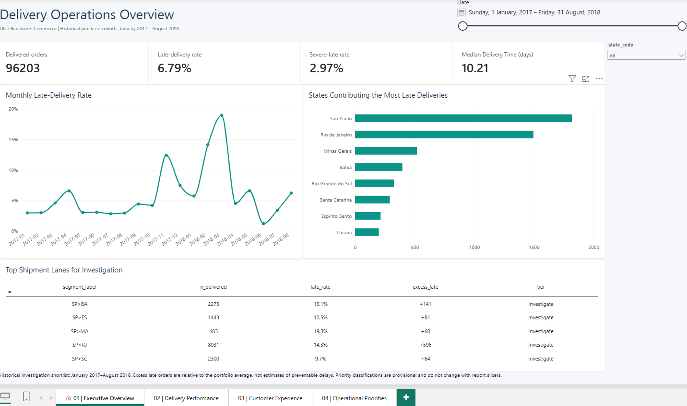
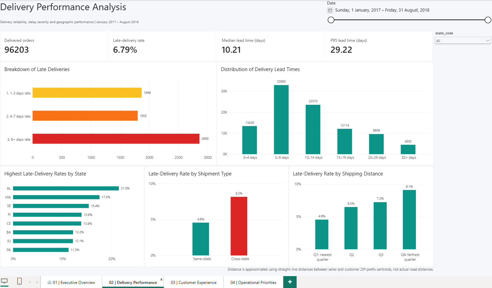
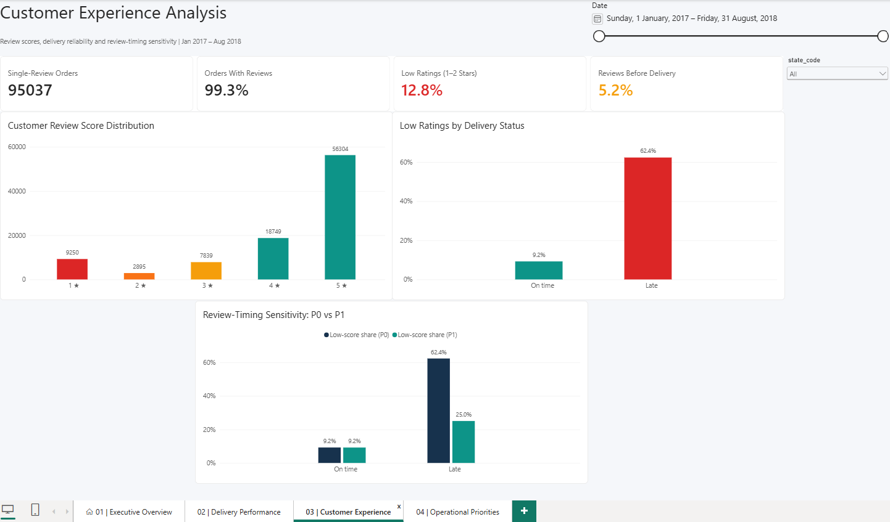
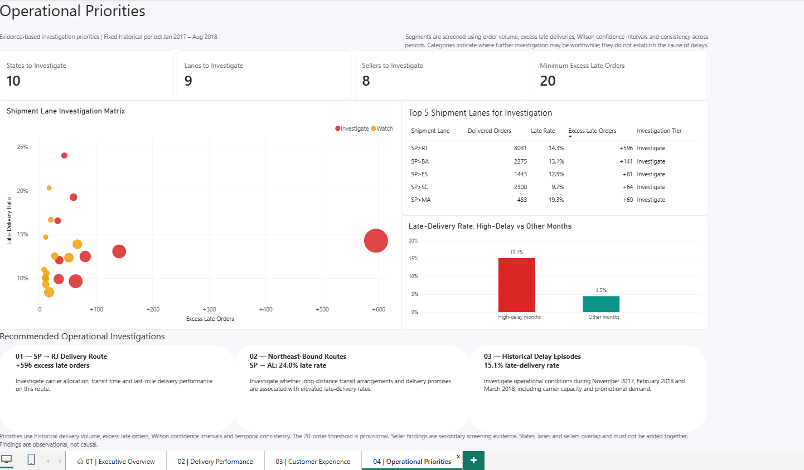

# Olist Operations Intelligence

**Where do late deliveries concentrate on a Brazilian e-commerce marketplace, how do they relate to customer reviews, and which states, lanes and sellers should operations investigate first?**

An end-to-end SQL, Python and Power BI analysis of the public Olist dataset (about 99k orders, 2017-2018). All results are **observational and descriptive**. No causal claims are made, and no machine-learning or NLP is used.

## Business problem

An e-commerce operations manager needs to know whether delivery performance is acceptable and stable, how much late delivery matters to customer satisfaction, and where limited investigation effort should go first. The project turns the raw Olist tables into a validated analytical model, four findings workstreams and a four-page Power BI dashboard. The recommendations are *investigation priorities*, not verdicts about any seller or region.

## Verified findings

Every number below is taken from the findings reports in `reports/` and is backed by automated tests (see [Testing](#testing-and-validation)). Population: orders purchased 2017-01 to 2018-08 that were delivered with a delivery date (N = 96,203), unless stated.

The four kinds of result in this project answer different questions and must not be mixed:

| Kind of result | What it is | Example below |
|---|---|---|
| **Observed late-delivery rate** | Share of delivered orders that arrived after the promised calendar date. Conditional on being delivered, not a share of all orders. | 6.79% overall |
| **Single-seller analysis** | Seller and lane results use only orders with exactly one seller (94,931 orders, 2,925 sellers). Multi-seller orders (1.3%) are excluded, not allocated. | seller screening |
| **Review P0 / P1 sensitivity** | P0 = orders with exactly one review row (95,037). P1 = P0 minus reviews written *before* the recorded delivery date (90,103). P1 sits next to P0 to show how much the result depends on review timing. | score gap |
| **Fixed-period priority snapshot** | Tiers computed once for the whole 2017-01 to 2018-08 period. Not recalculated by date, state or seller filters. Provisional screening labels. | Investigate tiers |

### 1. Delivery reliability ([report](reports/delivery_reliability_findings.md))
- **Observed:** 6.79% of delivered orders were late (6,531 of 96,203; Wilson 95% interval 6.63% to 6.95%) and 2.97% were more than 7 days late.
- Median lead time is 10.2 days, p95 is 29.2 days, and the median promised lead time is 24 days.
- Monthly cohort late rates range from 1.2% to 19.0%, so the pooled rate hides large swings.

### 2. Customer satisfaction ([report](reports/customer_satisfaction_findings.md))
- **P0 (primary):** mean review score is 4.29 for on-time and 2.27 for late orders; 9.2% vs 62.4% give 1-2 stars.
- **P1 sensitivity:** 74.4% of late orders' reviews were written before the recorded delivery date (0.24% for on-time orders). Removing them shrinks the low-score gap from 53.1 to 15.8 percentage points. The headline gap therefore depends heavily on review timing.
- 67% of 1-2 star orders were delivered on time. This is a composition, not an attributable fraction.
- This is an association. The data cannot show that lateness *causes* low scores.

### 3. Geography and sellers ([report](reports/geographic_seller_findings.md))
- State late rates run from 2.8% to 21.5% across 24 reportable states. The five highest are Northeast states, and São Paulo is the lowest large state (4.5%).
- Rio de Janeiro has 13% of orders but 23% of late orders (12.1% late on 12,310 orders).
- Cross-state shipments are late 8.2% of the time vs 4.6% for same-state (single-seller orders, n = 94,931). Distance is a straight-line ZIP-prefix approximation, not road distance.
- **Single-seller analysis:** 57 of 412 sellers with at least 50 orders have an interval entirely above the portfolio rate (about 14 expected by chance). Seller late rates are only moderately persistent between window halves (rank correlation 0.35).
- The 2017-11, 2018-02 and 2018-03 spike (15.1% vs 4.5% in other months) was broad-based. At most 0.2 of the 10.7 points is explained by changes in state, lane or seller mix.

### 4. Operational prioritization ([report](reports/operational_prioritization_findings.md))
- **Fixed-period snapshot:** at the 20-excess-late-order screening policy, 10 states, 9 lanes and 8 sellers are tiered *Investigate*.
- The state and lane lists are stable to the threshold and to removing the three high-delay months. **Only 2 of 8 Investigate sellers persist**, so seller results are secondary screening evidence, not a ranking.
- SP>RJ (seller state > customer state) is the largest lane (+596 excess late orders, 14.3% late on 8,031 orders) and largely overlaps the Rio de Janeiro state result. The state, lane and seller levels overlap heavily, so excess is never added across levels (+2,658 summed vs +1,384 for the union).
- The 20-order threshold is an **operational screening policy, not statistical significance**.

## Operational recommendations

These follow from the descriptive results and are suggestions to be confirmed with operations data that this dataset does not contain (carrier, warehouse, SLA).

1. **Start the investigation with Rio de Janeiro-bound shipments (SP>RJ) and the Northeast-bound lanes.** Use volume (excess late orders) to pick the first target and rate (intensity) to pick the second.
2. **Review the delivery promise for high-delay periods.** The Nov 2017, Feb 2018 and Mar 2018 spikes affected nearly every state and most sellers, which points to network-wide rather than segment-specific causes. The data cannot say which.
3. **Treat seller flags as prompts for a conversation, not a scorecard.** They are unstable once the high-delay months are removed.
4. **Do not size the benefit of fewer late orders from the review gap.** Review timing and non-response limit what the gap means.

No financial impact is estimated, because the dataset has no cost or margin information.

## Dashboard Preview

A four-page Power BI report (Executive Overview, Delivery Performance, Customer Experience, Operational Priorities) was built from the validated import package. All figures shown are historical, descriptive and observational: they say where and when deliveries ran late, not why. A PDF export of the four pages is in [`powerbi/visualisation/Olist-Operations-Intelligence.pdf`](powerbi/visualisation/Olist-Operations-Intelligence.pdf).

### Executive Overview



*A one-page answer to "how reliable is delivery?": 96,203 delivered orders, 6.79% late, 2.97% more than a week late, a monthly late rate that spikes in the high-delay months (Nov 2017, Feb-Mar 2018), the states contributing the most late orders, and the five lanes with the most excess late orders.*

### Delivery Performance



*How late, and where: severity bands among late orders, the lead-time distribution, the highest-rate states (Northeast-led, AL 21.5%), and late rates of 4.6% same-state vs 8.2% cross-state and 4.6% to 9.1% from the nearest to the farthest distance quarter. The shipment-type and distance charts cover the 94,931 single-seller orders; distance is a straight-line approximation.*

### Customer Experience



*Reviews vs lateness: 1-2 star shares of 9.2% for on-time and 62.4% for late orders (P0, 95,037 single-review orders). The P0 vs P1 chart shows the late-order share falling to 25.0% once reviews written before the recorded delivery date are removed, so the headline gap depends on review timing. An association, not an effect.*

### Operational Priorities



*Where to look first: a fixed-period snapshot (Jan 2017 - Aug 2018) with 10 states, 9 lanes and 8 sellers tiered Investigate at the 20-excess-late-order screening policy, SP>RJ as the largest lane (+596 excess late orders), and 15.1% vs 4.5% late in high-delay vs other months. Provisional screening labels, not statistical significance; the levels overlap and must not be added together.*

Screenshots were taken from the report owner's Power BI Desktop session. Page-level caveats are repeated on the pages themselves.

The `.pbix` itself is **not published in this repository**. It embeds row-level data derived from the Olist dataset, so it is kept local until the data-licence question below is settled. The import package definition (Power Query script, data dictionary, DAX dictionary and page specifications) is in [`powerbi/`](powerbi/); the row-level import CSVs are rebuilt with `scripts/export_powerbi.py`. How a data-free Power BI Project could be published is described in [`powerbi/README.md`](powerbi/README.md), section 11. It has not been created or inspected yet.

Analysis charts rendered from the same validated data are in [`reports/figures/`](reports/figures/).

Measure definitions, relationships and a KPI reconciliation checklist are in [`powerbi/README.md`](powerbi/README.md) and [`powerbi/dax_measures.md`](powerbi/dax_measures.md). All 13 dashboard-only objects (7 measures, 6 calculated columns) are documented with their exact formulas in section 8 of the DAX dictionary, taken from an export of the saved model made with Tabular Editor 2 ([`powerbi/dax_export.csv`](powerbi/dax_export.csv)). Their values were reconciled in SQL and Python against the DuckDB model and the validated report tables. **They have not been executed in Power BI Desktop by this project**, so the Desktop checks remain manual (see [Limitations](#limitations)).

Two reading notes for the page 2 charts:
- **Population.** "Late-Delivery Rate by Shipment Type" and "by Shipping Distance" use the **single-seller** population (94,931 orders, 6.87% late overall), because seller state and distance exist only for orders with one seller. The other page 2 visuals use all 96,203 delivered orders (6.79%).
- **Lead-time bands.** "Distribution of Delivery Lead Times" bins fractional days with the rule *at least the lower bound and below the upper bound*: "0–4 days" means under 5.0 days (4.9 days is included), "5–9 days" means 5.0 to under 10.0 days, and so on up to "30+ days" (30.0 days or more).

## Methods

- **Model:** DuckDB SQL builds typed staging tables, dimensions and an order-grain fact table with explicit population flags (about 34 build-time assertions).
- **Statistics:** Wilson intervals for proportions; seeded bootstrap (customers resampled as clusters) for medians and effect sizes; indirect standardisation (observed vs expected) by purchase month and promised lead time; stratified Mantel-Haenszel risk ratios; logistic regression with cluster-robust errors for adjusted review associations.
- **Screening rules:** fixed before looking at results (minimum volume, interval above reference, 20-excess-order policy, window-half consistency).
- **Validation:** an independent pandas implementation recomputes the SQL results, and Power BI DAX measures are checked through Python equivalents.

## Technology stack

DuckDB (SQL), Python 3.14 (pandas, NumPy, SciPy, statsmodels, matplotlib), pytest, Power BI Desktop (DAX, Power Query), Git.

## Project structure

```
data/raw/            original Olist CSVs (git-ignored, you download them)
data/processed/      built DuckDB model (git-ignored, regenerated)
sql/                 01-03 model build; analysis/ (per workstream); powerbi/ (export queries)
scripts/             model build, validation reports, Power BI export, DAX equivalents
analysis/            statistics, figures and findings-report generators (4 workstreams)
tests/               pytest suite and independent pandas reference
reports/             blueprint, validation and four findings reports; tables/ and figures/
powerbi/             .pbix, import package, Power Query, DAX dictionary, page specs
```

## Data source

The raw data is not included. Download "Brazilian E-Commerce Public Dataset by Olist" from Kaggle (free account): <https://www.kaggle.com/datasets/olistbr/brazilian-ecommerce>. Unzip and copy the nine CSVs into `data/raw/`:

`olist_customers_dataset.csv`, `olist_geolocation_dataset.csv`, `olist_order_items_dataset.csv`, `olist_order_payments_dataset.csv`, `olist_order_reviews_dataset.csv`, `olist_orders_dataset.csv`, `olist_products_dataset.csv`, `olist_sellers_dataset.csv`, `product_category_name_translation.csv`.

## Data licence and attribution

- **Dataset:** "Brazilian E-Commerce Public Dataset by Olist", published by Olist on Kaggle: <https://www.kaggle.com/datasets/olistbr/brazilian-ecommerce>.
- **Dataset licence:** Creative Commons Attribution-NonCommercial-ShareAlike 4.0 International (**CC BY-NC-SA 4.0**), as listed in the dataset's Kaggle metadata (checked 2026-10-10). Licence text: <https://creativecommons.org/licenses/by-nc-sa/4.0/>.
- **What this means here:** the dataset and anything derived from it (including row-level exports such as the Power BI fact tables and the `.pbix`) remain subject to those terms: attribution to Olist, non-commercial use only, and share-alike. This repository does **not** contain the raw CSVs, the DuckDB database, the row-level Power BI fact CSVs or the `.pbix`. Published tables and figures are aggregates computed from the dataset and are shared under the same non-commercial, share-alike terms with attribution to Olist.
- **Project code licence:** the licence for the original code (SQL, Python, tests, documentation) is a separate matter and has **not been chosen yet**. See the [audit](reports/final_portfolio_audit.md) for the proposal. Until a `LICENSE` file is added, no licence for the code is granted by default. The dataset licence does not apply to code that contains no Olist data, and a code licence does not change the dataset's terms.
- This is a portfolio project, not affiliated with or endorsed by Olist. This note is not legal advice.


## How to reproduce

Requires Python 3.10+ (developed and tested on 3.14).

```bash
pip install -r requirements.txt

python scripts/build_model.py                      # DuckDB model -> data/processed/olist_model.duckdb (seconds)
python -m pytest                                   # 186 tests, about 2 minutes (builds into a temp database)

python analysis/delivery_reliability.py            && python analysis/build_delivery_report.py
python analysis/customer_satisfaction.py           && python analysis/build_satisfaction_report.py   # about 1 minute
python analysis/geographic_seller.py               && python analysis/build_geographic_seller_report.py
python analysis/operational_prioritization.py      && python analysis/build_prioritization_report.py

python scripts/export_powerbi.py                   # powerbi/data/*.csv, manifest, power_query.m
python scripts/build_powerbi_validation_report.py
```

`scripts/build_model.py` accepts `--raw <csv dir> --db <output .duckdb>`. All paths are relative to the project root. The `build_*_report.py` scripts also run pytest and embed the result in the report.

To open the dashboard from scratch, follow [`powerbi/README.md`](powerbi/README.md). The `fact_orders.csv` and `fact_seller_orders.csv` import files are git-ignored (about 36 MB) and are rebuilt by `scripts/export_powerbi.py`.

## Testing and validation

186 pytest tests cover the model, each analysis workstream and the Power BI export. The suite also verifies that the raw CSVs stay byte-identical. See [`reports/final_portfolio_audit.md`](reports/final_portfolio_audit.md) for what was executed during the pre-publication audit and what could not be checked.

## Limitations

- The late rate is conditional on delivery. Cancelled, unavailable and still-open orders are not in the denominator and are reported separately.
- Delivery timestamps are order-level, so seller handling, carrier transit and last-mile delivery cannot be separated. No carrier, warehouse or SLA data exists.
- Reviews are voluntary, and a large share of late-order reviews were written before delivery. Review results are associations.
- Seller results hold for single-seller orders only and are unstable across periods.
- One marketplace, a 20-month window, and no cost data: no financial impact is claimed.
- The documented DAX (including the 13 dashboard-only objects) was validated through Python and SQL equivalents. It was **not executed in Power BI Desktop** in this audit; values shown in the dashboard PDF agree with the verified findings but are not a formula check.
