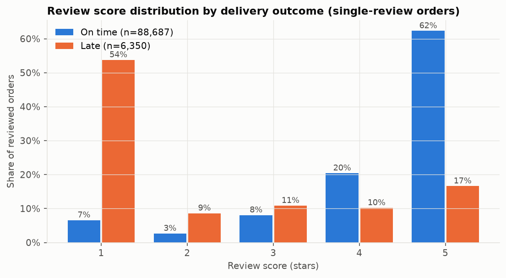
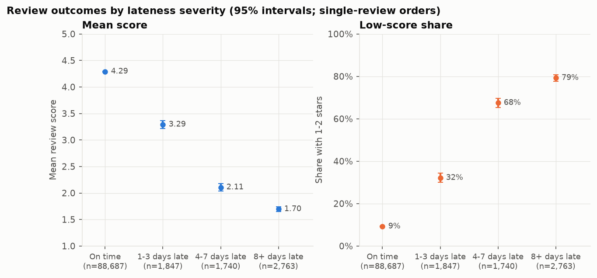
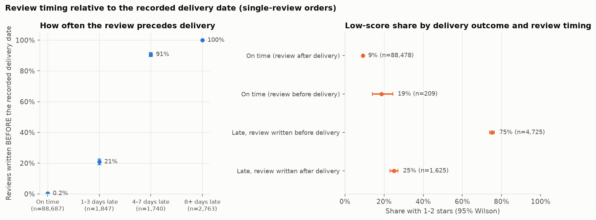
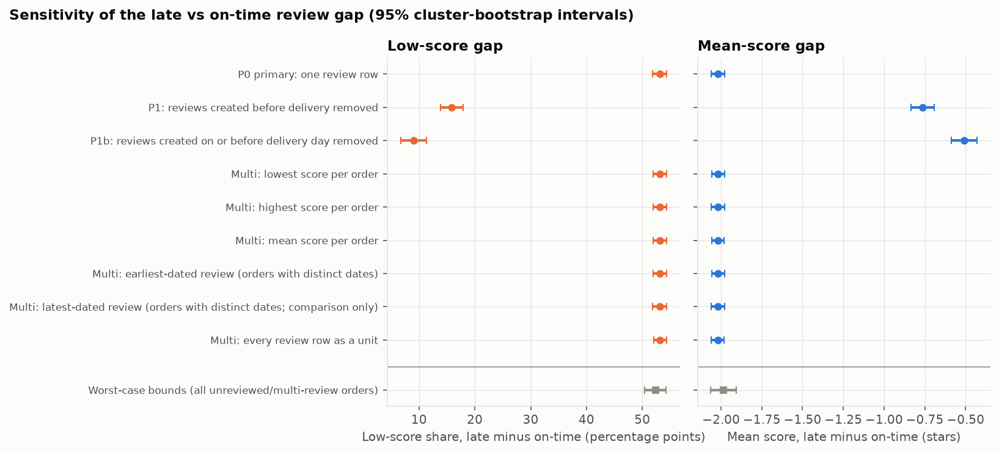
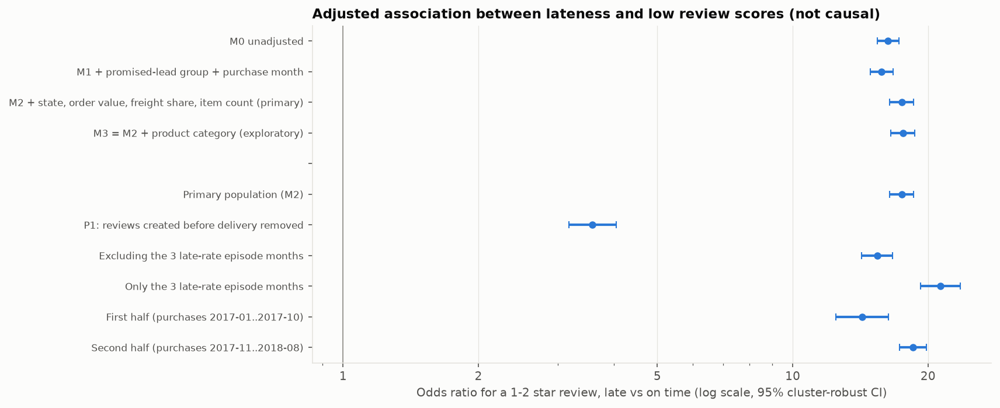
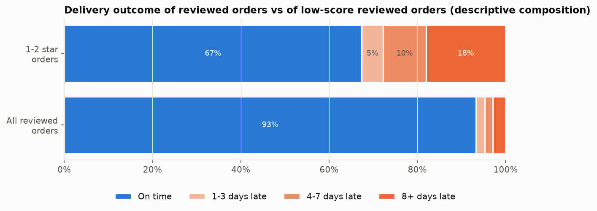
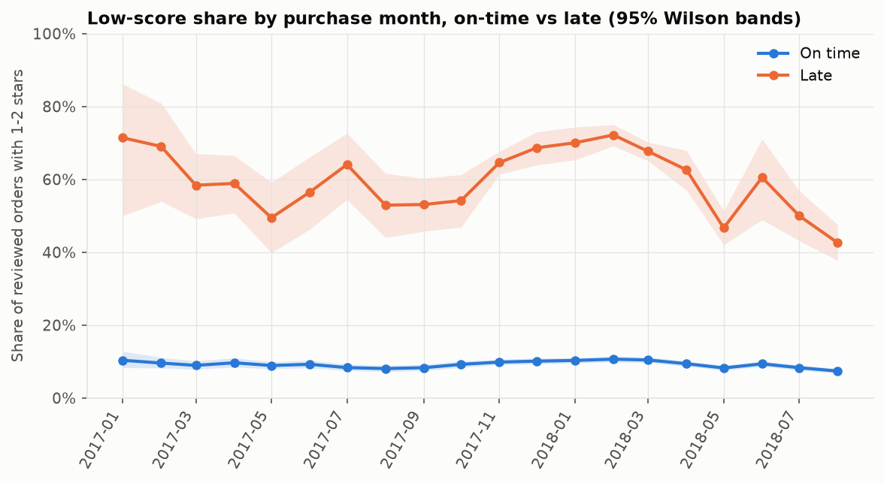

# Customer Satisfaction: Findings (Workstream 3)

Generated by `analysis/build_satisfaction_report.py` from `analysis/customer_satisfaction.py` (SQL in `sql/analysis/satisfaction/`) on the validated DuckDB model. Everything below is **observational association**: it shows how review scores differ between on-time and late deliveries, not whether lateness *causes* dissatisfaction. No text/NLP, seller, geographic or predictive analysis is included.

Labels: **[Observed]** a computed result; **[Interpretation]** a reading that goes beyond it; **[Hypothesis]** a possible explanation this analysis cannot test.

## Summary: what the data can and cannot establish

- **[Observed]** Late orders get much lower scores. Among single-review delivered orders, mean score is 4.29 on time vs 2.27 late, and 9.2% vs 62.4% give 1-2 stars (gap 53.1 percentage points; odds ratio 16.3). The gap barely moves with clustering, adjustment for state, promised lead time, month, order value, freight share, item count or product category, with the handling of multi-review orders, or with non-response.
- **[Observed] The size of the gap depends heavily on review timing.** 74.4% of late orders' reviews were created *before* the recorded delivery date (vs 0.24% of on-time orders'), and 98.8% of those were written after the promised date, i.e. while the order was overdue. Removing reviews written before delivery shrinks the gap to 15.8 points (odds ratio 3.3); removing those written on or before the delivery day shrinks it to 9.1 points. Severely late orders (8+ days) have almost no review written after delivery, so the data cannot say how they score once the order has arrived.
- **[Observed]** Most low scores are not on late orders. 67% of 1-2 star reviewed orders were delivered on time; 33% were late, against a late share of 6.7% among all reviewed orders. This is a composition, **not** an attributable fraction.
- **Not established:** that lateness causes low scores, how many low scores would disappear if deliveries were on time, or what customers think of a late order after it arrives (for the most severe delays).

## 1. Populations and definitions

| Population | Orders | Note |
|---|---|---|
| Delivered with date, purchases 2017-01..2018-08 (delivery KPI population) | 96,203 | established model population |
| **P0 (primary):** exactly one review row | 95,037 | 92,335 distinct customers |
| No review row | 643 | see Section 6 |
| Several review rows | 523 | excluded from P0; see Section 5 |
| **P1:** P0 minus reviews created before the recorded delivery date | 90,103 | 4,934 reviews removed |
| **P1b:** P0 minus reviews created on or before the delivery day | 86,968 | stress test (creation dates have day precision) |

- **Late** = calendar-date rule (`DATE(delivered) > estimated date`); lateness bands: on time, 1-3, 4-7, 8+ days late (8+ = severe, > 7 days).
- **Low score** = 1 or 2 stars. Review score exists only when exactly one review row exists; **the latest review is never treated as authoritative**.
- **Intervals:** Wilson for proportions; normal approximation for means within groups; for the late-vs-on-time effect sizes a **cluster bootstrap resampling customers** (1,000 resamples, seed 20241001). Effect sizes: difference in means, Cohen's d, difference in low-score share, risk ratio, odds ratio, Cliff's delta and the probability that a random on-time order out-scores a random late order (ties split).
- **Overall:** mean score 4.16, 12.8% low-score [12.6%, 13.0%] across 95,037 single-review orders.

## 2. On-time vs late



| Group | Orders | Mean score [95% CI] | 1-2 star share [95% Wilson] | Share of 1/2/3/4/5 stars |
|---|---|---|---|---|
| On time | 88,687 | 4.29 [4.28, 4.30] | 9.2% [9.0%, 9.4%] | 7% / 3% / 8% / 20% / 62% |
| Late | 6,350 | 2.27 [2.23, 2.31] | 62.4% [61.2%, 63.5%] | 54% / 9% / 11% / 10% / 17% |

| Effect size (P0, primary) | Estimate | 95% cluster-bootstrap interval |
|---|---|---|
| Mean score difference (late - on time) | -2.02 stars | [-2.06, -1.98] |
| Cohen's d | -1.71 | [-1.75, -1.67] |
| Low-score share difference | 53.1 points | [51.9, 54.3] |
| Risk ratio (low score) | 6.76 | [6.56, 6.95] |
| Odds ratio (low score) | 16.3 | [15.4, 17.2] |
| Cliff's delta (on time scores higher) | 0.64 | [0.63, 0.65] |
| P(random on-time score > random late score), ties split | 0.82 | [0.81, 0.83] |

**[Observed]** Late orders score about 2.0 stars lower on average and are 6.8 times as likely to receive 1-2 stars (Cohen's d 1.7, a very large standardised difference). Treating orders as independent gives practically the same interval for the low-score gap (Newcombe 51.9 to 54.3 points; cluster-to-independent standard-error ratio 1.00), because customers rarely appear more than once among the reviewed orders.

## 3. Lateness severity



| Band | Orders (P0) | Mean score [95% CI] | 1-2 star share [95% Wilson] | Gap vs on time (pts) | Orders (P1) | 1-2 star share (P1) |
|---|---|---|---|---|---|---|
| On time | 88,687 | 4.29 [4.28, 4.30] | 9.2% [9.0%, 9.4%] | - | 88,478 | 9.2% |
| 1-3 days late | 1,847 | 3.29 [3.22, 3.36] | 32.2% [30.1%, 34.3%] | 22.9 | 1,462 | 24.8% |
| 4-7 days late | 1,740 | 2.11 [2.04, 2.18] | 67.5% [65.3%, 69.7%] | 58.3 | 162 | 27.2% |
| 8+ days late | 2,763 | 1.70 [1.65, 1.74] | 79.3% [77.7%, 80.8%] | 70.1 | 1 | 0.0% (n too small) |

**[Observed]** In the primary population the low-score share rises steadily with lateness: 9.2% on time, 32.2% for 1-3 days late, 67.5% for 4-7 and 79.3% for 8+ days late; mean score falls from 4.29 to 1.70. After adjustment (Section 7) the odds ratios against on-time are 5.1, 22.9 and 39.8.

**[Observed]** This dose-response is **not stable once reviews written before delivery are removed (P1)**: only 162 reviewed orders remain in the 4-7 band, 1 in the 8+ band, and the 1-3 and 4-7 bands have similar low-score shares (24.8% and 27.2%). The apparent gradient is largely a gradient in how often the review is written before delivery (next section).

## 4. Review timing: the required sensitivity analysis



| Band | Reviewed orders | Review created before recorded delivery | Share | ...of which created after the promised date |
|---|---|---|---|---|
| On time | 88,687 | 209 | 0.24% | 0 |
| 1-3 days late | 1,847 | 385 | 20.8% | 374 |
| 4-7 days late | 1,740 | 1,578 | 90.7% | 1,566 |
| 8+ days late | 2,763 | 2,762 | 100.0% | 2,730 |

| Group | Orders | Mean score | 1-2 star share [95% Wilson] |
|---|---|---|---|
| On time (review after delivery) | 88,478 | 4.29 | 9.2% [9.0%, 9.4%] |
| On time (review before delivery) | 209 | 3.90 | 18.7% [14.0%, 24.5%] |
| Late, review written before delivery | 4,725 | 1.84 | 75.2% [73.9%, 76.4%] |
| Late, review written after delivery | 1,625 | 3.53 | 25.0% [23.0%, 27.2%] |

| Population | On time | Late | Mean diff [95% CI] | Low-score gap, pts [95% CI] | Odds ratio | Cohen's d |
|---|---|---|---|---|---|---|
| P0 primary | 88,687 | 6,350 | -2.02 [-2.06, -1.98] | 53.1 [51.9, 54.3] | 16.3 | -1.71 |
| P1: created before delivery removed | 88,478 | 1,625 | -0.76 [-0.83, -0.69] | 15.8 [13.8, 17.9] | 3.3 | -0.66 |
| P1b: created on/before delivery day removed | 85,923 | 1,045 | -0.51 [-0.59, -0.43] | 9.1 [6.7, 11.3] | 2.2 | -0.44 |

**[Observed]** 74.4% of late orders' reviews (4,725 of 6,350) were created before the recorded delivery date, against 0.24% of on-time orders' (209 of 88,687). Of the 4,725 such reviews on late orders, 4,670 (98.8%) were created *after the promised date*. They are very negative (mean 1.93 across all early reviews; 75.2% low-score on late orders) compared with reviews written after a late delivery (25.0% low-score).

**[Observed]** Removing early reviews cuts the low-score gap from 53.1 to 15.8 points (9.1 in the strictest variant). It stays positive with an interval excluding zero in both. The sensitivity also changes who is compared: only 1,625 of 6,350 late orders (26%) keep a review, and these are disproportionately mildly late (Section 3).

**[Interpretation]** The primary and P1 results answer different questions, and neither is 'the' effect of lateness. P0 describes reviews as they are, including reviews written while an order is overdue; P1 describes how customers rate an order *after* it has arrived late. Because 99% of the early late-order reviews were written after the promised date, they most plausibly reflect customers reacting to a parcel that had not arrived on time. Two explanations remain open **[Hypothesis]**: (a) the review request is triggered at the promised date for undelivered orders (external knowledge about the platform, **not verifiable here**), or (b) the recorded delivery date lags actual arrival for some orders. Operations should confirm how `order_delivered_customer_date` is recorded.

## 5. Alternative handling of multi-review orders



| Handling of orders with several review rows | Unit | On time | Late | Low-score gap, pts [95% CI] | Mean diff |
|---|---|---|---|---|---|
| primary: single-review orders only | orders | 88,687 | 6,350 | 53.1 [51.9, 54.3] | -2.02 |
| lowest score per order | orders | 89,182 | 6,378 | 53.2 [51.9, 54.4] | -2.02 |
| highest score per order | orders | 89,182 | 6,378 | 53.1 [51.9, 54.4] | -2.02 |
| mean score per order | orders | 89,182 | 6,378 | 53.1 [52.0, 54.3] | -2.02 |
| earliest-dated review (orders with distinct dates) | orders | 89,030 | 6,375 | 53.1 [51.9, 54.3] | -2.02 |
| latest-dated review (orders with distinct dates; comparison only) | orders | 89,030 | 6,375 | 53.1 [51.9, 54.4] | -2.02 |
| every review row as a unit | review rows | 89,681 | 6,406 | 53.2 [52.1, 54.3] | -2.02 |

**[Observed]** 523 delivered orders (0.54%) have several review rows. Whichever rule is used (lowest, highest, mean, earliest-dated, latest-dated where dates differ, or every row), the low-score gap stays within 0.04 points of the primary figure. The lowest-score and highest-score rules bracket any other per-order choice. The latest-dated rule is shown for comparison only; no rule is treated as authoritative.

## 6. Review non-response

| Group | Delivered orders | One review | No review (rate) [95% Wilson] | Several reviews |
|---|---|---|---|---|
| on time | 89,672 | 88,687 | 490 (0.55%) [0.50%, 0.60%] | 495 (0.55%) |
| late | 6,531 | 6,350 | 153 (2.34%) [2.00%, 2.74%] | 28 (0.43%) |

**[Observed]** Late orders are less likely to have any review: 2.34% vs 0.55% (difference 1.8 points, Newcombe interval 1.5 to 2.2). Response is differential, but missingness is small in absolute terms.

**Sensitivity scenarios for the unreviewed orders (labelled illustrative: they assume values for reviews that do not exist).** Low-score gap in points, restricting to orders with zero or one review row:

| Assumed share low-scored among the 153 unreviewed late orders ↓ / the 490 unreviewed on-time orders → | same as reviewed on-time orders | none low-scored | all low-scored |
|---|---|---|---|
| same as reviewed late orders | 53.1 | 53.2 | 52.6 |
| none low-scored | 51.7 | 51.7 | 51.2 |
| all low-scored | 54.0 | 54.1 | 53.5 |

**Worst-case bounds** (no assumption at all about the 1,166 late or on-time delivered orders with no or several review rows): the low-score gap lies between 50.4 and 54.3 points and the mean-score gap between -2.06 and -1.91 stars.

**[Interpretation]** Non-response of this kind cannot explain the association. This says nothing about customers who never reviewed because they were not asked, or who reviewed only because they were unhappy: voluntary reviewing is not observable here.

## 7. Adjusted association (logistic regression; not causal)



**Pre-specified design.** Outcome: 1-2 star review. Exposure: late (calendar date). Covariates fixed before fitting: promised-lead group (5 groups), purchase month (20), customer state (states with fewer than 100 delivered orders pooled, 25 levels), log order value, freight share of order cost, item count (1, 2, 3+), and, in the exploratory model only, product category (categories with fewer than 500 reviewed orders pooled; mixed/unknown kept as levels). Customer-clustered robust standard errors. Seller is not included (seller analysis is out of scope here).

| Model | Orders | Low-score events | Odds ratio for late | 95% CI (cluster-robust) |
|---|---|---|---|---|
| M0 unadjusted | 95,037 | 12,145 | 16.30 | [15.41, 17.23] |
| M1 + promised-lead group + purchase month | 95,037 | 12,145 | 15.77 | [14.89, 16.70] |
| M2 + state, order value, freight share, item count (primary) | 95,037 | 12,145 | 17.46 | [16.43, 18.56] |
| M3 = M2 + product category (exploratory) | 95,037 | 12,145 | 17.57 | [16.52, 18.69] |

- **Average marginal difference (M2):** adjusted predicted probability of a 1-2 star review is 51.7 points higher (95% CI 50.4 to 53.0) if an order is classed late rather than on time, holding the others at their observed values; linear model for the score itself: -1.99 stars [-2.03, -1.95].
- **By severity (M2 with bands):** odds ratios vs on time 5.1 (1-3 days), 22.9 (4-7), 39.8 (8+).

| Stability check (M2 specification) | Orders | Events | Odds ratio for late | 95% CI |
|---|---|---|---|---|
| Primary population (M2) | 95,037 | 12,145 | 17.46 | [16.43, 18.56] |
| P1: reviews created before delivery removed | 90,103 | 8,553 | 3.59 | [3.18, 4.05] |
| Excluding the 3 late-rate episode months | 74,517 | 8,251 | 15.42 | [14.24, 16.68] |
| Only the 3 late-rate episode months | 20,520 | 3,894 | 21.32 | [19.25, 23.60] |
| First half (purchases 2017-01..2017-10) | 30,163 | 3,196 | 14.27 | [12.49, 16.32] |
| Second half (purchases 2017-11..2018-08) | 64,874 | 8,949 | 18.50 | [17.26, 19.83] |

Leaving out each purchase month in turn (20 refits) keeps the odds ratio between 16.7 and 18.1.

**Diagnostics**

- **Missingness:** none in the outcome or any covariate (all counts zero).
- **Sparsity:** customer state: 25 levels, smallest level 143 orders / 18 events; product category: 28 levels, smallest level 594 orders / 66 events; promised-lead group: 5 levels, smallest level 8,198 orders / 1,134 events; item count: 3 levels, smallest level 2,181 orders / 678 events; purchase month: 20 levels, smallest level 735 orders / 89 events; purchase month x late: 40 levels, smallest level 21 orders / 15 events. 8 cells have fewer than 50 low-score events (small states and a few month-by-late cells), so their own coefficients are imprecise; the late coefficient is not affected. No separation or convergence warning in any fit.
- **Collinearity:** variance inflation factor for late = 1.07; the largest, 10.6 (C(month)[T.2017-11]), belongs to a purchase-month indicator (16 of 52 terms exceed 5, all of them purchase-month indicators); lateness itself is not entangled with the other covariates. Standardised design condition number 15.
- **Clustering:** cluster-robust and naive standard errors for the late coefficient are 0.0312 and 0.0309.

**[Observed]** Adjustment barely moves the association (unadjusted odds ratio 16.3; primary adjusted 17.5; with product category 17.6). It is stable across halves of the window, with or without the three late-rate episode months, and across leave-one-month-out refits. It is **not** stable to the review-timing restriction (P1: odds ratio 3.6).

**[Interpretation]** The coefficients describe association conditional on the listed covariates. They do not estimate the effect of delivering on time: product quality, seller, customer expectations and other unobserved factors are absent, and the timing finding shows that part of the association comes from when customers choose to review. Odds ratios of this size are non-collapsible; the marginal difference above is the easier figure to quote.

## 8. Share of low-score reviewed orders that were delivered late



| Population | 1-2 star orders | of which delivered late | Share delivered late [95% Wilson] | Late share among all reviewed orders |
|---|---|---|---|---|
| P0 primary: one review row | 12,145 | 3,960 | 32.6% [31.8%, 33.4%] | 6.7% |
| P1: reviews created before delivery removed | 8,553 | 407 | 4.8% [4.3%, 5.2%] | 1.8% |
| P1b: reviews created on or before delivery day removed | 8,106 | 191 | 2.4% [2.0%, 2.7%] | 1.2% |

**[Observed]** In the primary population 32.6% of 1-2 star reviewed orders were delivered late and 67.4% on time; late orders are only 6.7% of reviewed orders. With the lowest-score rule for multi-review orders the share is 32.5%; after removing reviews written before delivery it is 4.8%.

**This is a descriptive composition of low-score orders by delivery outcome. It is not an attributable fraction**: it depends on how common lateness is, it does not say how many low scores would disappear without late deliveries, and it moves from about a third to about 5% depending on whether reviews written before delivery are counted.

## 9. Consistency over time



**[Observed]** In every one of the 20 purchase-month cohorts the low-score share of late orders is clearly above that of on-time orders (Wilson intervals do not overlap). The on-time share is stable (7.4% to 10.7%); the late share varies more (43% to 72%) with wider intervals because late orders per month are few in calm months.

## 10. Status of the blueprint hypotheses

| Hypothesis | Status | Basis |
|---|---|---|
| H3.1 Late delivery is associated with lower scores after adjustment | Supported (association) | adjusted odds ratio 17.5 [16.4, 18.6]; smaller but positive after review-timing restriction (3.3) |
| H3.2 Scores fall as days late increase | Supported in the primary population only | monotone in P0; not testable in P1 (8+ band has 1 review) |
| H3.3 The association persists within sellers | Not tested | seller analysis out of scope for this workstream |
| H3.4 Excluding reviews created before delivery changes the gap only modestly | **Rejected** | gap falls from 53.1 to 15.8 points |
| H3.5 Most low-score reviews come from on-time orders in absolute count | Supported | 67% of 1-2 star reviewed orders were on time |

## 11. Business implications (what these data support)

1. **Do not quote a single effect size for 'the cost of lateness'.** The gap is about 53 points if reviews are taken as they come and 9 to 16 points if only reviews written after delivery are counted; the data cannot say which is the relevant business quantity, because late orders attract many reviews while the parcel is still overdue.
2. **The overdue-but-undelivered window matters.** Most reviews on late orders are written after the promised date and before delivery, and they are far more negative than reviews written after a late order arrives. If the platform can contact customers whose orders pass the promised date (status update, revised date, proactive support), that is the moment the data suggest dissatisfaction is expressed. Whether such contact would change review behaviour is a hypothesis to test, not a finding.
3. **Lateness is a minority of the dissatisfaction.** About 67% of 1-2 star reviews are on on-time orders, and 9.2% of on-time orders still receive 1-2 stars. Reducing late deliveries would address one visible driver; understanding the rest needs data not used here (product, seller, review text).
4. **Severe delays have an observability gap.** Almost no 8+ day late order has a review written after delivery. Measuring post-delivery sentiment for the worst delays requires a different data source or survey design.
5. **Confirm the meaning of the delivery timestamp** with operations (customer-confirmed or carrier-scan); alternative (b) in Section 4 would change how 'late' should be interpreted for review analysis.

## 12. Uncertainty and limitations

- **Association, not causation:** unobserved product quality, seller behaviour, customer expectations and communication are not in the model; reverse timing (review before delivery) is itself a finding that complicates a causal reading.
- **Voluntary reviews:** only customers who review appear; we observe 99.3% coverage of delivered orders but not why customers do or do not review.
- **Review dates have day precision**; same-day reviews cannot be ordered against delivery, hence the P1/P1b pair.
- **Calendar-date lateness** and undocumented time zones; the exact-timestamp definition was not re-run here.
- **Single-review restriction:** 0.5% of delivered orders have several review rows (Section 5). Results do not depend on how they are handled.
- **Intervals:** cluster bootstrap resamples customers only (not sellers or calendar days); regression uses customer-clustered errors; month-level structure (episodes) is handled by month indicators and leave-one-month-out checks, not modelled.
- **Multiple model variants** were fitted, all pre-specified and reported; no variant was selected for its result.
- **Scope:** no seller, geographic, text or predictive analysis; those belong to later workstreams.
- Single marketplace, 2017-2018; findings describe this dataset.

## 13. Validation and tests

- Full test run (`python -m pytest`): **84 passed in 67.21s (0:01:07)** (exit code 0); 84 of 84 cases passed.
- Every SQL aggregation (group, band, timing, multi-review rule, non-response and C8 tables) is recomputed independently in pandas from the raw CSVs; effect sizes are checked against SciPy (Mann-Whitney); the cluster bootstrap is checked on synthetic clustered data (cluster SE > independent SE) and for seeded reproducibility.
- **Regression:** the M1/M2 logistic models, their cluster-robust standard errors, the average marginal effect, the variance inflation factor and the P1 stability fit are all re-derived with a hand-written IRLS and sandwich estimator (`tests/test_customer_satisfaction.py`) and agree with `statsmodels` to 6 significant figures; the unadjusted model equals the crude odds ratio. A deliberately wrong lateness definition changes the odds ratio from 17.5 to 12.5 and would fail these tests.
- **Fixes during this workstream:** no defect was found in the model or earlier code; all pre-existing tests still pass. One new dependency, `statsmodels`, was added to `requirements.txt`.

| Test | Result |
|---|---|
| test_customer_satisfaction::test_populations_match_pandas | PASS |
| test_customer_satisfaction::test_group_summary_matches_pandas[P0-<lambda>] | PASS |
| test_customer_satisfaction::test_group_summary_matches_pandas[P1:-<lambda>] | PASS |
| test_customer_satisfaction::test_group_summary_matches_pandas[P1b-<lambda>] | PASS |
| test_customer_satisfaction::test_primary_anchor_values | PASS |
| test_customer_satisfaction::test_band_summary_matches_pandas | PASS |
| test_customer_satisfaction::test_effect_sizes_vs_scipy | PASS |
| test_customer_satisfaction::test_cluster_bootstrap_is_seeded_and_clusters | PASS |
| test_customer_satisfaction::test_design_effect_close_to_one_for_real_data | PASS |
| test_customer_satisfaction::test_timing_sensitivity_results | PASS |
| test_customer_satisfaction::test_early_review_composition_and_promise_timing | PASS |
| test_customer_satisfaction::test_multi_review_rules_match_pandas | PASS |
| test_customer_satisfaction::test_multi_review_rules_bound_each_other_and_primary | PASS |
| test_customer_satisfaction::test_nonresponse_and_bounds | PASS |
| test_customer_satisfaction::test_c8_share_of_low_score_orders_that_were_late | PASS |
| test_customer_satisfaction::test_unadjusted_model_equals_crude_odds_ratio | PASS |
| test_customer_satisfaction::test_adjusted_logit_matches_independent_irls[M1-1] | PASS |
| test_customer_satisfaction::test_adjusted_logit_matches_independent_irls[M2-2] | PASS |
| test_customer_satisfaction::test_average_marginal_effect_matches_independent | PASS |
| test_customer_satisfaction::test_p1_stability_model_matches_independent | PASS |
| test_customer_satisfaction::test_regression_diagnostics | PASS |
| test_customer_satisfaction::test_leave_one_month_out_and_band_models | PASS |
| test_customer_satisfaction::test_no_causal_language_in_outputs | PASS |
| test_customer_satisfaction::test_outputs_written_and_figures_nonempty | PASS |
| test_data_model::test_all_build_assertions_pass | PASS |
| test_data_model::test_staging_row_counts_match_profile | PASS |
| test_data_model::test_fact_table_grains | PASS |
| test_data_model::test_multi_seller_orders | PASS |
| test_data_model::test_delivered_populations | PASS |
| test_data_model::test_late_rate_calendar_and_exact | PASS |
| test_data_model::test_timestamp_anomalies_preserved_not_deleted | PASS |
| test_data_model::test_anomaly_flags_are_never_null | PASS |
| test_data_model::test_window_late_rate_is_stable_vs_all_months | PASS |
| test_data_model::test_six_mutually_exclusive_fulfilment_classes | PASS |
| test_data_model::test_cancelled_unavailable_never_overdue | PASS |
| test_data_model::test_original_order_status_preserved_for_open_orders | PASS |
| test_data_model::test_reference_date_is_extract_end | PASS |
| test_data_model::test_review_score_only_when_exactly_one_row | PASS |
| test_data_model::test_review_populations_all_months | PASS |
| test_data_model::test_review_kpi_anchors_all_months | PASS |
| test_data_model::test_review_window_populations_partition | PASS |
| test_data_model::test_single_seller_view | PASS |
| test_data_model::test_state_volume_thresholds | PASS |
| test_data_model::test_macro_region_mapping | PASS |
| test_data_model::test_geolocation_aggregation_prevents_row_multiplication | PASS |
| test_data_model::test_distance_formula_against_known_pair | PASS |
| test_data_model::test_distance_coverage_close_to_feasibility | PASS |
| test_data_model::test_severe_late_and_band_consistency | PASS |
| test_data_model::test_null_and_range_edge_cases | PASS |
| test_data_model::test_pandas_parity_counts | PASS |
| test_data_model::test_pandas_parity_seller_thresholds_and_states | PASS |
| test_data_model::test_pandas_parity_fulfilment_classes | PASS |
| test_data_model::test_pandas_parity_rates_and_scores | PASS |
| test_data_model::test_pandas_parity_order_distance | PASS |
| test_data_model::test_cross_state_flag_matches_pandas | PASS |
| test_data_model::test_rebuild_is_deterministic | PASS |
| test_delivery_reliability::test_wilson_matches_scipy[0-10] | PASS |
| test_delivery_reliability::test_wilson_matches_scipy[5-10] | PASS |
| test_delivery_reliability::test_wilson_matches_scipy[10-10] | PASS |
| test_delivery_reliability::test_wilson_matches_scipy[81-263] | PASS |
| test_delivery_reliability::test_wilson_matches_scipy[6531-96203] | PASS |
| test_delivery_reliability::test_wilson_matches_scipy[1-1000] | PASS |
| test_delivery_reliability::test_wilson_edge_cases | PASS |
| test_delivery_reliability::test_newcombe_published_example | PASS |
| test_delivery_reliability::test_bootstrap_is_seeded_and_brackets_estimate | PASS |
| test_delivery_reliability::test_base_population_and_overall | PASS |
| test_delivery_reliability::test_monthly_kpis_match_pandas | PASS |
| test_delivery_reliability::test_overall_lead_time_quantiles | PASS |
| test_delivery_reliability::test_promise_error_distribution_and_summary | PASS |
| test_delivery_reliability::test_severity_bands_partition | PASS |
| test_delivery_reliability::test_fulfilment_outcomes_match_pandas_and_stay_separate | PASS |
| test_delivery_reliability::test_scenario_bounds_are_ordered_and_labelled_as_bounds | PASS |
| test_delivery_reliability::test_promised_lead_groups_match_pandas | PASS |
| test_delivery_reliability::test_standardisation_identity_and_independent_expected | PASS |
| test_delivery_reliability::test_high_volume_rule_and_comparison | PASS |
| test_delivery_reliability::test_sensitivity_variants_match_pandas[Base: purchases 2017-01..2018-08-override0] | PASS |
| test_delivery_reliability::test_sensitivity_variants_match_pandas[Window ends 2018-07-override1] | PASS |
| test_delivery_reliability::test_sensitivity_variants_match_pandas[Cohort maturity 0 days (= base)-override2] | PASS |
| test_delivery_reliability::test_sensitivity_variants_match_pandas[Cohort maturity 30 days-override3] | PASS |
| test_delivery_reliability::test_sensitivity_variants_match_pandas[Cohort maturity 60 days-override4] | PASS |
| test_delivery_reliability::test_sensitivity_variants_match_pandas[Excluding timestamp-sequence anomalies-override5] | PASS |
| test_delivery_reliability::test_sensitivity_anchor_counts | PASS |
| test_delivery_reliability::test_anomaly_exclusion_keeps_non_delivered_orders | PASS |
| test_delivery_reliability::test_outputs_written_and_figures_nonempty | PASS |

## 14. Reproduction

```
python scripts/build_model.py
python analysis/customer_satisfaction.py        # tables, figures, stats JSON
python analysis/build_satisfaction_report.py     # this report
```
SQL: `sql/analysis/satisfaction/*.sql`; tables: `reports/tables/satisfaction_*.csv`; figures: `reports/figures/satisfaction_*.png`; stats: `reports/satisfaction_stats.json`.

