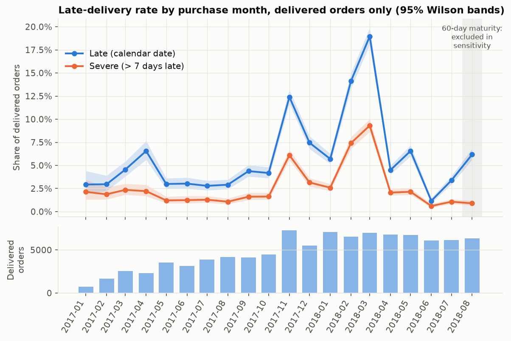
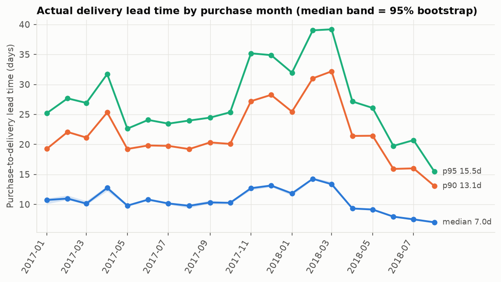
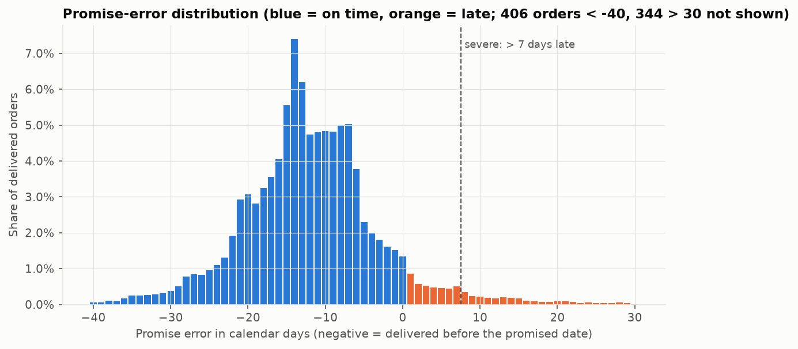
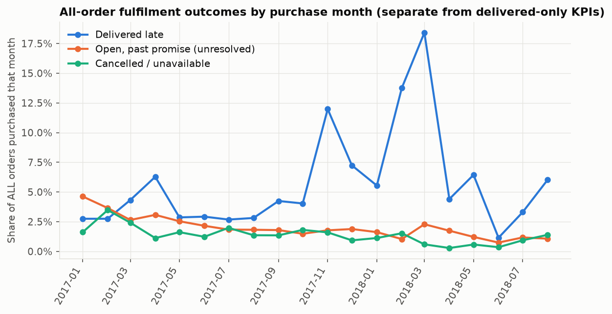
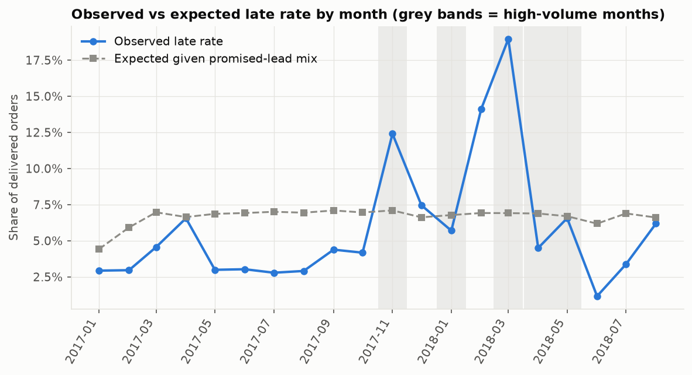
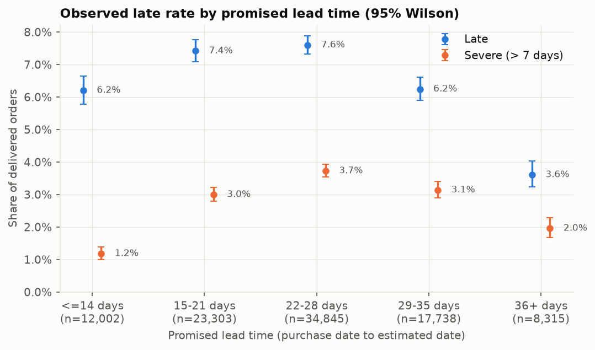
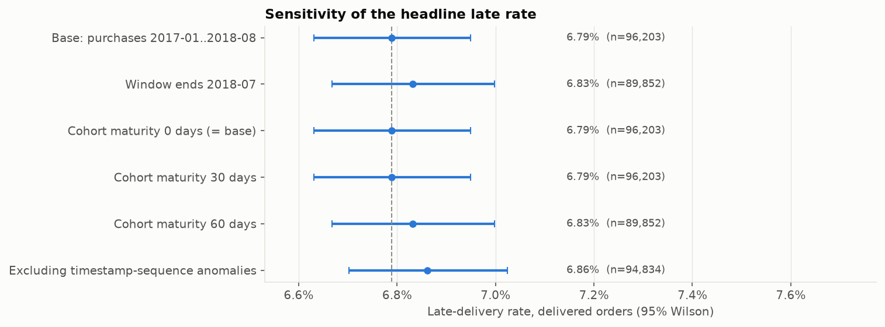

# Delivery Reliability: Findings (Workstream 1)

Generated by `analysis/build_delivery_report.py` from `analysis/delivery_reliability.py` (SQL in `sql/analysis/delivery/`) on the validated DuckDB model. Everything below is **descriptive and observational**: it shows how delivery outcomes vary, not why. No seller, geographic, satisfaction or predictive analysis is included.

Labels: **[Observed]** a computed result; **[Interpretation]** a reading of the result that goes beyond it; **[Hypothesis]** a possible explanation this analysis cannot test.

## 1. Populations and KPI definitions

- **Delivered-only population (delivery KPIs):** orders with status `delivered` and a customer-delivery timestamp, purchased 2017-01 to 2018-08: **N = 96,203** (the established model population `is_delivery_kpi_eligible`; nothing was redefined).
- **All-order population (fulfilment outcomes):** every order purchased in the same window: **N = 99,092**. Delivered-only KPIs and all-order outcomes are reported separately and never blended.
- Reference date for 'past promise': 2018-10-17 (latest observed event timestamp in the extract).

| KPI | Definition | Notes |
|---|---|---|
| Late-delivery rate | `DATE(delivered) > estimated date` / delivered-only orders | Calendar-date rule; Wilson 95% intervals |
| Severe-late rate | promise error > 7 calendar days / delivered-only orders | Equals band '8+' (> 7 days late) |
| Lead time | purchase timestamp to customer-delivery timestamp, fractional days; median, p90, p95 | Seeded bootstrap 95% intervals (orders resampled independently) |
| Promise error | `DATE(delivered) - estimated date`, signed days; negative = early | Promise slack = -error for on-time orders |
| Promised lead time | estimated date - purchase date, days | Groups fixed before looking at outcomes: <=14, 15-21, 22-28, 29-35, 36+ |
| Fulfilment class share | class count / all window orders | Six mutually exclusive classes (blueprint R9) |
| High-volume month | top 5 of 20 cohort months by delivered-order count (top quartile) | Rule fixed in advance |
| Expected late rate | month's orders x pooled late rate of their promised-lead group | Indirect standardisation; observed/expected = O/E |

## 2. Headline results

| Measure | Value | 95% interval |
|---|---|---|
| Late-delivery rate (calendar date) | 6.79% (6,531 / 96,203) | [6.63%, 6.95%] |
| Severe-late rate (> 7 days) | 2.97% (2,860) | [2.87%, 3.08%] |
| Severe orders as share of late orders | 43.8% |  |
| Median lead time | 10.21 days | [10.17, 10.26] |
| p90 lead time | 23.06 days | [22.93, 23.17] |
| p95 lead time | 29.22 days | [29.03, 29.51] |
| Median promised lead time | 24 days |  |
| Late rate by exact timestamp (sensitivity only) | 8.13% | Counts any delivery after midnight of the promised day |

**[Observed]** About 6.8% of delivered orders arrive after the promised calendar date and 3.0% arrive more than a week late. The pooled rate hides large month-to-month variation: cohort rates range from 1.2% to 19.0% (Section 3).

## 3. Late rate by purchase-month cohort



| Cohort | Delivered | Late | Late rate [95% Wilson] | Severe rate | Median / p90 / p95 lead (d) | Median promise (d) | O/E | Mature at 60 d |
|---|---|---|---|---|---|---|---|---|
| 2017-01 | 750 | 22 | 2.93% [1.94%, 4.40%] | 2.13% | 10.7 / 19.3 / 25.2 | 39 | 0.66 | yes |
| 2017-02 | 1,653 | 49 | 2.96% [2.25%, 3.90%] | 1.88% | 11.0 / 22.1 / 27.7 | 31 | 0.50 | yes |
| 2017-03 | 2,546 | 116 | 4.56% [3.81%, 5.44%] | 2.36% | 10.1 / 21.1 / 26.9 | 23 | 0.65 | yes |
| 2017-04 | 2,303 | 151 | 6.56% [5.62%, 7.64%] | 2.21% | 12.7 / 25.3 / 31.7 | 26 | 0.99 | yes |
| 2017-05 | 3,545 | 106 | 2.99% [2.48%, 3.60%] | 1.21% | 9.8 / 19.2 / 22.6 | 24 | 0.44 | yes |
| 2017-06 | 3,135 | 95 | 3.03% [2.49%, 3.69%] | 1.24% | 10.8 / 19.8 / 24.1 | 24 | 0.44 | yes |
| 2017-07 | 3,872 | 108 | 2.79% [2.32%, 3.36%] | 1.29% | 10.2 / 19.8 / 23.5 | 24 | 0.40 | yes |
| 2017-08 | 4,193 | 122 | 2.91% [2.44%, 3.46%] | 1.07% | 9.8 / 19.2 / 24.0 | 23 | 0.42 | yes |
| 2017-09 | 4,150 | 182 | 4.39% [3.80%, 5.05%] | 1.61% | 10.3 / 20.3 / 24.5 | 23 | 0.62 | yes |
| 2017-10 | 4,478 | 187 | 4.18% [3.63%, 4.80%] | 1.63% | 10.3 / 20.1 / 25.4 | 23 | 0.60 | yes |
| 2017-11 | 7,288 | 904 | 12.40% [11.67%, 13.18%] | 6.11% | 12.7 / 27.2 / 35.2 | 23 | 1.75 | yes |
| 2017-12 | 5,513 | 411 | 7.46% [6.79%, 8.18%] | 3.16% | 13.1 / 28.3 / 34.9 | 28 | 1.13 | yes |
| 2018-01 | 7,069 | 403 | 5.70% [5.18%, 6.27%] | 2.59% | 11.8 / 25.5 / 32.0 | 26 | 0.84 | yes |
| 2018-02 | 6,555 | 926 | 14.13% [13.30%, 14.99%] | 7.41% | 14.3 / 31.0 / 39.0 | 25 | 2.04 | yes |
| 2018-03 | 7,003 | 1,328 | 18.96% [18.06%, 19.90%] | 9.31% | 13.4 / 32.2 / 39.2 | 22 | 2.74 | yes |
| 2018-04 | 6,798 | 306 | 4.50% [4.03%, 5.02%] | 2.06% | 9.3 / 21.4 / 27.2 | 24 | 0.65 | yes |
| 2018-05 | 6,749 | 443 | 6.56% [6.00%, 7.18%] | 2.15% | 9.1 / 21.4 / 26.1 | 22 | 0.98 | yes |
| 2018-06 | 6,096 | 71 | 1.16% [0.92%, 1.47%] | 0.61% | 8.0 / 15.9 / 19.8 | 28 | 0.19 | yes |
| 2018-07 | 6,156 | 208 | 3.38% [2.96%, 3.86%] | 1.07% | 7.5 / 16.0 / 20.7 | 20 | 0.49 | yes |
| 2018-08 | 6,351 | 393 | 6.19% [5.62%, 6.81%] | 0.90% | 7.0 / 13.1 / 15.5 | 14 | 0.94 | no |

**[Observed]** Three cohorts stand well apart from the rest: 2018-03, 2018-02, 2017-11. Their rates are clearly separated (Wilson lower bounds above every other month's upper bound). Together they hold 21.7% of delivered orders but 48.4% of all late orders. The other 17 cohorts together have a late rate of 4.48% (individual months 1.2% to 7.5%).

**[Observed]** The lowest cohort is 2018-06 (1.16%). From 2018-07 to 2018-08 the late rate rises again (3.38% to 6.19%) while the severe rate stays near 1% (1.07% to 0.90%).

**[Interpretation]** Delivery lateness in this data is episodic rather than steady: a few cohorts drive roughly half of all late deliveries. The cause of those episodes is not identifiable from these data **[Hypothesis]**: demand peaks, carrier or capacity problems and changes to promise setting are all candidates.

## 4. Lead time



**[Observed]** Overall median lead time is 10.2 days, p90 23.1 and p95 29.2. Cohort medians range from 7.0 to 14.3 days. The slow tail follows the late-rate episodes: p95 peaks at 39.2 days (2018-03). After the 2018-03 peak, median and p95 fall cohort by cohort: the 2018-08 cohort has median 7.0 and p95 15.5 days.

**[Interpretation]** The fall in 2018-07/08 is partly uncertain: the latest cohorts have had only 47 to 77 days (2018-08 purchases) to be delivered before the extract ended, so the slowest orders may not yet be observed. This cannot explain the decline in the *median* (which is driven by ordinary deliveries), but it could contribute to the p95/p90 decline in the last cohorts. Bootstrap intervals treat orders as independent, so they understate uncertainty from clustering by customer.

## 5. Promise error and earliness



**[Observed]** The median order arrives **12 days before** the promised date (p25 -17, p75 -7; p5 -26, p95 3). 91.9% of delivered orders arrive before the promised day, 1.3% on it, 78.9% at least 7 days early and 43.5% at least 14 days early. Among on-time orders the median slack is 13 days (interquartile range 8 to 17). The median order takes 44% of its promised lead time.

**[Interpretation]** Estimated delivery dates carry a large buffer for typical orders. The same buffer is not enough in the episodic late cohorts: the promised-lead mix was stable across months (expected late rate given the mix stays between 6.2% and 7.1% from 2017-04 onward, Figure 6), so promises did not become more conservative when deliveries slowed.

## 6. Severe lateness (> 7 calendar days late)

| Band | Orders | Share of delivered |
|---|---|---|
| 1-3 days late | 1,869 | 1.94% |
| 4-7 days late | 1,802 | 1.87% |
| 8+ days late (severe) | 2,860 | 2.97% |

**[Observed]** Late orders are a mix of shallow and deep delays: the median late order is 7 days late, p90 is 22 days, and 43.8% of late orders are severe (maximum 188 days). The severe-late rate follows the same cohort pattern as the late rate (peak 9.3% in 2018-03).

## 7. All-order fulfilment outcomes (separate from delivered-only KPIs)



| Outcome class | Orders | Share of all window orders |
|---|---|---|
| Delivered on time | 89,672 | 90.49% |
| Delivered late | 6,531 | 6.59% |
| Cancelled / unavailable | 1,182 | 1.19% |
| Open (non-terminal status), past promised date | 1,699 | 1.71% |
| Open, not yet due | 0 | 0.00% |
| Status delivered, no delivery date | 8 | 0.01% |

Original statuses behind the unresolved classes: open past promise: shipped 1,097, processing 299, invoiced 296, created 5, approved 2; cancelled/unavailable: unavailable 602, canceled 580.

**[Observed]** 2.9% of window orders (2,881) never reached a delivered state by the extract date: 1,182 cancelled or unavailable and 1,699 still in an open status although the promised date had passed. No window order is open and not yet due. Monthly shares stay between 0.3% and 3.5% (cancelled/unavailable, highest in 2017-02) and between 0.7% and 4.6% (open past promise, highest in 2017-01); neither shows the spikes seen in the late rate in 2017-11, 2018-02 and 2018-03.

**Unresolved orders are not confirmed failures.** An open status at the extract date does not show that delivery failed: the data cannot distinguish stalled shipments from orders whose status was never updated, and cancelled orders were never expected to be delivered. The illustrative scenario below only shows how sensitive the delivered-only late rate is to what those open orders might be; it is **not an estimate**.

| Scenario for the 1,699 open orders (cancelled/unavailable excluded) | Late rate |
|---|---|
| No open past-promise order was late | 6.67% |
| Observed (delivered-only) | 6.79% |
| Every open past-promise order was late (extreme bound) | 8.41% |

**[Interpretation]** The delivered-only rate is a conditional observed rate. Whatever happened to the open orders, the rate over delivered plus open orders would lie between 0.1 points below and 1.6 points above the observed rate; the upper figure rests on an extreme assumption. The direction and size of any real difference are unknown.

## 8. Do high-volume months and promised-lead groups differ in observed late rate?

### 8.1 High-volume purchase months



| Group | Delivered | Late | Late rate [95% Wilson] | O/E given promised mix |
|---|---|---|---|---|
| High-volume (2017-11, 2018-01, 2018-03, 2018-04, 2018-05) | 34,907 | 3,384 | 9.69% [9.39%, 10.01%] | 1.41 |
| Other 15 months | 61,296 | 3,147 | 5.13% [4.96%, 5.31%] | 0.76 |

**[Observed]** High-volume months have a higher pooled late rate (9.7% vs 5.1%; difference 4.6 points, Newcombe 95% interval 4.2 to 4.9). Peak month 2017-11 (7,288 delivered orders) had 12.4% late versus 6.0% in the adjacent months 2017-10 and 2017-12 (difference 6.4 points, interval 5.5 to 7.3). Across the 20 cohorts, monthly volume and late rate are moderately rank-correlated (Spearman 0.57).

**[Interpretation]** The volume pattern is an association with limited evidential weight. (a) The intervals treat orders as independent; the unit that varies is the month (n = 20), so they are too narrow for a month-level claim. (b) Volume rose steadily over the window, so it is confounded with calendar time and marketplace growth. (c) The high-volume group is heterogeneous: the five months' late rates are 2017-11 12.4%, 2018-01 5.7%, 2018-03 19.0%, 2018-04 4.5%, 2018-05 6.6%. Months with similar volume (2018-06 to 2018-08) had very different late rates, and 2018-02, the second-highest late rate, is not in the high-volume group. Volume alone does not explain the episodes. (d) The promised-lead mix does not explain them either: the expected rate given that mix is flat at about 7% while observed monthly rates range from 1% to 19%. All of this is association; no mechanism is tested.

### 8.2 Promised lead-time groups



| Promised lead | Delivered | Late rate [95% Wilson] | Severe rate [95% Wilson] | Median lead (d) | Median promise error (d) |
|---|---|---|---|---|---|
| <=14 days | 12,002 | 6.21% [5.79%, 6.65%] | 1.18% [1.00%, 1.39%] | 4.9 | -7 |
| 15-21 days | 23,303 | 7.42% [7.09%, 7.76%] | 3.00% [2.79%, 3.23%] | 8.0 | -10 |
| 22-28 days | 34,845 | 7.60% [7.33%, 7.89%] | 3.73% [3.53%, 3.93%] | 11.2 | -14 |
| 29-35 days | 17,738 | 6.25% [5.90%, 6.61%] | 3.14% [2.89%, 3.41%] | 14.1 | -17 |
| 36+ days | 8,315 | 3.61% [3.23%, 4.03%] | 1.96% [1.68%, 2.28%] | 15.3 | -25 |

**[Observed]** The late rate is **not monotone** in promised lead time: it is 6.2% for the shortest promises (<=14 days), peaks at 7.6% for 22-28 days, and is lowest (3.6%) for 36+ days (shortest minus longest: 2.6 points, interval 2.0 to 3.2). The severe rate is lowest for the shortest promises.

**[Interpretation]** The hypothesis that short promises are missed more often is **not supported** by the observed rates. Promised lead time is likely a proxy for other things (the distance a parcel must travel, region, product type), which this workstream did not examine **[Hypothesis]**. The lowest late rate in the 36+ day group may reflect a larger buffer (median early margin grows from 7 days in the shortest group to 25 days in the longest) **[Hypothesis]**, but the 22-28 day group has a bigger margin (14 days) than the shortest group and a higher late rate, so buffer size alone is not a sufficient explanation.

## 9. Sensitivity checks



| Variant | Delivered | Late rate [95% Wilson] | Change vs base (pp) | Severe rate | Median / p95 lead (d) |
|---|---|---|---|---|---|
| Base: purchases 2017-01..2018-08 | 96,203 | 6.79% [6.63%, 6.95%] | +0.00 | 2.97% | 10.21 / 29.22 |
| Window ends 2018-07 | 89,852 | 6.83% [6.67%, 7.00%] | +0.04 | 3.12% | 10.62 / 30.00 |
| Cohort maturity 0 days (= base) | 96,203 | 6.79% [6.63%, 6.95%] | +0.00 | 2.97% | 10.21 / 29.22 |
| Cohort maturity 30 days | 96,203 | 6.79% [6.63%, 6.95%] | +0.00 | 2.97% | 10.21 / 29.22 |
| Cohort maturity 60 days | 89,852 | 6.83% [6.67%, 7.00%] | +0.04 | 3.12% | 10.62 / 30.00 |
| Excluding timestamp-sequence anomalies | 94,834 | 6.86% [6.70%, 7.02%] | +0.07 | 3.01% | 10.26 / 29.31 |

**[Observed]** No variant moves the pooled late rate by more than 0.07 percentage points; every interval overlaps the base interval. The 0-day and 30-day maturity thresholds select the same cohorts as the base (the last cohort, 2018-08, ended 47 days before the extract end); the 60-day threshold drops 2018-08 and equals the 'window ends 2018-07' variant. Excluding the 1,369 delivered orders with flagged timestamp-sequence anomalies changes the rate by +0.07 points; these anomalies concern the carrier leg, not the purchase and delivery timestamps used here.

**[Interpretation]** The pooled headline is robust to these choices. The sensitivity thresholds are assumptions, not proof that recent cohorts are completely observed. Sensitivity checks were run on the pooled rate; the 2018-07/08 monthly values remain the least certain.

## 10. Key findings

1. **[Observed]** 6.8% of delivered orders are late by calendar date (6,531 of 96,203; 95% interval [6.63%, 6.95%]); 3.0% are more than 7 days late.
2. **[Observed]** Lateness is concentrated in time: 2018-03, 2018-02, 2017-11 account for 48% of late orders from 22% of delivered orders; the other 17 cohorts average 4.5%.
3. **[Observed]** The typical order is early: median 12 days before the promised date; median lead time 10.2 days against a median promise of 24.
4. **[Observed]** 2.9% of orders never reached delivered status (1.2% cancelled/unavailable, 1.7% open past promise). These are not counted as delivery failures.
5. **[Observed]** High-volume months have a higher pooled late rate, but volume is confounded with time and the relationship is inconsistent across months; promised-lead mix does not explain the variation; shorter promises are not associated with more lateness.
6. **[Observed]** The headline late rate is stable (within about 0.1 pp) across the window, maturity and anomaly sensitivities.

**Status of the blueprint hypotheses for this workstream**

| Hypothesis | Status | Basis |
|---|---|---|
| H1.1 Late rate is higher in peak-demand months | Partly supported (association) | 2017-11: 12.4% vs 6.0% in adjacent months; but the highest cohorts (2018-02, 2018-03) are not the highest-volume months, and volume is confounded with time |
| H1.2 Short promises are missed more often | Not supported | Late rate 6.2% (<=14 d) vs 7.6% (22-28 d) vs 3.6% (36+ d); not monotone |
| H1.3 Recent cohorts not comparable with mature ones | Not resolved | Pooled rate insensitive to maturity thresholds; the 2018-07/08 monthly p95 and severe rates may be affected by incomplete observation |
| H1.4 Purchase weekday relates to lateness | Not analysed | Low-priority exploratory hypothesis |

## 11. Uncertainty

- Wilson and Newcombe intervals assume independent orders. Orders cluster within customers, sellers, regions and calendar days, so true uncertainty is larger, especially for month-level comparisons.
- Bootstrap intervals (1,000 resamples overall, 500 per month, seed 20240901) resample orders independently.
- Month-level patterns rest on 20 cohorts; correlations across months are descriptive, not inferential.
- Delivered-only rates are conditional on observed delivery; the open-order scenario (Section 7) shows sensitivity, not an estimate.

## 12. Business implications (what these data support)

1. **Treat delivery reliability as an episode-management problem.** Roughly half of late orders sit in three cohorts. Monitoring monthly late and severe-late rates with control limits, and reviewing capacity and carrier performance ahead of known peaks (e.g. November), is more targeted than a uniform improvement programme. Whether those episodes had operational causes needs operations data not present here.
2. **The promise appears generous for typical orders but did not adapt to slow periods.** Median early margin is 12 days, yet during the worst cohorts the promised lead times looked like other months. A promise that widens when lead-time p90/p95 rise would be one option to evaluate; shortening promises generally would raise the late rate unless the slow tail is controlled. This is a hypothesis to test, not a finding.
3. **Follow up the unresolved orders.** 1,699 open orders past their promised date and 1,182 cancelled/unavailable orders are 2.9% of orders. Operations should establish the true status of the open ones before they are counted as failures, and understand the reasons for cancellation/unavailability.
4. **Watch the 2018-08 cohort.** Late rate rose to 6.2% while promised lead times shortened (median 14 days vs 20 in July). Whether tighter promises, incomplete observation or real slippage explain it cannot be determined here.
5. **Next step (not done here):** examine whether the episodes concentrate in particular regions or sellers (Workstream 2).

## 13. Limitations

- Conditional on delivery: cancelled, unavailable and open orders are outside delivery KPIs (Section 7).
- Observational only: no causal conclusion about volume, promises, carriers or sellers is drawn.
- Right-censoring in the latest cohorts; the 30/60-day maturity thresholds are sensitivity assumptions.
- Time zones of timestamps are undocumented; calendar-date lateness assumes comparable dates.
- 1,369 delivered window orders have timestamp-sequence anomalies (retained in primary KPIs; excluded in the sensitivity).
- Promised-lead groups and the high-volume rule were fixed before examining outcomes, but their edges are judgement-based.
- Single marketplace, 2017-2018 data; findings describe this dataset, not current operations.
- Weekday of purchase (blueprint hypothesis H1.4, low priority) was not analysed.

## 14. Validation and tests

- Full test run (`python -m pytest`): **60 passed in 17.86s** (exit code 0); 60 of 60 cases passed.
- Every primary SQL result (monthly counts, quantiles, promise-error distribution, severity bands, fulfilment classes, promised-lead groups, standardisation, high-volume rule, all six sensitivity variants) is recomputed independently in pandas from the raw CSVs and compared in `tests/test_delivery_reliability.py`; Wilson intervals are compared with SciPy, Newcombe with a published example.
- **Model defect found and fixed during this workstream:** `ts_sequence_violation` and `carrier_leg_unreliable` were NULL (not FALSE) for orders with missing timestamps, so `WHERE NOT ts_sequence_violation` silently dropped 15 delivered orders and every non-delivered order. The established TRUE counts (1,382) and all populations were unaffected; the flags are now coalesced to FALSE, a regression test and a build assertion were added, and the model was rebuilt (34 build assertions, all established anchors unchanged).

| Test | Result |
|---|---|
| test_data_model::test_all_build_assertions_pass | PASS |
| test_data_model::test_staging_row_counts_match_profile | PASS |
| test_data_model::test_fact_table_grains | PASS |
| test_data_model::test_multi_seller_orders | PASS |
| test_data_model::test_delivered_populations | PASS |
| test_data_model::test_late_rate_calendar_and_exact | PASS |
| test_data_model::test_timestamp_anomalies_preserved_not_deleted | PASS |
| test_data_model::test_anomaly_flags_are_never_null | PASS |
| test_data_model::test_window_late_rate_is_stable_vs_all_months | PASS |
| test_data_model::test_six_mutually_exclusive_fulfilment_classes | PASS |
| test_data_model::test_cancelled_unavailable_never_overdue | PASS |
| test_data_model::test_original_order_status_preserved_for_open_orders | PASS |
| test_data_model::test_reference_date_is_extract_end | PASS |
| test_data_model::test_review_score_only_when_exactly_one_row | PASS |
| test_data_model::test_review_populations_all_months | PASS |
| test_data_model::test_review_kpi_anchors_all_months | PASS |
| test_data_model::test_review_window_populations_partition | PASS |
| test_data_model::test_single_seller_view | PASS |
| test_data_model::test_state_volume_thresholds | PASS |
| test_data_model::test_macro_region_mapping | PASS |
| test_data_model::test_geolocation_aggregation_prevents_row_multiplication | PASS |
| test_data_model::test_distance_formula_against_known_pair | PASS |
| test_data_model::test_distance_coverage_close_to_feasibility | PASS |
| test_data_model::test_severe_late_and_band_consistency | PASS |
| test_data_model::test_null_and_range_edge_cases | PASS |
| test_data_model::test_pandas_parity_counts | PASS |
| test_data_model::test_pandas_parity_seller_thresholds_and_states | PASS |
| test_data_model::test_pandas_parity_fulfilment_classes | PASS |
| test_data_model::test_pandas_parity_rates_and_scores | PASS |
| test_data_model::test_pandas_parity_order_distance | PASS |
| test_data_model::test_cross_state_flag_matches_pandas | PASS |
| test_data_model::test_rebuild_is_deterministic | PASS |
| test_delivery_reliability::test_wilson_matches_scipy[0-10] | PASS |
| test_delivery_reliability::test_wilson_matches_scipy[5-10] | PASS |
| test_delivery_reliability::test_wilson_matches_scipy[10-10] | PASS |
| test_delivery_reliability::test_wilson_matches_scipy[81-263] | PASS |
| test_delivery_reliability::test_wilson_matches_scipy[6531-96203] | PASS |
| test_delivery_reliability::test_wilson_matches_scipy[1-1000] | PASS |
| test_delivery_reliability::test_wilson_edge_cases | PASS |
| test_delivery_reliability::test_newcombe_published_example | PASS |
| test_delivery_reliability::test_bootstrap_is_seeded_and_brackets_estimate | PASS |
| test_delivery_reliability::test_base_population_and_overall | PASS |
| test_delivery_reliability::test_monthly_kpis_match_pandas | PASS |
| test_delivery_reliability::test_overall_lead_time_quantiles | PASS |
| test_delivery_reliability::test_promise_error_distribution_and_summary | PASS |
| test_delivery_reliability::test_severity_bands_partition | PASS |
| test_delivery_reliability::test_fulfilment_outcomes_match_pandas_and_stay_separate | PASS |
| test_delivery_reliability::test_scenario_bounds_are_ordered_and_labelled_as_bounds | PASS |
| test_delivery_reliability::test_promised_lead_groups_match_pandas | PASS |
| test_delivery_reliability::test_standardisation_identity_and_independent_expected | PASS |
| test_delivery_reliability::test_high_volume_rule_and_comparison | PASS |
| test_delivery_reliability::test_sensitivity_variants_match_pandas[Base: purchases 2017-01..2018-08-override0] | PASS |
| test_delivery_reliability::test_sensitivity_variants_match_pandas[Window ends 2018-07-override1] | PASS |
| test_delivery_reliability::test_sensitivity_variants_match_pandas[Cohort maturity 0 days (= base)-override2] | PASS |
| test_delivery_reliability::test_sensitivity_variants_match_pandas[Cohort maturity 30 days-override3] | PASS |
| test_delivery_reliability::test_sensitivity_variants_match_pandas[Cohort maturity 60 days-override4] | PASS |
| test_delivery_reliability::test_sensitivity_variants_match_pandas[Excluding timestamp-sequence anomalies-override5] | PASS |
| test_delivery_reliability::test_sensitivity_anchor_counts | PASS |
| test_delivery_reliability::test_anomaly_exclusion_keeps_non_delivered_orders | PASS |
| test_delivery_reliability::test_outputs_written_and_figures_nonempty | PASS |

## 15. Reproduction

```
python scripts/build_model.py
python analysis/delivery_reliability.py      # tables, figures, stats JSON
python analysis/build_delivery_report.py      # this report
```
SQL: `sql/analysis/delivery/*.sql`; tables: `reports/tables/delivery_*.csv`; figures: `reports/figures/delivery_*.png`; stats: `reports/delivery_reliability_stats.json`.

