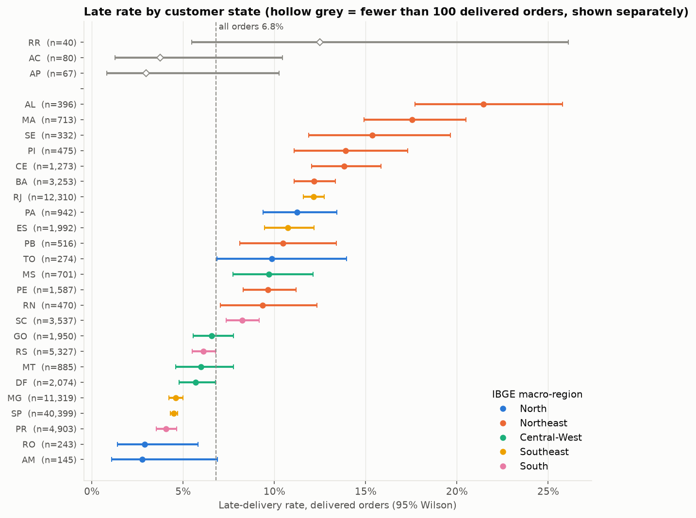
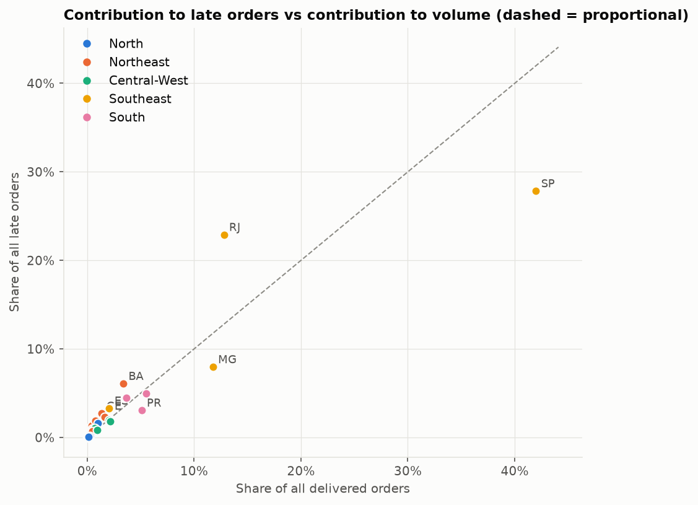
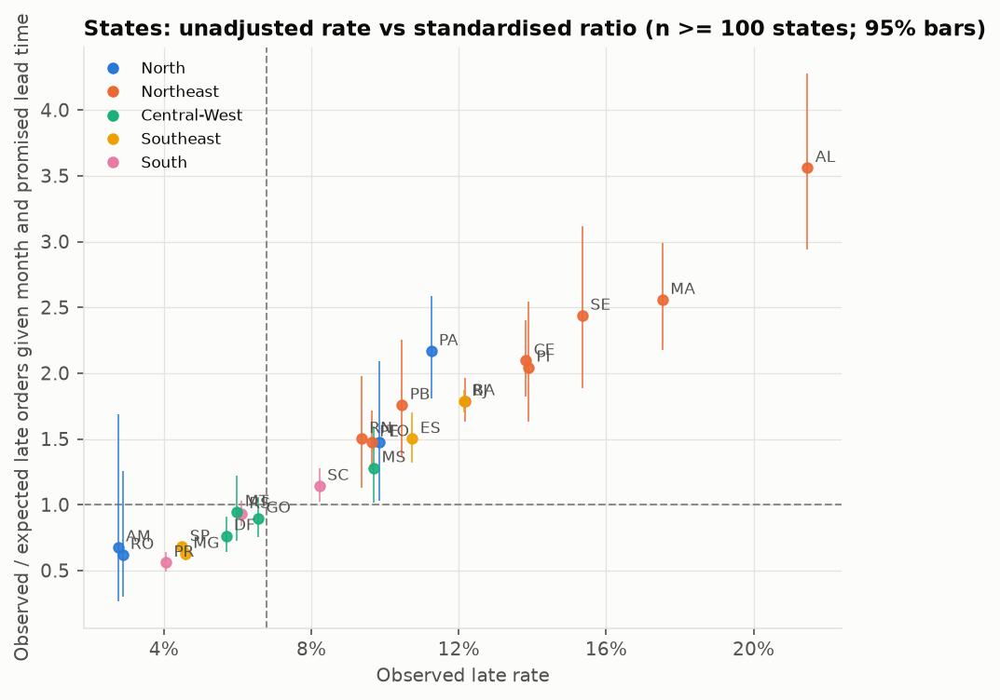
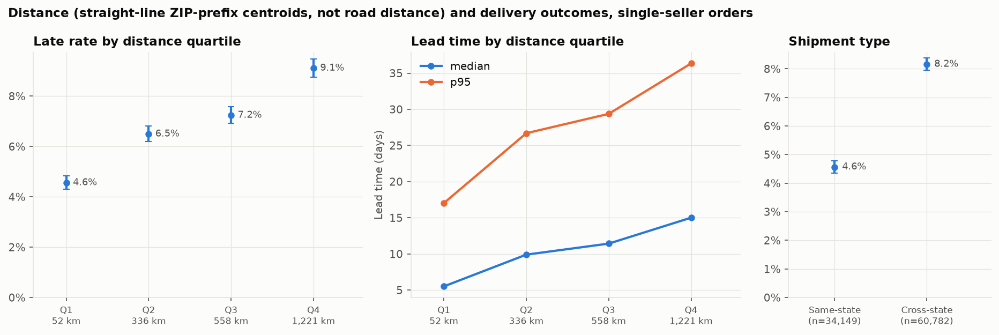
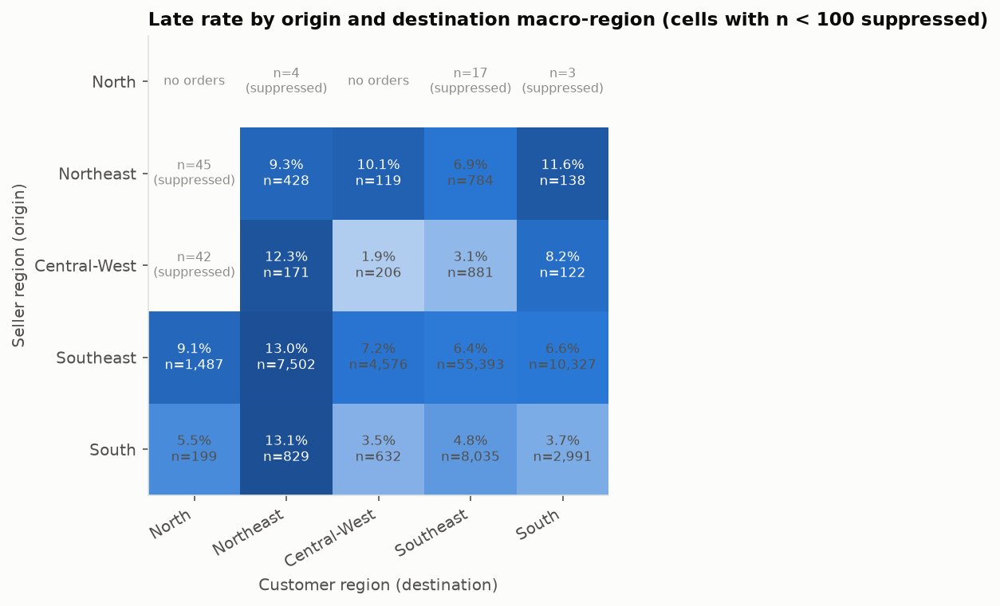
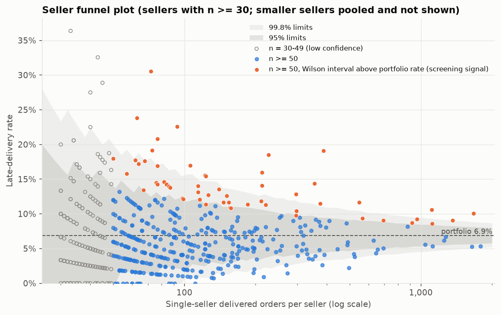
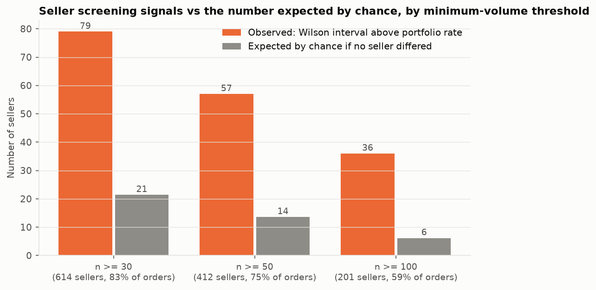
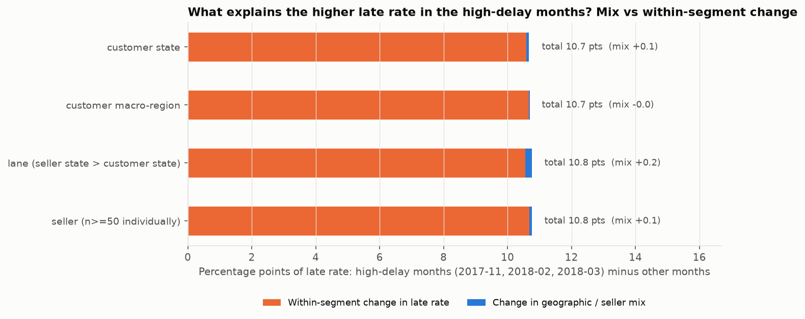

# Geographic and Seller Performance: Findings (Workstream 2)

Generated by `analysis/build_geographic_seller_report.py` from `analysis/geographic_seller.py` (SQL in `sql/analysis/geography/`) on the validated DuckDB model. Everything below is **descriptive screening**: it shows where late deliveries concentrate, not why, and **it does not attribute delays to sellers or regions**. No operational priority tiers, dashboards, NLP or predictive models are included.

Labels: **[Observed]** a computed result; **[Interpretation]** a reading that goes beyond it; **[Hypothesis]** a possible explanation this analysis cannot test.

## Summary

- **[Observed] Geography matters a lot.** Late rates run from 2.8% to 21.5% across the 24 reportable states. Northeast states are the five highest (AL, MA, SE, PI, CE); São Paulo is the lowest large state (4.5%). Rio de Janeiro (12,310 orders, 12.1% late) supplies 23% of all late orders from 13% of orders. The state ranking barely changes after standardising for purchase month and promised lead time (rank correlation 0.97).
- **[Observed] Distance and cross-state shipping go with later and more late deliveries.** Cross-state shipments are late 8.2% of the time vs 4.6% for same-state; after stratifying by month and promised lead time the risk ratio is 2.37 [2.20, 2.56], and 1.90 when stratifying by destination state and promised lead time instead. Distance is a straight-line ZIP-prefix approximation, not road distance.
- **[Observed] Seller screening signals exceed chance but are not proof.** Of 412 sellers with n >= 50 orders, 57 have a Wilson interval entirely above the portfolio rate; about 14 would be expected by chance if no seller differed. 37 remain above the rate expected from their own month, promised-lead and distance mix. Seller late rates are only moderately persistent between window halves (rank correlation 0.35).
- **[Observed] The high-delay months were broad-based, not a mix shift.** The late rate in 2017-11, 2018-02 and 2018-03 was 15.1% vs 4.5% in other months. At most 0.2 points of the 10.7-point gap is explained by changes in state, lane or seller mix; the rate rose in all 18 comparable states and in 139 of 152 comparable sellers.
- **Not established:** that any seller or region *causes* late deliveries. Order-level delivery timestamps cannot separate seller handling, carrier transit and last-mile delivery.

## 1. Populations and pre-specified rules

| Analysis | Population | Orders | Late rate (reference) |
|---|---|---|---|
| State / region analysis | Delivered with date, purchases 2017-01..2018-08, all orders incl. multi-seller | 96,203 | 6.79% |
| Lanes, distance, sellers | `v_single_seller_orders` (single-seller orders only) | 94,931 | 6.87% |

- **Reporting policy (blueprint R8):** states are ranked at n >= 100 delivered orders; RR, AC, AP (187 orders in total) are shown separately and get no screening signal. Lanes are shown at n >= 100 (70 of 408 lanes, 94.6% of orders; the rest pooled). Sellers are ranked at n >= 50, labelled low-confidence at 30-49 and pooled below 30.
- **Screening signal:** the Wilson 95% interval lies entirely above the reference rate (6.79% for states, 6.87% for lanes/sellers). It is descriptive, never evidence of exceptional or poor seller performance.
- **Simple stratification (fixed in advance):** strata S1 = purchase month x promised-lead group (<=14, 15-21, 22-28, 29-35, 36+ days); S2 = S1 x distance quartile. Observed / expected (O/E) uses pooled stratum late rates; Mantel-Haenszel risk ratios compare groups within strata.
- **Distance:** straight-line distance between seller and customer ZIP-prefix median centroids (quartile cut points 184, 434 and 799 km; 471 orders without a distance form their own band). **It is an approximation, not a road distance:** prefixes are 5-digit areas with centroid error of the order of kilometres, and real routes differ.
- **High-delay months:** 2017-11, 2018-02 and 2018-03, identified in the delivery workstream.
- **Not used:** empirical-Bayes shrinkage, permutation tests and rank-stability analysis (optional methods in the blueprint that were not needed); the expected number of chance flags is computed analytically instead.

## 2. Customer state and macro-region



| State | Region | Delivered | Late | Late rate [95% Wilson] | Median / p95 lead (d) | Share of late orders | Share of orders | Excess late vs all-order rate | O/E (month x promise) | Signal |
|---|---|---|---|---|---|---|---|---|---|---|
| AL | Northeast | 396 | 85 | 21.5% [17.7%, 25.8%] | 22.3 / 46.0 | 1.3% | 0.4% | +58 | 3.56 | above |
| MA | Northeast | 713 | 125 | 17.5% [14.9%, 20.5%] | 19.2 / 41.1 | 1.9% | 0.7% | +77 | 2.56 | above |
| SE | Northeast | 332 | 51 | 15.4% [11.9%, 19.6%] | 17.9 / 42.6 | 0.8% | 0.3% | +28 | 2.44 | above |
| PI | Northeast | 475 | 66 | 13.9% [11.1%, 17.3%] | 16.3 / 37.7 | 1.0% | 0.5% | +34 | 2.04 | above |
| CE | Northeast | 1,273 | 176 | 13.8% [12.0%, 15.8%] | 18.2 / 44.6 | 2.7% | 1.3% | +90 | 2.10 | above |
| BA | Northeast | 3,253 | 396 | 12.2% [11.1%, 13.3%] | 16.9 / 36.8 | 6.1% | 3.4% | +175 | 1.79 | above |
| RJ | Southeast | 12,310 | 1,495 | 12.1% [11.6%, 12.7%] | 12.0 / 38.3 | 22.9% | 12.8% | +659 | 1.78 | above |
| PA | North | 942 | 106 | 11.3% [9.4%, 13.4%] | 21.1 / 46.8 | 1.6% | 1.0% | +42 | 2.17 | above |
| ES | Southeast | 1,992 | 214 | 10.7% [9.5%, 12.2%] | 13.6 / 30.9 | 3.3% | 2.1% | +79 | 1.50 | above |
| PB | Northeast | 516 | 54 | 10.5% [8.1%, 13.4%] | 18.2 / 40.0 | 0.8% | 0.5% | +19 | 1.76 | above |
| TO | North | 274 | 27 | 9.9% [6.9%, 14.0%] | 15.9 / 31.5 | 0.4% | 0.3% | +8 | 1.48 | above |
| MS | Central-West | 701 | 68 | 9.7% [7.7%, 12.1%] | 13.9 / 30.4 | 1.0% | 0.7% | +20 | 1.28 | above |
| PE | Northeast | 1,587 | 153 | 9.6% [8.3%, 11.2%] | 15.7 / 39.5 | 2.3% | 1.6% | +45 | 1.48 | above |
| RN | Northeast | 470 | 44 | 9.4% [7.0%, 12.3%] | 16.0 / 42.0 | 0.7% | 0.5% | +12 | 1.50 | above |
| SC | South | 3,537 | 291 | 8.2% [7.4%, 9.2%] | 13.0 / 31.0 | 4.5% | 3.7% | +51 | 1.14 | above |
| GO | Central-West | 1,950 | 128 | 6.6% [5.5%, 7.8%] | 13.9 / 29.2 | 2.0% | 2.0% | -4 | 0.90 |  |
| RS | South | 5,327 | 325 | 6.1% [5.5%, 6.8%] | 13.2 / 32.8 | 5.0% | 5.5% | -37 | 0.93 |  |
| MT | Central-West | 885 | 53 | 6.0% [4.6%, 7.8%] | 16.1 / 33.7 | 0.8% | 0.9% | -7 | 0.95 |  |
| DF | Central-West | 2,074 | 118 | 5.7% [4.8%, 6.8%] | 11.4 / 25.9 | 1.8% | 2.2% | -23 | 0.76 | below |
| MG | Southeast | 11,319 | 519 | 4.6% [4.2%, 5.0%] | 10.3 / 24.4 | 7.9% | 11.8% | -249 | 0.63 | below |
| SP | Southeast | 40,399 | 1,817 | 4.5% [4.3%, 4.7%] | 7.2 / 19.9 | 27.8% | 42.0% | -926 | 0.68 | below |
| PR | South | 4,903 | 199 | 4.1% [3.5%, 4.6%] | 10.4 / 24.7 | 3.0% | 5.1% | -134 | 0.56 | below |
| RO | North | 243 | 7 | 2.9% [1.4%, 5.8%] | 17.6 / 33.4 | 0.1% | 0.3% | -9 | 0.62 |  |
| AM | North | 145 | 4 | 2.8% [1.1%, 6.9%] | 25.9 / 41.1 | 0.1% | 0.2% | -6 | 0.68 |  |

**States with fewer than 100 delivered orders (shown separately, not ranked, no screening signal)**

| State | Region | Delivered | Late | Late rate [95% Wilson] |
|---|---|---|---|---|
| RR | North | 40 | 5 | 12.5% [5.5%, 26.1%] |
| AC | North | 80 | 3 | 3.8% [1.3%, 10.5%] |
| AP | North | 67 | 2 | 3.0% [0.8%, 10.2%] |



| Macro-region | Delivered | Late | Late rate [95% Wilson] | Median / p95 lead (d) | Share of late orders | Share of orders | O/E (month x promise) |
|---|---|---|---|---|---|---|---|
| North | 1,791 | 154 | 8.6% [7.4%, 10.0%] | 20.2 / 43.6 | 2.4% | 1.9% | 1.67 |
| Northeast | 9,015 | 1,150 | 12.8% [12.1%, 13.5%] | 17.3 / 40.5 | 17.6% | 9.4% | 1.93 |
| Central-West | 5,610 | 367 | 6.5% [5.9%, 7.2%] | 13.3 / 28.9 | 5.6% | 5.8% | 0.90 |
| Southeast | 66,020 | 4,045 | 6.1% [5.9%, 6.3%] | 8.7 / 25.2 | 61.9% | 68.6% | 0.90 |
| South | 13,767 | 815 | 5.9% [5.5%, 6.3%] | 12.1 / 29.6 | 12.5% | 14.3% | 0.85 |

**[Observed]** 15 of 24 reportable states have a Wilson interval entirely above the all-order rate and 6 entirely below; standardising for purchase month and promised lead time leaves 15 above and 4 below (15 states are above on both bases). The Northeast (12.8%) and North (8.6%) have the highest regional rates and the longest lead times; the Southeast and South are below the all-order rate. Largest contributors to excess late orders: RJ (+659), BA (+175), CE (+90), ES (+79).



**[Interpretation]** The geographic gradient is not an artefact of which months or promise lengths each state's orders fall in. It is, however, not separable from distance and shipping route (Section 3): remote states are served almost entirely from other states (see `cross_state_share` in `reports/tables/geo_states.csv`). Segments overlap (a state contains many lanes and sellers), so contributions at different levels must not be added.

## 3. Shipment lanes, shipment type and distance (single-seller orders)



| Shipment | Orders | Late rate [95% Wilson] | Median / p95 lead (d) | Median distance (km) | Median promised lead (d) |
|---|---|---|---|---|---|
| Same-state | 34,149 | 4.6% [4.3%, 4.8%] | 6.6 / 18.2 | 96 | 18 |
| Cross-state | 60,782 | 8.2% [7.9%, 8.4%] | 12.8 / 33.2 | 658 | 27 |

| Distance quartile | Orders | Median km | Late rate [95% Wilson] | Median / p95 lead (d) | Cross-state share | Median promise (d) |
|---|---|---|---|---|---|---|
| Q1 (nearest) | 23,615 | 52 | 4.6% [4.3%, 4.8%] | 5.5 / 17.0 | 4% | 16 |
| Q2 | 23,615 | 336 | 6.5% [6.2%, 6.8%] | 9.9 / 26.7 | 59% | 23 |
| Q3 | 23,615 | 558 | 7.2% [6.9%, 7.6%] | 11.4 / 29.4 | 93% | 25 |
| Q4 (farthest) | 23,615 | 1,221 | 9.1% [8.8%, 9.5%] | 15.0 / 36.4 | 100% | 30 |

**Stratified comparisons (Mantel-Haenszel risk ratios of late delivery)**

| Comparison | Crude RR | Stratified RR [95% CI] |
|---|---|---|
| Cross-state vs same-state; strata month x promised group | 1.79 | 2.37 [2.20, 2.56] |
| Cross-state vs same-state; strata customer state x promised group | 1.79 | 1.90 [1.71, 2.12] |
| Farthest vs nearest distance quartile; strata month x promised group | 2.00 | 2.85 [2.49, 3.25] |
| Farthest vs nearest distance quartile; strata customer state x promised group | 2.00 | 2.03 [1.68, 2.46] |
| São Paulo-origin vs other-origin sellers; strata customer state x promised group | 1.35 | 1.28 [1.21, 1.36] |

**[Observed]** Cross-state shipments have 2.0 times the median lead time and a late rate of 8.2% vs 4.6%, even though their median promised lead time is longer (27 vs 18 days). The late rate rises with every distance quartile (4.6% to 9.1%). Stratifying by promised lead time *raises* the cross-state risk ratio (1.79 crude to 2.37) because cross-state orders carry longer promises, which partly absorb their longer transit; comparing within destination state attenuates it to 1.90 but it stays clearly above 1 (it rests on fewer comparable strata: 26 with at least 30 orders in each group, exposed group higher in 21). Sellers in São Paulo have a higher raw late rate than other origins (7.4% vs 5.5%); within destination state and promised lead time the ratio is 1.28.

**[Interpretation]** Longer routes are associated with later deliveries even after accounting for the promised lead time, so promises do not fully compensate for distance. Distance, cross-state shipping and destination are tightly entangled (almost all of the farthest quartile is cross-state), so this analysis cannot say which of them matters; it is also silent on carriers, which are not in the data.



Lanes with n >= 100, top 12 by excess late orders over the portfolio rate (70 lanes reported; 5,109 orders in the 338 smaller lanes are pooled, with a late rate of 7.8% [7.1%, 8.6%]):

| Lane (seller>customer state) | Orders | Late | Late rate [95% Wilson] | Excess late vs portfolio | O/E (month x promise) | Median lead (d) | Median km |
|---|---|---|---|---|---|---|---|
| SP>RJ | 8,031 | 1,147 | 14.3% [13.5%, 15.1%] | +596 | 2.03 | 12.9 | 383 |
| SP>BA | 2,275 | 297 | 13.1% [11.7%, 14.5%] | +141 | 1.86 | 17.7 | 1,448 |
| SP>ES | 1,443 | 180 | 12.5% [10.9%, 14.3%] | +81 | 1.68 | 13.6 | 760 |
| SP>CE | 958 | 133 | 13.9% [11.8%, 16.2%] | +67 | 2.03 | 18.4 | 2,316 |
| SP>SC | 2,300 | 222 | 9.7% [8.5%, 10.9%] | +64 | 1.29 | 13.9 | 543 |
| SP>MA | 483 | 93 | 19.3% [16.0%, 23.0%] | +60 | 2.71 | 19.5 | 2,236 |
| PR>RJ | 948 | 117 | 12.3% [10.4%, 14.6%] | +52 | 1.73 | 14.2 | 840 |
| SP>AL | 254 | 61 | 24.0% [19.2%, 29.6%] | +44 | 3.91 | 23.1 | 1,921 |
| SP>PA | 672 | 81 | 12.1% [9.8%, 14.7%] | +35 | 2.26 | 20.9 | 2,424 |
| SP>PE | 1,122 | 111 | 9.9% [8.3%, 11.8%] | +34 | 1.50 | 16.0 | 2,103 |
| SP>PI | 326 | 54 | 16.6% [12.9%, 21.0%] | +32 | 2.35 | 16.6 | 2,078 |
| SP>MS | 471 | 59 | 12.5% [9.8%, 15.8%] | +27 | 1.56 | 14.0 | 852 |

**[Observed]** 21 of 70 reported lanes are above the portfolio rate on the stratified (month x promised lead) comparison, and 21 on the raw comparison. São Paulo to Rio de Janeiro is by far the largest source of excess late orders (+596 over the portfolio rate; 14.3% late on 8,031 orders). The macro-region grid shows the same picture: shipments into the Northeast are late 9%-13% of the time from every origin region with at least 100 orders, while shipments inside the Southeast, South and Central-West are 2%-6%.

## 4. Sellers (single-seller orders only)

| Seller tier (by single-seller delivered orders) | Sellers | Orders | Share of orders | Late rate |
|---|---|---|---|---|
| ranked (n>=50) | 412 | 71,327 | 75.1% | 6.9% |
| low-confidence (30-49) | 202 | 7,672 | 8.1% | 6.9% |
| pooled (n<30) | 2,311 | 15,932 | 16.8% | 6.8% |

Sellers below 30 orders (2,311 sellers, 15,932 orders) are pooled: their combined late rate is 6.8% [6.4%, 7.2%], and no individual rate is reported.



**[Observed]** Most sellers sit inside the funnel limits around the portfolio rate, as expected for small samples; sellers with n >= 50 have late rates from 1.7% (10th percentile) to 12.0% (90th percentile) around a median of 5.8%. 57 of 412 ranked sellers have a Wilson interval entirely above the portfolio rate and 52 entirely below.

**Sensitivity to the minimum-volume threshold**



| Minimum orders | Eligible sellers | Share of orders | Wilson interval above portfolio rate | Share of eligible | Expected by chance if no real differences | Also above own stratified expectation | Share of all late orders in flagged sellers |
|---|---|---|---|---|---|---|---|
| 30 | 614 | 83% | 79 | 13% | 21.4 | 49 | 30.7% |
| 50 | 412 | 75% | 57 | 14% | 13.6 | 37 | 28.0% |
| 100 | 201 | 59% | 36 | 18% | 6.2 | 22 | 23.9% |

**Multiple-comparison risk.** Screening hundreds of sellers guarantees some apparent outliers. If no seller differed from the portfolio rate, about 14 of the 412 ranked sellers (3.3%) would still show an interval above the rate (computed exactly from the binomial distribution; at n >= 30 about 21 of 614). The observed counts are well above these figures at every threshold, so real between-seller differences are likely; but up to roughly 24% of the n >= 50 flags could be chance alone (an upper-end figure, because it assumes no seller truly differs), and which ones cannot be known. The flagged sets are nested by construction (36 flagged at n >= 100, 57 at n >= 50, 79 at n >= 30), and the share flagged rises with volume because larger samples can detect smaller differences.

**Persistence.** For the 157 sellers with at least 30 orders in both window halves, seller late rates in the two halves have a rank correlation of 0.35: positive and well short of 1, consistent with a persistent seller-related component plus a lot of noise and the system-wide change between halves (3.7% to 8.3%). Among the 57 flagged ranked sellers, 44 have orders in both halves and 26 of those are above the half-specific portfolio rate in both.

**Concentration.** Among ranked sellers, 166 have more late orders than the portfolio rate implies; the ten largest account for 31% of that positive excess and the 25 largest for 51% (positive excess totals 1,013 late orders). Small-sample noise inflates such concentration figures, so they are an upper-end description.

**Origin.** 82% of the flagged ranked sellers are in São Paulo state, which holds 68% of ranked sellers. São Paulo-origin orders have a higher raw late rate than other origins (Section 3), only slightly reduced once destination state and promised lead time are held fixed, so the flags are not independent of where orders are shipped.

**Screening candidates: top 15 flagged sellers by excess late orders.** These are **descriptive screening signals for investigation, not tiers and not findings about seller performance**: IDs are shortened to 8 characters (full IDs in `reports/tables/geo_seller_candidates.csv`).

| Seller | State | Orders | Late | Late rate [95% Wilson] | Excess late | O/E S1 | O/E S2 | Above S2 expectation | Cross-state share | Late rate H1 / H2 |
|---|---|---|---|---|---|---|---|---|---|---|
| 4a3ca931 | SP | 1,673 | 168 | 10.0% [8.7%, 11.6%] | +53 | 1.40 | 1.41 | yes | 55% | 4.3% / 15.2% |
| 06a2c3af | MA | 388 | 74 | 19.1% [15.5%, 23.3%] | +47 | 3.54 | 2.36 | yes | 96% | - / 19.1% |
| 4869f7a5 | SP | 1,111 | 118 | 10.6% [8.9%, 12.6%] | +42 | 1.37 | 1.44 | yes | 61% | 5.3% / 12.1% |
| 1f50f920 | SP | 1,364 | 124 | 9.1% [7.7%, 10.7%] | +30 | 1.04 | 1.01 | no | 64% | 4.7% / 10.8% |
| 81602554 | SP | 355 | 51 | 14.4% [11.1%, 18.4%] | +27 | 1.39 | 1.44 | yes | 57% | 0.0% / 14.8% |
| 88460e8e | PR | 227 | 42 | 18.5% [14.0%, 24.1%] | +26 | 2.03 | 1.98 | yes | 92% | - / 18.5% |
| 7d13fca1 | SP | 548 | 64 | 11.7% [9.3%, 14.6%] | +26 | 1.35 | 1.42 | yes | 65% | - / 11.7% |
| 7c67e144 | SP | 963 | 89 | 9.2% [7.6%, 11.2%] | +23 | 1.46 | 1.96 | yes | 60% | 6.5% / 11.2% |
| e5a34388 | SP | 213 | 34 | 16.0% [11.7%, 21.5%] | +19 | 1.83 | 1.85 | yes | 56% | 6.5% / 18.6% |
| ea8482cd | SP | 1,116 | 96 | 8.6% [7.1%, 10.4%] | +19 | 0.97 | 0.92 | no | 63% | 0.0% / 9.1% |
| 855668e0 | SP | 296 | 38 | 12.8% [9.5%, 17.1%] | +18 | 1.93 | 2.07 | yes | 60% | 8.1% / 16.2% |
| 1835b56c | SP | 375 | 43 | 11.5% [8.6%, 15.1%] | +17 | 1.25 | 1.33 | no | 50% | 2.0% / 12.9% |
| 54965bbe | PR | 72 | 22 | 30.6% [21.1%, 42.0%] | +17 | 3.27 | 2.81 | yes | 94% | 0.0% / 32.4% |
| 8b321bb6 | SP | 917 | 80 | 8.7% [7.1%, 10.7%] | +17 | 0.98 | 0.95 | no | 59% | 0.0% / 8.8% |
| f7ba60f8 | SP | 213 | 30 | 14.1% [10.0%, 19.4%] | +15 | 1.78 | 1.50 | yes | 64% | 13.6% / 14.1% |

The full candidate list has 79 sellers (n >= 30); 49 of them remain above their stratified expectation (S2). O/E S1 controls for purchase month and promised lead time, S2 additionally for distance band. H1 = purchases 2017-01..2017-10, H2 = 2017-11..2018-08 (the delivery workstream showed that H2 contains the three high-delay months).

**[Interpretation]** A seller on this list has more late orders than expected for sellers of its size, month mix, promise mix (and distance mix for S2). That is a reason to look at the seller's operations; it is not evidence that the seller caused the delays: the delivery timestamp covers handling, carrier collection, transit and last mile together, and carrier-stage timestamps are unreliable for about 1.4% of orders. Customer mix beyond distance (destination states, product types) is not controlled for.

## 5. High-delay months vs other months: mix or within-segment change?



| Segmentation | Late rate, high-delay months | Late rate, other months | Difference (pts) | Due to mix (pts) | Due to within-segment rates (pts) | Other-month rate if it had high-delay mix | Segments |
|---|---|---|---|---|---|---|---|
| customer state | 15.1% | 4.5% | 10.67 | +0.08 | +10.59 | 4.47% | 25 |
| customer macro-region | 15.1% | 4.5% | 10.67 | -0.03 | +10.70 | 4.46% | 5 |
| lane (seller state > customer state) | 15.3% | 4.5% | 10.76 | +0.20 | +10.56 | 4.52% | 71 |
| seller (n>=50 individually) | 15.3% | 4.5% | 10.76 | +0.07 | +10.69 | 4.43% | 413 |

**[Observed]** The high-delay months have 20,846 delivered orders at a 15.1% late rate [14.7%, 15.6%], against 75,357 orders at 4.5% [4.3%, 4.6%]. Whatever the segmentation (customer state, region, lane or individual seller), the change in mix explains at most 0.20 points of the 10.7-point difference; the rest is higher late rates *within* the same segments. Applying the other months' rates to the high-delay months' mix would hardly change the other-month rate (4.5% vs 4.5%). The cross-state share (65.6% vs 63.6%), median distance (451 vs 429 km) and São Paulo-origin share (71% vs 71%) are almost the same.

**[Observed]** The increase is broad: in all 18 states with at least 100 orders in both groups the late rate was higher in the high-delay months (ratio 1.3x to 5.5x, median 4.2x), and for 139 of 152 sellers with at least 30 orders in both groups. The sellers' rates in the two groups are only moderately correlated (rank correlation 0.31), i.e. sellers that were relatively worse in calm months were only partly the ones that were worse in the episodes. Rio de Janeiro stands out: 31.2% late vs 6.6% in other months, and it contributes the most excess late orders in the high-delay months (+677).

**[Interpretation]** The episodes look system-wide, not caused by a shift in where orders went or which sellers shipped them. This points toward factors that affect most routes and sellers at once, such as carrier capacity or demand peaks **[Hypothesis]**; this analysis cannot test them.

## 6. What persists after simple stratification

| Pattern | Evidence | Verdict |
|---|---|---|
| State ranking | Rank correlation unadjusted vs standardised (month x promised lead) = 0.97; 15 of 15 raw signals persist | Persists |
| Cross-state vs same-state | RR 2.37 (month x promise), 1.90 (destination state x promise) | Persists (attenuated within destination state) |
| Far vs near distance | RR 2.85 (month x promise), 2.03 (destination state x promise) | Persists (attenuated) |
| São Paulo origin | crude RR 1.35, within destination x promise 1.28 | Persists, smaller |
| Lane signals | 21 stratified vs 21 raw | All raw signals persist |
| Seller signals (n >= 50) | 37 of 57 above own S2 expectation | About two thirds persist |
| High-delay months | mix explains < 0.2 pts of 10.7 | Increase is within-segment |

Strata were deliberately simple (cell counts, no model). Distance strata were not used for states because distance largely *defines* remoteness there. Residual confounding by product mix, seller size and carrier remains possible.

## 7. Status of the blueprint hypotheses

| Hypothesis | Status | Basis |
|---|---|---|
| H2.1 Late rate and lead time rise with distance and cross-state shipping; promises compensate only partly | Supported (association) | RR 2.37 cross-state, 2.85 far vs near, after stratifying by promise |
| H2.2 North/Northeast have higher late rates than SP/RJ/MG | Partly supported | Northeast 12.8%, North 8.6% (imprecise: few orders); but RJ (12.1%) is as high as BA, while SP and MG are low |
| H2.3 More sellers exceed the rate than chance explains | Supported | 57 vs about 14 expected at n >= 50 |
| H2.4 A minority of sellers accounts for a large share of excess late orders | Descriptively yes, with a noise caveat | top 10 = 31%, top 25 = 51% of positive excess |
| H2.5 Most apparent bad low-volume lanes are noise | Handled by pooling | 338 lanes below 100 orders pooled (7.8% late) |

## 8. Business implications (what these data support)

1. **Late deliveries are a destination and route problem first.** Cross-state, long-distance routes into the Northeast and Rio de Janeiro carry most of the excess. São Paulo to Rio de Janeiro alone accounts for about 596 excess late orders, and the Northeast lanes have both high rates and long lead times. Investigating carrier and last-mile performance on these lanes is better targeted than a seller-by-seller programme; the data cannot identify the cause.
2. **Promised dates for long routes may need review.** Cross-state shipments are promised 9 days longer (median) than same-state ones but are still late 1.8 times as often. Whether longer or route-specific promises would help is a hypothesis to test.
3. **Treat the seller list as a shortlist for verification.** There are more sellers above the portfolio rate than chance explains, and 37 of 57 remain above after allowing for their own month, promise and distance mix. But up to about a quarter of the flags could be chance, seller rates are only moderately persistent, and the data cannot separate seller handling from carrier performance. A fair next step is to compare flagged sellers' handling times and carrier hand-off dates (partly unreliable) with operations data, then re-check on later data.
4. **The high-delay episodes need a system-level explanation.** The rate rose in every comparable state and almost every seller, with no change in mix. Capacity and carrier hypotheses should be checked against operations records for 2017-11, 2018-02 and 2018-03.
5. **Do not rank or penalise sellers on these results.** No causal claim is made, and 2,311 sellers (17% of orders) have too few orders for any individual assessment.

## 9. Limitations

- **Association only.** No causal claim about regions, lanes or sellers; delivery timestamps are order-level, so handling, carrier and last-mile time cannot be separated, and carrier identity is not in the data.
- **Distance is approximate:** straight-line between ZIP-prefix median centroids (5-digit prefixes, centroid taken from a non-unique table, 0.5% of single-seller orders without a distance), not road distance or transit time.
- **Single-seller scope:** lane, distance and seller results cover 94,931 single-seller orders (98.7% of delivered orders); multi-seller orders are excluded, not allocated. State and region results include all delivered orders.
- **Conditional on delivery:** cancelled, unavailable and open orders are outside these KPIs (delivery workstream, Section 7); regions or sellers with more such orders would look better than they are.
- **Uncertainty:** Wilson intervals assume independent orders; orders cluster within sellers, destinations and days, so true uncertainty is larger, especially for states. Signals are not corrected for multiple comparisons beyond the chance-expectation reported.
- **Segments overlap** (state, lane, seller): excess late orders at different levels must not be summed.
- **Stratification is simple by design** (cell counts); product mix, order value, seller size and carrier are not controlled.
- **Timestamp quirks:** 1,369 delivered window orders have timestamp-sequence anomalies (kept; they do not affect purchase-to-delivery timing).
- Single marketplace, 2017-2018; findings describe this dataset.

## 10. Unresolved questions

1. Which carrier handles each lane, and do carrier differences explain the Northeast / Rio de Janeiro pattern?
2. How are estimated delivery dates set, and are they route-specific? Is the longer promise for cross-state shipments calibrated to observed lead times?
3. For flagged sellers, how much of the delay is before carrier hand-off (seller handling) versus after (carrier)? Carrier-stage timestamps are unreliable for about 1.4% of orders and untested elsewhere.
4. What was different system-wide in 2017-11, 2018-02 and 2018-03 (carrier capacity, promotions, strikes, stock-outs)?
5. Do flagged sellers stay flagged on newer data? Only a split-window check was possible here.
6. How do cancelled/unavailable and open past-promise orders distribute by state and seller? Not analysed here.

## 11. Validation, defects and deviations

- Full test run (`python -m pytest`): **113 passed in 81.82s (0:01:21)** (exit code 0); 113 of 113 cases passed.
- All primary SQL aggregations (states, regions, lanes, distance bands, shipment types, seller counts, half-window counts, period counts) are recomputed independently in pandas from the raw CSVs, including an independent haversine distance and seller attribution. Wilson intervals are compared with SciPy; Mantel-Haenszel risk ratios with statsmodels `StratifiedTable.riskratio_pooled` (point estimate) and with a parametric bootstrap (variance); the expected number of chance flags with a Monte Carlo simulation; funnel limits by simulated coverage; the decomposition on synthetic data with known composition-only and within-only changes.
- **Defect found and fixed:** `seller_summary.sql` returned NULL instead of 0 for a seller's late count in a window half in which the seller had no orders. It did not change any reported figure (downstream rates guard against zero counts), but the independent test flagged the discrepancy and the SQL now uses `coalesce`.
- **Methodological choices to note:** (a) the reference rate for lanes and sellers is the single-seller population rate (6.87%), slightly above the all-order rate (6.79%); (b) expected late orders use stratum rates pooled over the same population, so they are indirect-standardisation reference values, not external benchmarks; (c) the half-window persistence check and Mantel-Haenszel comparisons go beyond the blueprint's minimal toolkit but add no model fitting; (d) chance-flag expectations are analytic, replacing optional permutation tests; (e) no empirical-Bayes shrinkage; (f) no operational priority tiers.
- **No change** was made to the data model or earlier analyses in this workstream.

| Test | Result |
|---|---|
| test_customer_satisfaction::test_populations_match_pandas | PASS |
| test_customer_satisfaction::test_group_summary_matches_pandas[P0-<lambda>] | PASS |
| test_customer_satisfaction::test_group_summary_matches_pandas[P1:-<lambda>] | PASS |
| test_customer_satisfaction::test_group_summary_matches_pandas[P1b-<lambda>] | PASS |
| test_customer_satisfaction::test_primary_anchor_values | PASS |
| test_customer_satisfaction::test_band_summary_matches_pandas | PASS |
| test_customer_satisfaction::test_effect_sizes_vs_scipy | PASS |
| test_customer_satisfaction::test_cluster_bootstrap_is_seeded_and_clusters | PASS |
| test_customer_satisfaction::test_design_effect_close_to_one_for_real_data | PASS |
| test_customer_satisfaction::test_timing_sensitivity_results | PASS |
| test_customer_satisfaction::test_early_review_composition_and_promise_timing | PASS |
| test_customer_satisfaction::test_multi_review_rules_match_pandas | PASS |
| test_customer_satisfaction::test_multi_review_rules_bound_each_other_and_primary | PASS |
| test_customer_satisfaction::test_nonresponse_and_bounds | PASS |
| test_customer_satisfaction::test_c8_share_of_low_score_orders_that_were_late | PASS |
| test_customer_satisfaction::test_unadjusted_model_equals_crude_odds_ratio | PASS |
| test_customer_satisfaction::test_adjusted_logit_matches_independent_irls[M1-1] | PASS |
| test_customer_satisfaction::test_adjusted_logit_matches_independent_irls[M2-2] | PASS |
| test_customer_satisfaction::test_average_marginal_effect_matches_independent | PASS |
| test_customer_satisfaction::test_p1_stability_model_matches_independent | PASS |
| test_customer_satisfaction::test_regression_diagnostics | PASS |
| test_customer_satisfaction::test_leave_one_month_out_and_band_models | PASS |
| test_customer_satisfaction::test_no_causal_language_in_outputs | PASS |
| test_customer_satisfaction::test_outputs_written_and_figures_nonempty | PASS |
| test_data_model::test_all_build_assertions_pass | PASS |
| test_data_model::test_staging_row_counts_match_profile | PASS |
| test_data_model::test_fact_table_grains | PASS |
| test_data_model::test_multi_seller_orders | PASS |
| test_data_model::test_delivered_populations | PASS |
| test_data_model::test_late_rate_calendar_and_exact | PASS |
| test_data_model::test_timestamp_anomalies_preserved_not_deleted | PASS |
| test_data_model::test_anomaly_flags_are_never_null | PASS |
| test_data_model::test_window_late_rate_is_stable_vs_all_months | PASS |
| test_data_model::test_six_mutually_exclusive_fulfilment_classes | PASS |
| test_data_model::test_cancelled_unavailable_never_overdue | PASS |
| test_data_model::test_original_order_status_preserved_for_open_orders | PASS |
| test_data_model::test_reference_date_is_extract_end | PASS |
| test_data_model::test_review_score_only_when_exactly_one_row | PASS |
| test_data_model::test_review_populations_all_months | PASS |
| test_data_model::test_review_kpi_anchors_all_months | PASS |
| test_data_model::test_review_window_populations_partition | PASS |
| test_data_model::test_single_seller_view | PASS |
| test_data_model::test_state_volume_thresholds | PASS |
| test_data_model::test_macro_region_mapping | PASS |
| test_data_model::test_geolocation_aggregation_prevents_row_multiplication | PASS |
| test_data_model::test_distance_formula_against_known_pair | PASS |
| test_data_model::test_distance_coverage_close_to_feasibility | PASS |
| test_data_model::test_severe_late_and_band_consistency | PASS |
| test_data_model::test_null_and_range_edge_cases | PASS |
| test_data_model::test_pandas_parity_counts | PASS |
| test_data_model::test_pandas_parity_seller_thresholds_and_states | PASS |
| test_data_model::test_pandas_parity_fulfilment_classes | PASS |
| test_data_model::test_pandas_parity_rates_and_scores | PASS |
| test_data_model::test_pandas_parity_order_distance | PASS |
| test_data_model::test_cross_state_flag_matches_pandas | PASS |
| test_data_model::test_rebuild_is_deterministic | PASS |
| test_delivery_reliability::test_wilson_matches_scipy[0-10] | PASS |
| test_delivery_reliability::test_wilson_matches_scipy[5-10] | PASS |
| test_delivery_reliability::test_wilson_matches_scipy[10-10] | PASS |
| test_delivery_reliability::test_wilson_matches_scipy[81-263] | PASS |
| test_delivery_reliability::test_wilson_matches_scipy[6531-96203] | PASS |
| test_delivery_reliability::test_wilson_matches_scipy[1-1000] | PASS |
| test_delivery_reliability::test_wilson_edge_cases | PASS |
| test_delivery_reliability::test_newcombe_published_example | PASS |
| test_delivery_reliability::test_bootstrap_is_seeded_and_brackets_estimate | PASS |
| test_delivery_reliability::test_base_population_and_overall | PASS |
| test_delivery_reliability::test_monthly_kpis_match_pandas | PASS |
| test_delivery_reliability::test_overall_lead_time_quantiles | PASS |
| test_delivery_reliability::test_promise_error_distribution_and_summary | PASS |
| test_delivery_reliability::test_severity_bands_partition | PASS |
| test_delivery_reliability::test_fulfilment_outcomes_match_pandas_and_stay_separate | PASS |
| test_delivery_reliability::test_scenario_bounds_are_ordered_and_labelled_as_bounds | PASS |
| test_delivery_reliability::test_promised_lead_groups_match_pandas | PASS |
| test_delivery_reliability::test_standardisation_identity_and_independent_expected | PASS |
| test_delivery_reliability::test_high_volume_rule_and_comparison | PASS |
| test_delivery_reliability::test_sensitivity_variants_match_pandas[Base: purchases 2017-01..2018-08-override0] | PASS |
| test_delivery_reliability::test_sensitivity_variants_match_pandas[Window ends 2018-07-override1] | PASS |
| test_delivery_reliability::test_sensitivity_variants_match_pandas[Cohort maturity 0 days (= base)-override2] | PASS |
| test_delivery_reliability::test_sensitivity_variants_match_pandas[Cohort maturity 30 days-override3] | PASS |
| test_delivery_reliability::test_sensitivity_variants_match_pandas[Cohort maturity 60 days-override4] | PASS |
| test_delivery_reliability::test_sensitivity_variants_match_pandas[Excluding timestamp-sequence anomalies-override5] | PASS |
| test_delivery_reliability::test_sensitivity_anchor_counts | PASS |
| test_delivery_reliability::test_anomaly_exclusion_keeps_non_delivered_orders | PASS |
| test_delivery_reliability::test_outputs_written_and_figures_nonempty | PASS |
| test_geographic_seller::test_state_summary_matches_pandas | PASS |
| test_geographic_seller::test_low_volume_policy | PASS |
| test_geographic_seller::test_region_summary_and_mapping | PASS |
| test_geographic_seller::test_state_expected_by_strata_independent | PASS |
| test_geographic_seller::test_single_seller_population | PASS |
| test_geographic_seller::test_distance_quartiles_and_bands | PASS |
| test_geographic_seller::test_shipment_type_matches_pandas | PASS |
| test_geographic_seller::test_lanes_match_pandas | PASS |
| test_geographic_seller::test_region_lanes_partition | PASS |
| test_geographic_seller::test_mh_risk_ratio_matches_statsmodels[cross-strata0-mh_cross_state] | PASS |
| test_geographic_seller::test_mh_risk_ratio_matches_statsmodels[cross-strata1-mh_cross_state_within_state] | PASS |
| test_geographic_seller::test_mh_far_vs_near_matches_statsmodels | PASS |
| test_geographic_seller::test_mh_variance_matches_parametric_bootstrap | PASS |
| test_geographic_seller::test_stratification_changes_crude_estimate_as_expected | PASS |
| test_geographic_seller::test_seller_summary_matches_pandas | PASS |
| test_geographic_seller::test_seller_tiers_and_thresholds_anchors | PASS |
| test_geographic_seller::test_screening_signal_matches_scipy_wilson | PASS |
| test_geographic_seller::test_expected_false_flags_vs_monte_carlo[50] | PASS |
| test_geographic_seller::test_expected_false_flags_vs_monte_carlo[100] | PASS |
| test_geographic_seller::test_expected_false_flags_vs_monte_carlo[400] | PASS |
| test_geographic_seller::test_funnel_limits_coverage | PASS |
| test_geographic_seller::test_screening_exceeds_chance_but_is_not_proof | PASS |
| test_geographic_seller::test_seller_persistence_independent | PASS |
| test_geographic_seller::test_seller_expected_under_stratification_independent | PASS |
| test_geographic_seller::test_decomposition_algebra_synthetic | PASS |
| test_geographic_seller::test_decomposition_matches_independent_computation | PASS |
| test_geographic_seller::test_period_tables_partition_population | PASS |
| test_geographic_seller::test_pool_segments_conserves_totals | PASS |
| test_geographic_seller::test_outputs_written_and_figures_nonempty | PASS |

## 12. Reproduction

```
python scripts/build_model.py
python analysis/geographic_seller.py            # tables, figures, stats JSON
python analysis/build_geographic_seller_report.py   # this report
```
SQL: `sql/analysis/geography/*.sql`; tables: `reports/tables/geo_*.csv`; figures: `reports/figures/geo_*.png`; stats: `reports/geo_stats.json`.

