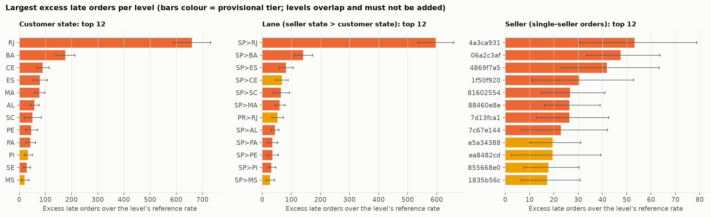
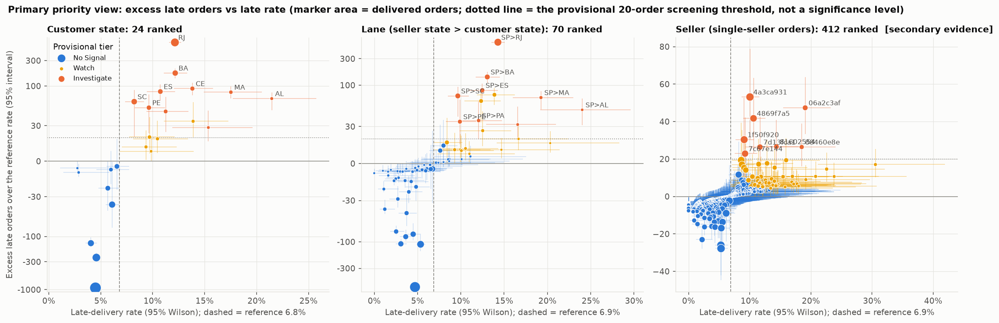
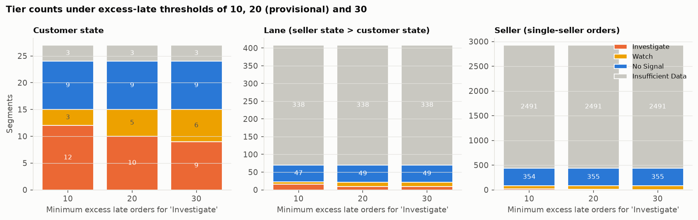
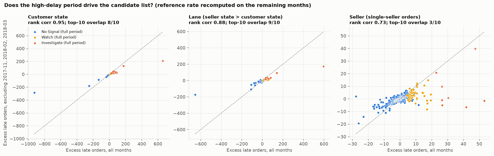
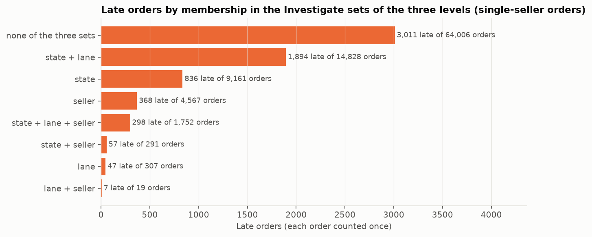
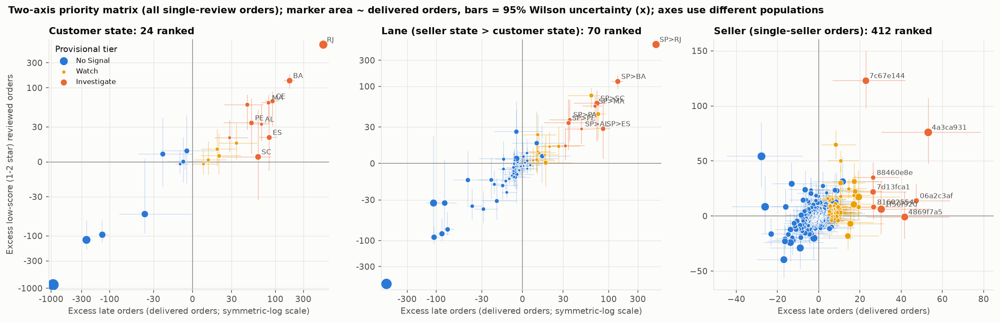
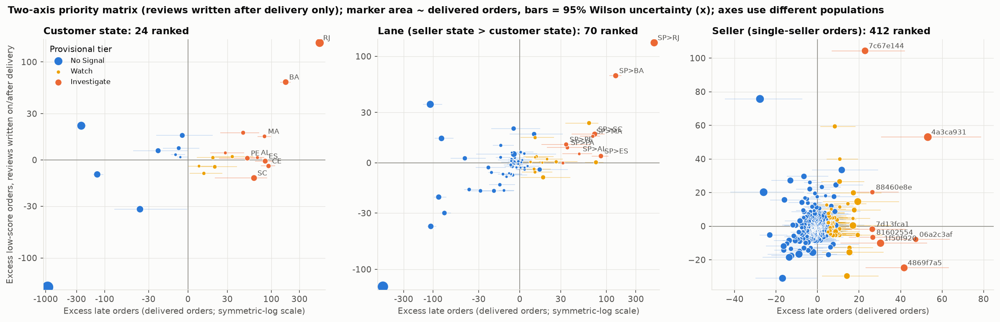

# Operational Prioritization: Findings (Workstream 4, Revision 2)

Generated by `analysis/build_prioritization_report.py` from `analysis/operational_prioritization.py` (SQL in `sql/analysis/prioritization/`) on the validated DuckDB model and the populations of the earlier workstreams. The tiers below are **provisional, rule-based evidence labels that say where to look first**. They are not scores, not significance tests, and **not findings about cause**: nothing here shows that a state, lane or seller caused delays, or that any action would reduce them or save money.

Labels: **[Observed]** a computed result; **[Interpretation]** a reading that goes beyond it; **[Hypothesis]** a possible explanation this analysis cannot test.

**Revision 2 (review corrections).** (1) The Northeast-bound lane classification was re-verified by *destination* state: the 11 lanes, 6,787 orders, 908 late orders and +442 excess figures are correct and reconcile (Section 7.1), but one sentence in the shortlist wrongly listed `MA>SP` (a Maranhão-origin lane delivering to São Paulo, not Northeast-bound) among the highest-rate Northeast lanes; this is corrected and direction columns were added to the lane tables. (2) The 20-order threshold is now described everywhere as an operational screening policy, not statistical significance. (3) Seller results are presented as secondary screening evidence, with the finding that only 2 of 8 Investigate sellers remain Investigate when the three high-delay months are excluded. (4) The primary priority view is now excess late orders against late rate; the original excess-late versus excess-low-score matrix moved to Appendix A. (5) Customer-experience measures moved to their own section (Section 8). (6) Wording was reviewed so that no investigation priority implies cause or guaranteed improvement. No validated KPI definition or population was changed.

## Summary

- **[Observed] The same destination shows up at every level.** Rio de Janeiro is the largest candidate by excess late orders at the state level (+659, 12.1% late on 12,310 orders) and the São Paulo to Rio de Janeiro lane (SP>RJ) is the largest at the lane level (+596, 14.3% late on 8,031 orders). These are largely the same orders, not two separate findings: SP>RJ carries 91% of the excess among single-seller orders to Rio de Janeiro; all other lanes into Rio together add +60 (8.3% late).
- **[Observed] Northeast-bound lanes are smaller in volume, with several higher-rate lanes.** Lane labels read *seller state > customer state*; "Northeast-bound" means the destination (customer) state is in the Northeast. 11 Northeast-bound lanes have an interval above the reference rate; together they hold 6,787 orders and +442 excess late orders, less than SP>RJ alone. By *rate* and by adjusted observed/expected the ordering is different: SP>RJ ranks 7 of 70 on late rate; the highest-rate Northeast-bound lanes are SP>AL, SP>MA, SP>SE. Which lane comes first depends on whether volume (excess orders) or intensity (rate) is the criterion; the primary view in Section 3 shows both.
- **[Observed] Provisional tiers at 20 excess late orders:** 10 states, 9 lanes and 8 sellers are Investigate. The state and lane lists are fairly stable to the threshold (10/30) and to removing the three high-delay months. **The seller list is not: only 2 of 8 Investigate sellers stay Investigate once 2017-11, 2018-02 and 2018-03 are excluded, so seller results are secondary screening evidence, not a ranking of sellers.**
- **The 20-order threshold is an operational screening policy, not statistical significance.** It says how large a gap is judged worth a manager's attention. The Wilson-interval condition separates the rate from the reference; neither is a hypothesis test, and with hundreds of sellers some flags are expected by chance.
- **[Observed] Levels overlap heavily.** The Investigate sets cover 33% of single-seller orders and 54% of late orders. Adding the three levels' excess would give +2,658 against +1,384 for the union, a +1,274 double count, so contributions are never added across levels.
- **Customer-experience measures are kept separate** (Section 8). They do not enter the tiers; reviews are voluntary, a share are written before delivery, and low-score associations are not causal effects.

## 1. Populations, reference rates and provisional rules

| Level | Population | Orders | Reference late rate | Minimum-N policy (blueprint R8) |
|---|---|---|---|---|
| Customer state | Delivered with date, purchases 2017-01..2018-08 (incl. multi-seller) | 96,203 | 6.79% | n >= 100 (24 of 27 states) |
| Lane | `v_single_seller_orders` | 94,931 | 6.87% | n >= 100 (70 of 408 lanes) |
| Seller | `v_single_seller_orders` | 94,931 | 6.87% | n >= 50 ranked (412 of 2925); 30-49 low-confidence |

**Lane notation.** A lane label is *seller state > customer state* (e.g. `SP>BA` ships from São Paulo to Bahia). **Northeast-bound** means the *destination* (customer) state is AL, BA, CE, MA, PB, PE, PI, RN or SE; a lane such as `MA>SP` originates in the Northeast but is delivered in the Southeast, so it is **not** Northeast-bound. The lane tables carry `origin_state`, `destination_state`, `origin_region`, `destination_region` and `northeast_bound` columns.

**Measures per segment.** *Expected late* = delivered orders x the level's reference rate; *excess* = observed minus expected; Wilson 95% interval on the late rate (and on excess, by scaling). *Adjusted O/E* (secondary context only) = observed / expected from purchase-month x promised-lead-group strata pooled over the same population.

**Provisional tier rules** (fixed before looking at results; no weights, no significance tests):

| Tier | Rule |
|---|---|
| **Investigate** | volume at or above the minimum-N AND Wilson interval entirely above the reference rate AND excess late orders >= 20 AND window-half consistency is not 'inconsistent' |
| **Watch** | positive excess with an interval above the reference or excess >= 20, but not Investigate; also low-confidence sellers (30-49 orders) with a signal |
| **No Signal** | adequate volume, none of the above |
| **Insufficient Data** | below the minimum volume (sellers below 30; low-confidence sellers without a signal) |

**What the 20-order threshold is, and is not.** It is an **operational screening policy**: a judgement about how many extra late orders are worth a manager's time, applied alongside minimum volume and an interval check. It is **not a statistical significance level**, has no probability interpretation, and is provisional (10 and 30 are shown in Section 4). The Wilson condition only asks whether the segment's late-rate interval lies wholly above the reference rate; it is a descriptive screen, not a test, and no multiple-comparison correction is applied.

**Consistency (stability across time).** Compare the segment's late rate with the population rate in each window half (H1 = purchases 2017-01..2017-10, H2 = 2017-11..2018-08; population rates 3.7% and 8.3% for lanes/sellers). *Consistent* = above the reference in both halves; *inconsistent* = both halves have at least 30 orders and at least one is not above; **unverified = one half has fewer than 30 orders, which is not a negative result and does not block Investigate**. H2 contains all three high-delay months, so 'consistent' means the segment was above the reference both before and after the episodes began.

## 2. Candidate tables (late-delivery evidence only)



### 2.1 Customer state

27 segments: Investigate 10, Watch 5, No Signal 9, Insufficient Data 3. Full tables: `reports/tables/prio_candidates_state.csv`.

| Segment | Tier | Orders | Late | Late rate [95% Wilson] | Expected | Excess | O/E (month x promise) | Rate H1 / H2 | Consistency | Tier at 10 / 30 | Tier without episodes |
|---|---|---|---|---|---|---|---|---|---|---|---|
| RJ | Investigate | 12,310 | 1,495 | 12.1% [11.6%, 12.7%] | 836 | +659 | 1.78 | 4.3% / 16.2% | consistent | Investigate / Investigate | Investigate |
| BA | Investigate | 3,253 | 396 | 12.2% [11.1%, 13.3%] | 221 | +175 | 1.79 | 8.5% / 14.0% | consistent | Investigate / Investigate | Investigate |
| CE | Investigate | 1,273 | 176 | 13.8% [12.0%, 15.8%] | 86 | +90 | 2.10 | 4.8% / 18.9% | consistent | Investigate / Investigate | Investigate |
| ES | Investigate | 1,992 | 214 | 10.7% [9.5%, 12.2%] | 135 | +79 | 1.50 | 4.3% / 14.0% | consistent | Investigate / Investigate | Investigate |
| MA | Investigate | 713 | 125 | 17.5% [14.9%, 20.5%] | 48 | +77 | 2.56 | 8.4% / 23.2% | consistent | Investigate / Investigate | Investigate |
| AL | Investigate | 396 | 85 | 21.5% [17.7%, 25.8%] | 27 | +58 | 3.56 | 22.5% / 20.8% | consistent | Investigate / Investigate | Investigate |
| SC | Investigate | 3,537 | 291 | 8.2% [7.4%, 9.2%] | 240 | +51 | 1.14 | 6.2% / 9.2% | consistent | Investigate / Investigate | No Signal |
| PE | Investigate | 1,587 | 153 | 9.6% [8.3%, 11.2%] | 108 | +45 | 1.48 | 8.8% / 10.0% | consistent | Investigate / Investigate | Investigate |
| PA | Investigate | 942 | 106 | 11.3% [9.4%, 13.4%] | 64 | +42 | 2.17 | 4.7% / 15.3% | consistent | Investigate / Investigate | Investigate |
| SE | Investigate | 332 | 51 | 15.4% [11.9%, 19.6%] | 23 | +28 | 2.44 | 12.1% / 17.7% | consistent | Investigate / Watch | Watch |
| PI | Watch | 475 | 66 | 13.9% [11.1%, 17.3%] | 32 | +34 | 2.04 | 3.1% / 19.6% | inconsistent | Watch / Watch | Watch |
| MS | Watch | 701 | 68 | 9.7% [7.7%, 12.1%] | 48 | +20 | 1.28 | 1.4% / 13.3% | inconsistent | Watch / Watch | No Signal |
| PB | Watch | 516 | 54 | 10.5% [8.1%, 13.4%] | 35 | +19 | 1.76 | 11.5% / 9.9% | consistent | Investigate / Watch | Investigate |
| RN | Watch | 470 | 44 | 9.4% [7.0%, 12.3%] | 32 | +12 | 1.50 | 8.2% / 9.9% | consistent | Investigate / Watch | Watch |
| TO | Watch | 274 | 27 | 9.9% [6.9%, 14.0%] | 19 | +8 | 1.48 | 2.0% / 14.3% | inconsistent | Watch / Watch | No Signal |

### 2.2 Lane (seller state > customer state)

408 segments: Investigate 9, Watch 12, No Signal 49, Insufficient Data 338. Full tables: `reports/tables/prio_candidates_lane.csv`.

| Segment | Tier | Orders | Late | Late rate [95% Wilson] | Expected | Excess | O/E (month x promise) | Rate H1 / H2 | Consistency | Tier at 10 / 30 | Tier without episodes |
|---|---|---|---|---|---|---|---|---|---|---|---|
| SP>RJ | Investigate | 8,031 | 1,147 | 14.3% [13.5%, 15.1%] | 551 | +596 | 2.03 | 4.5% / 19.4% | consistent | Investigate / Investigate | Investigate |
| SP>BA | Investigate | 2,275 | 297 | 13.1% [11.7%, 14.5%] | 156 | +141 | 1.86 | 8.8% / 15.0% | consistent | Investigate / Investigate | Investigate |
| SP>ES | Investigate | 1,443 | 180 | 12.5% [10.9%, 14.3%] | 99 | +81 | 1.68 | 4.3% / 16.4% | consistent | Investigate / Investigate | Investigate |
| SP>SC | Investigate | 2,300 | 222 | 9.7% [8.5%, 10.9%] | 158 | +64 | 1.29 | 6.9% / 11.0% | consistent | Investigate / Investigate | Watch |
| SP>MA | Investigate | 483 | 93 | 19.3% [16.0%, 23.0%] | 33 | +60 | 2.71 | 9.1% / 25.7% | consistent | Investigate / Investigate | Investigate |
| SP>AL | Investigate | 254 | 61 | 24.0% [19.2%, 29.6%] | 17 | +44 | 3.91 | 26.4% / 22.3% | consistent | Investigate / Investigate | Investigate |
| SP>PA | Investigate | 672 | 81 | 12.1% [9.8%, 14.7%] | 46 | +35 | 2.26 | 5.0% / 16.5% | consistent | Investigate / Investigate | Watch |
| SP>PE | Investigate | 1,122 | 111 | 9.9% [8.3%, 11.8%] | 77 | +34 | 1.50 | 8.6% / 10.5% | consistent | Investigate / Investigate | Investigate |
| SP>PI | Investigate | 326 | 54 | 16.6% [12.9%, 21.0%] | 22 | +32 | 2.35 | 4.1% / 24.0% | consistent | Investigate / Investigate | Watch |
| SP>CE | Watch | 958 | 133 | 13.9% [11.8%, 16.2%] | 66 | +67 | 2.03 | 3.3% / 19.4% | inconsistent | Watch / Watch | Watch |
| PR>RJ | Watch | 948 | 117 | 12.3% [10.4%, 14.6%] | 65 | +52 | 1.73 | 3.7% / 15.9% | inconsistent | Watch / Watch | No Signal |
| SP>MS | Watch | 471 | 59 | 12.5% [9.8%, 15.8%] | 32 | +27 | 1.56 | 0.8% / 17.0% | inconsistent | Watch / Watch | No Signal |
| SP>SE | Watch | 204 | 34 | 16.7% [12.2%, 22.4%] | 14 | +20 | 2.36 | 11.7% / 19.7% | consistent | Investigate / Watch | Watch |
| MG>RJ | Watch | 1,120 | 94 | 8.4% [6.9%, 10.2%] | 77 | +17 | 1.29 | 3.5% / 11.8% | inconsistent | Watch / Watch | Watch |
| MA>SP | Watch | 123 | 25 | 20.3% [14.2%, 28.3%] | 8 | +17 | 3.42 | - / 20.3% | unverified | Investigate / Watch | Watch |
| SP>PB | Watch | 332 | 35 | 10.5% [7.7%, 14.3%] | 23 | +12 | 1.76 | 10.3% / 10.6% | consistent | Investigate / Watch | Watch |
| SC>RJ | Watch | 463 | 43 | 9.3% [7.0%, 12.3%] | 32 | +11 | 1.53 | 4.3% / 13.3% | consistent | Investigate / Watch | No Signal |
| PR>BA | Watch | 143 | 21 | 14.7% [9.8%, 21.4%] | 10 | +11 | 2.14 | 8.0% / 18.3% | consistent | Investigate / Watch | Watch |
| MG>BA | Watch | 362 | 36 | 9.9% [7.3%, 13.5%] | 25 | +11 | 1.59 | 8.9% / 10.6% | consistent | Investigate / Watch | Watch |
| SP>RN | Watch | 328 | 33 | 10.1% [7.3%, 13.8%] | 23 | +10 | 1.61 | 8.5% / 11.0% | consistent | Investigate / Watch | Watch |
| SP>TO | Watch | 191 | 21 | 11.0% [7.3%, 16.2%] | 13 | +8 | 1.57 | 0.0% / 17.8% | inconsistent | Watch / Watch | No Signal |

### 2.3 Seller (single-seller orders; secondary screening evidence)

2,925 segments: Investigate 8, Watch 71, No Signal 355, Insufficient Data 2491 (of which 202 low-confidence sellers with 30-49 orders). Full tables: `reports/tables/prio_candidates_seller.csv`.

**Secondary screening evidence.** Only 2 of the 8 Investigate sellers remain Investigate when 2017-11, 2018-02 and 2018-03 are excluded (Section 5), 4 have too few first-half orders to check stability, and with several hundred sellers some flags are expected by chance. Treat this list as a shortlist for verification with operational data, not as a ranking or assessment of sellers. Seller IDs are shortened to 8 characters (full IDs in the CSV). **Investigate sellers:**

| Segment | Tier | Orders | Late | Late rate [95% Wilson] | Expected | Excess | O/E (month x promise) | Rate H1 / H2 | Consistency | Tier at 10 / 30 | Tier without episodes |
|---|---|---|---|---|---|---|---|---|---|---|---|
| 4a3ca931 | Investigate | 1,673 | 168 | 10.0% [8.7%, 11.6%] | 115 | +53 | 1.40 | 4.3% / 15.2% | consistent | Investigate / Investigate | No Signal |
| 06a2c3af | Investigate | 388 | 74 | 19.1% [15.5%, 23.3%] | 27 | +47 | 3.54 | - / 19.1% | unverified | Investigate / Investigate | Investigate |
| 4869f7a5 | Investigate | 1,111 | 118 | 10.6% [8.9%, 12.6%] | 76 | +42 | 1.37 | 5.3% / 12.1% | consistent | Investigate / Investigate | No Signal |
| 1f50f920 | Investigate | 1,364 | 124 | 9.1% [7.7%, 10.7%] | 94 | +30 | 1.04 | 4.7% / 10.8% | consistent | Investigate / Investigate | No Signal |
| 81602554 | Investigate | 355 | 51 | 14.4% [11.1%, 18.4%] | 24 | +27 | 1.39 | 0.0% / 14.8% | unverified | Investigate / Watch | No Signal |
| 88460e8e | Investigate | 227 | 42 | 18.5% [14.0%, 24.1%] | 16 | +26 | 2.03 | - / 18.5% | unverified | Investigate / Watch | No Signal |
| 7d13fca1 | Investigate | 548 | 64 | 11.7% [9.3%, 14.6%] | 38 | +26 | 1.35 | - / 11.7% | unverified | Investigate / Watch | Watch |
| 7c67e144 | Investigate | 963 | 89 | 9.2% [7.6%, 11.2%] | 66 | +23 | 1.46 | 6.5% / 11.2% | consistent | Investigate / Watch | Investigate |

Watch tier: 71 sellers; the 10 with the largest excess:

| Segment | Tier | Orders | Late | Late rate [95% Wilson] | Expected | Excess | O/E (month x promise) | Rate H1 / H2 | Consistency | Tier at 10 / 30 | Tier without episodes |
|---|---|---|---|---|---|---|---|---|---|---|---|
| e5a34388 | Watch | 213 | 34 | 16.0% [11.7%, 21.5%] | 15 | +19 | 1.83 | 6.5% / 18.6% | consistent | Investigate / Watch | No Signal |
| ea8482cd | Watch | 1,116 | 96 | 8.6% [7.1%, 10.4%] | 77 | +19 | 0.97 | 0.0% / 9.1% | inconsistent | Watch / Watch | No Signal |
| 855668e0 | Watch | 296 | 38 | 12.8% [9.5%, 17.1%] | 20 | +18 | 1.93 | 8.1% / 16.2% | consistent | Investigate / Watch | Watch |
| 1835b56c | Watch | 375 | 43 | 11.5% [8.6%, 15.1%] | 26 | +17 | 1.25 | 2.0% / 12.9% | inconsistent | Watch / Watch | No Signal |
| 54965bbe | Watch | 72 | 22 | 30.6% [21.1%, 42.0%] | 5 | +17 | 3.27 | 0.0% / 32.4% | unverified | Investigate / Watch | Insufficient Data |
| 8b321bb6 | Watch | 917 | 80 | 8.7% [7.1%, 10.7%] | 63 | +17 | 0.98 | 0.0% / 8.8% | unverified | Investigate / Watch | No Signal |
| f7ba60f8 | Watch | 213 | 30 | 14.1% [10.0%, 19.4%] | 15 | +15 | 1.78 | 13.6% / 14.1% | unverified | Investigate / Watch | Watch |
| 620c87c1 | Watch | 694 | 63 | 9.1% [7.2%, 11.4%] | 48 | +15 | 1.13 | 4.9% / 11.0% | consistent | Investigate / Watch | No Signal |
| a49928bc | Watch | 93 | 21 | 22.6% [15.3%, 32.1%] | 6 | +15 | 3.54 | 4.2% / 42.2% | consistent | Investigate / Watch | Watch |
| fa1c13f2 | Watch | 566 | 53 | 9.4% [7.2%, 12.0%] | 39 | +14 | 1.39 | 2.4% / 12.3% | inconsistent | Watch / Watch | No Signal |

Insufficient-data states (not ranked): RR, AC, AP (187 orders). The 5,109 orders in the 338 lanes below 100 orders and the 22,716 orders of the 2491 sellers below the minimum are not individually assessed.

## 3. Primary priority view: excess late orders vs late-delivery rate



**How to read it.** Vertical axis: excess late orders over the level's reference rate (the *volume* of the gap). Horizontal axis: the segment's late-delivery rate with its 95% Wilson interval (the *intensity*); the dashed vertical line is the reference rate. Marker area is delivered volume; the vertical bars are the same Wilson interval scaled to orders; colour is the provisional evidence tier. The dotted horizontal line marks the 20-order screening policy (not a significance level). State and lane panels use a symmetric-log vertical scale because a few very large segments dominate; the seller panel is labelled secondary evidence.

**[Observed]** Segments in the upper-right combine many excess orders with a high rate; segments in the upper-left have many excess orders at a moderate rate (large volume), and segments in the lower-right have a high rate but few orders (e.g. small states or lanes). Rio de Janeiro and SP>RJ sit highest on the volume axis at moderate-to-high rates (12.1% and 14.3%); AL, MA and the Northeast-bound lanes SP>AL and SP>MA sit furthest right but with far fewer orders; the confidence bars are wide for all small segments, which is why the tier rules also require a minimum volume and an interval above the reference.

**[Interpretation]** Putting volume and rate on the same chart makes the choice of criterion visible: a manager who wants to address the most excess late orders will start at the top; one who wants the worst rates will start at the right. Neither axis says why the orders were late.

## 4. Sensitivity to the excess-late threshold (10 / 20 / 30)



| Level | Minimum excess late orders (screening policy) | Investigate | Watch | No Signal | Insufficient Data |
|---|---|---|---|---|---|
| Customer state | 10 | 12 | 3 | 9 | 3 |
| Customer state | 20 (provisional) | 10 | 5 | 9 | 3 |
| Customer state | 30 | 9 | 6 | 9 | 3 |
| Lane (seller state > customer state) | 10 | 16 | 7 | 47 | 338 |
| Lane (seller state > customer state) | 20 (provisional) | 9 | 12 | 49 | 338 |
| Lane (seller state > customer state) | 30 | 9 | 12 | 49 | 338 |
| Seller (single-seller orders; secondary screening evidence) | 10 | 21 | 59 | 354 | 2491 |
| Seller (single-seller orders; secondary screening evidence) | 20 (provisional) | 8 | 71 | 355 | 2491 |
| Seller (single-seller orders; secondary screening evidence) | 30 | 4 | 75 | 355 | 2491 |

Membership changes (all sets are nested: raising the threshold only removes candidates):

- **Customer state:** lowering the threshold to 10 adds PB, RN; raising it to 30 removes SE.
- **Lane:** lowering the threshold to 10 adds MA>SP, MG>BA, PR>BA, SC>RJ, SP>PB, SP>RN, SP>SE; raising it to 30 removes none.
- **Seller:** lowering the threshold to 10 adds 1ca7077d, 2c9e548b, 54965bbe, 620c87c1, 712e6ed8, 855668e0, 897060da, 8b321bb6, a49928bc, beadbee3, cd68562d, e5a34388, f7ba60f8; raising it to 30 removes 7c67e144, 7d13fca1, 81602554, 88460e8e.

**[Observed]** States are insensitive to the threshold between 10 and 30 (12 to 9 Investigate); lanes change only when the threshold is lowered to 10 (the extra lanes have interval lower bounds barely above the reference); sellers are the most sensitive (21, 8, 4) because most sellers have few orders, so an excess of 10-30 late orders is large for them. The threshold of 20 therefore remains a provisional screening policy.

**What the consistency rule changes.** Without it (excess threshold unchanged) the following segments would move from Watch to Investigate: customer state PI, MS; lane SP>CE, PR>RJ, SP>MS. These have a signal and at least 20 excess late orders but one window half was not above the reference rate (e.g. SP>CE: 11 late orders of 329 in H1 vs 19.4% in H2). That is a deliberate, visible consequence of the rule, not a verdict: a quiet first half on a small count can come from noise.

## 5. Stability across time and the three high-delay periods

| Level (ranked segments) | Consistent | Inconsistent | Unverified (one half < 30 orders) |
|---|---|---|---|
| Customer state | 12 | 12 | 0 |
| Lane | 20 | 47 | 3 |
| Seller | 45 | 112 | 255 |

**[Observed]** Many ranked segments are 'inconsistent' simply because the H1 reference rate is low (3.7%) and small segments have noisy half-year rates; for sellers the consistency rule never changes a tier (no flagged seller is inconsistent), but 4 of the 8 Investigate sellers are *unverified* because they had too few orders in H1: their stability is simply not known.



| Level | Investigate (all months) | Still Investigate without the 3 months | Dropped out | Newly Investigate | Rank correlation of excess | Top-10 overlap |
|---|---|---|---|---|---|---|
| Customer state | 10 | 8 | SC, SE | PB | 0.95 | 8/10 |
| Lane | 9 | 6 | SP>PA, SP>PI, SP>SC | - | 0.88 | 9/10 |
| Seller | 8 | 2 | 1f50f920, 4869f7a5, 4a3ca931, 7d13fca1, 81602554, 88460e8e | - | 0.73 | 3/10 |

The reference rate is recomputed on the remaining months (6.9% overall vs 4.5% without the episodes for single-seller orders), so a segment is compared with a much lower reference rate and its excess is counted in a smaller sample.

**Share of each Investigate segment's late orders that fall in the three months** (population: 48%):

| Level | Segment | Excess late | Share of its late orders in the 3 months | Tier without the 3 months |
|---|---|---|---|---|
| state | RJ | +659 | 58% | Investigate |
| state | BA | +175 | 38% | Investigate |
| state | CE | +90 | 61% | Investigate |
| state | ES | +79 | 50% | Investigate |
| state | MA | +77 | 57% | Investigate |
| state | AL | +58 | 28% | Investigate |
| state | SC | +51 | 52% | No Signal |
| state | PE | +45 | 33% | Investigate |
| state | PA | +42 | 48% | Investigate |
| state | SE | +28 | 39% | Watch |
| lane | SP>RJ | +596 | 61% | Investigate |
| lane | SP>BA | +141 | 42% | Investigate |
| lane | SP>ES | +81 | 53% | Investigate |
| lane | SP>SC | +64 | 55% | Watch |
| lane | SP>MA | +60 | 56% | Investigate |
| lane | SP>AL | +44 | 26% | Investigate |
| lane | SP>PA | +35 | 51% | Watch |
| lane | SP>PE | +34 | 35% | Investigate |
| lane | SP>PI | +32 | 50% | Watch |
| seller | 4a3ca931 | +53 | 66% | No Signal |
| seller | 06a2c3af | +47 | 26% | Investigate |
| seller | 4869f7a5 | +42 | 74% | No Signal |
| seller | 1f50f920 | +30 | 67% | No Signal |
| seller | 81602554 | +27 | 92% | No Signal |
| seller | 88460e8e | +26 | 88% | No Signal |
| seller | 7d13fca1 | +26 | 55% | Watch |
| seller | 7c67e144 | +23 | 40% | Investigate |

**[Observed]** The state and lane lists survive the exclusion largely intact (8 of 10 states and 6 of 9 lanes), including Rio de Janeiro and SP>RJ (SP>RJ: 61% of its late orders fall in the three months, above the 48% population share, yet it stays Investigate without them).

**[Observed] Sellers: only 2 of 8 Investigate sellers remain Investigate when the three high-delay months are excluded** (06a2c3af, 7c67e144). For the 6 that drop out, 55%-92% of their late orders fall in the three months. Northeast-bound lanes such as SP>AL (26%), SP>PE (35%) and SP>BA (42%) are among the least episode-dependent: a smaller share of their late orders falls in the three months than for the population.

**[Observed]** Adjusted observed/expected (month x promised lead) is a useful cross-check on sellers. Investigate sellers with a ratio close to 1: 1f50f920 (1.04; 67% of its late orders in the three months). Once month and promised-lead mix are allowed for, such a seller is no later than others shipping in the same months; its excess against the portfolio is consistent with having sold heavily in the high-delay months, which this analysis cannot distinguish from a seller-specific effect in those months.

**[Interpretation]** The seller shortlist mostly reflects sellers that had many late orders in the three system-wide high-delay months, not sellers that are persistently later in calm months; only the sellers that stay Investigate without those months have evidence of the latter. Geography and lanes are more persistent. This does not say why some sellers were affected more during the high-delay months. **Seller results are therefore secondary screening evidence.**

## 6. Overlap between states, lanes and sellers



Computed on 94,931 single-seller orders by order id (multi-seller orders have no lane or seller). Reference rate 6.87%.

| Investigate set | Segments | Orders | Late orders | Excess late orders |
|---|---|---|---|---|
| Customer state | 10 | 26,032 | 3,085 | +1,298 |
| Lane | 9 | 16,906 | 2,246 | +1,085 |
| Seller | 8 | 6,629 | 730 | +275 |
| **Union of the three sets** | - | 30,925 | 3,507 | +1,384 |
| Sum of the three levels (**double counted**) | - | - | 6,061 | +2,658 |

| Pair of levels | Orders in both | Share of first level's orders in the second | Share of second level's orders in the first | Late orders in both |
|---|---|---|---|---|
| state & lane | 16,580 | 64% | 98% | 2,192 |
| state & seller | 2,043 | 8% | 31% | 355 |
| lane & seller | 1,771 | 10% | 27% | 305 |

**[Observed]** 98% of the orders in Investigate lanes lie in Investigate states (a lane has exactly one destination state), and 64% of the orders in Investigate states are in Investigate lanes. Investigate sellers overlap far less: 31% of their orders are in Investigate states and 27% in Investigate lanes. Counting each level's excess and adding them would overstate the combined excess by +1,274 late orders (48% of the naive sum).

| Investigate state | Single-seller orders | Excess late | Orders in Investigate lanes | Excess in Investigate lanes | Share of state orders in Investigate lanes |
|---|---|---|---|---|---|
| AL | 394 | +58 | 254 | +44 | 64% |
| BA | 3,217 | +175 | 2,275 | +141 | 71% |
| CE | 1,262 | +89 | 0 | +0 | 0% |
| ES | 1,965 | +79 | 1,443 | +81 | 73% |
| MA | 702 | +76 | 483 | +60 | 69% |
| PA | 933 | +41 | 672 | +35 | 72% |
| PE | 1,579 | +45 | 1,122 | +34 | 71% |
| RJ | 12,154 | +656 | 8,031 | +596 | 66% |
| SC | 3,497 | +51 | 2,300 | +64 | 66% |
| SE | 329 | +28 | 0 | +0 | 0% |

For CE, SE no lane meets the Investigate rule: their excess is spread over several smaller lanes rather than concentrated in one (a destination-level view is the only view that sees it).

## 7. Specific candidates: SP>RJ, Rio de Janeiro destinations and Northeast-bound lanes

No preferred ranking was assumed. Each candidate is ranked among the ranked segments of its own level on five different metrics; rankings differ by metric.

| Level | Segment | Orders | Late rate [95% Wilson] | Excess late | O/E | Tier | Tier without episodes | Rank: excess | Rank: conservative excess | Rank: rate | Rank: O/E | Rank: excess low |
|---|---|---|---|---|---|---|---|---|---|---|---|---|
| state | RJ | 12,310 | 12.1% [11.6%, 12.7%] | +659 | 1.78 | Investigate | Investigate | 1 | 1 | 7 | 8 | 1 |
| lane | SP>RJ | 8,031 | 14.3% [13.5%, 15.1%] | +596 | 2.03 | Investigate | Investigate | 1 | 1 | 7 | 8 | 1 |
| lane | SP>BA | 2,275 | 13.1% [11.7%, 14.5%] | +141 | 1.86 | Investigate | Investigate | 2 | 2 | 9 | 10 | 2 |
| lane | SP>CE | 958 | 13.9% [11.8%, 16.2%] | +67 | 2.03 | Watch | Watch | 4 | 4 | 8 | 9 | 6 |
| lane | SP>MA | 483 | 19.3% [16.0%, 23.0%] | +60 | 2.71 | Investigate | Investigate | 6 | 5 | 3 | 3 | 5 |
| lane | SP>AL | 254 | 24.0% [19.2%, 29.6%] | +44 | 3.91 | Investigate | Investigate | 8 | 8 | 1 | 1 | 10 |
| lane | SP>PE | 1,122 | 9.9% [8.3%, 11.8%] | +34 | 1.50 | Investigate | Investigate | 10 | 11 | 20 | 20 | 8 |
| lane | SP>PI | 326 | 16.6% [12.9%, 21.0%] | +32 | 2.35 | Investigate | Watch | 11 | 10 | 5 | 5 | 14 |
| lane | SP>SE | 204 | 16.7% [12.2%, 22.4%] | +20 | 2.36 | Watch | Watch | 13 | 13 | 4 | 4 | 16 |
| lane | SP>PB | 332 | 10.5% [7.7%, 14.3%] | +12 | 1.76 | Watch | Watch | 17 | 16 | 16 | 11 | 19 |
| lane | PR>BA | 143 | 14.7% [9.8%, 21.4%] | +11 | 2.14 | Watch | Watch | 19 | 15 | 6 | 7 | 17 |
| lane | MG>BA | 362 | 9.9% [7.3%, 13.5%] | +11 | 1.59 | Watch | Watch | 20 | 17 | 19 | 15 | 29 |
| lane | SP>RN | 328 | 10.1% [7.3%, 13.8%] | +10 | 1.61 | Watch | Watch | 22 | 18 | 18 | 14 | 25 |

(Conservative excess = Wilson lower bound of the rate minus the reference, times orders. Lane ranks are among 70 lanes; state ranks among 24 states. All lanes listed other than SP>RJ are Northeast-bound.)

### 7.1 Reconciliation of the Northeast-bound lanes (classified by destination state)

Rule: eligible lane (n >= 100) AND Wilson interval above the single-seller reference rate AND destination state in the Northeast. Order and late counts below are the SQL results; the last two columns recount them from the order-level frame.

| Lane | Origin > destination | Destination region | Orders | Late | Late rate [95% Wilson] | Excess late | Tier | Orders recounted | Late recounted |
|---|---|---|---|---|---|---|---|---|---|
| SP>BA | SP > BA | Northeast | 2,275 | 297 | 13.1% [11.7%, 14.5%] | +141 | Investigate | 2,275 | 297 |
| SP>CE | SP > CE | Northeast | 958 | 133 | 13.9% [11.8%, 16.2%] | +67 | Watch | 958 | 133 |
| SP>MA | SP > MA | Northeast | 483 | 93 | 19.3% [16.0%, 23.0%] | +60 | Investigate | 483 | 93 |
| SP>AL | SP > AL | Northeast | 254 | 61 | 24.0% [19.2%, 29.6%] | +44 | Investigate | 254 | 61 |
| SP>PE | SP > PE | Northeast | 1,122 | 111 | 9.9% [8.3%, 11.8%] | +34 | Investigate | 1,122 | 111 |
| SP>PI | SP > PI | Northeast | 326 | 54 | 16.6% [12.9%, 21.0%] | +32 | Investigate | 326 | 54 |
| SP>SE | SP > SE | Northeast | 204 | 34 | 16.7% [12.2%, 22.4%] | +20 | Watch | 204 | 34 |
| SP>PB | SP > PB | Northeast | 332 | 35 | 10.5% [7.7%, 14.3%] | +12 | Watch | 332 | 35 |
| PR>BA | PR > BA | Northeast | 143 | 21 | 14.7% [9.8%, 21.4%] | +11 | Watch | 143 | 21 |
| MG>BA | MG > BA | Northeast | 362 | 36 | 9.9% [7.3%, 13.5%] | +11 | Watch | 362 | 36 |
| SP>RN | SP > RN | Northeast | 328 | 33 | 10.1% [7.3%, 13.8%] | +10 | Watch | 328 | 33 |
| TOTAL | - | - | 6,787 | 908 | - | +442 | - | 6,787 | 908 |

**[Observed]** 11 Northeast-bound lanes, 6,787 orders, 908 late, +442 excess late orders; SQL and recount agree. They are not the same as lanes that *originate* in the Northeast. Northeast-origin lanes with at least 100 orders: MA>SP (to SP, Southeast; 123 orders, 20.3% late, +17 excess, Watch); BA>SP (to SP, Southeast; 135 orders, 3.7% late, -4 excess, No Signal); PE>SP (to SP, Southeast; 104 orders, 1.9% late, -5 excess, No Signal). None is Northeast-bound. Orders shipped from the Northeast to a destination outside it: 1,086 orders, 8.0% late.

| Overlap-aware group (single-seller orders; reference 6.87%) | Orders | Late | Late rate | Excess late |
|---|---|---|---|---|
| All single-seller orders to RJ | 12,154 | 1,490 | 12.3% | +656 |
| SP>RJ lane | 8,031 | 1,147 | 14.3% | +596 |
| Other lanes into RJ | 4,123 | 343 | 8.3% | +60 |
| Northeast-bound lanes with an interval above the reference (11 lanes) | 6,787 | 908 | 13.4% | +442 |
| All single-seller orders to the Northeast region | 8,934 | 1,149 | 12.9% | +536 |
| Northeast region, lanes not flagged | 2,147 | 241 | 11.2% | +94 |
| Shipped FROM the Northeast (any destination; NOT Northeast-bound by itself) | 1,514 | 127 | 8.4% | +23 |
| Shipped from the Northeast to a non-Northeast destination (e.g. MA>SP) | 1,086 | 87 | 8.0% | +12 |

**[Observed]** *Rio de Janeiro as a destination* is the single largest candidate by volume of excess: +659 late orders across all orders. Within single-seller orders 91% of that excess is the SP>RJ lane (+596); every other lane into Rio together adds +60. So the state-level and lane-level candidates for Rio largely coincide: the excess is concentrated in the SP>RJ lane rather than spread over the other lanes into Rio.
*Northeast-bound lanes:* the 11 lanes with an interval above the reference (MG>BA, PR>BA, SP>AL, SP>BA, SP>CE, SP>MA, SP>PB, SP>PE, SP>PI, SP>RN, SP>SE) are individually much smaller than SP>RJ (+141 for the largest, SP>BA). Their combined late rate (13.4%) is a little below SP>RJ's (14.3%), but 5 of them individually rank higher than SP>RJ on late rate (SP>MA, SP>AL, SP>PI, SP>SE, PR>BA). Together they hold +442 excess late orders against +596 for SP>RJ alone. 5 of the 11 are Investigate at excess >= 20 (4 still are without the three high-delay months); the others are Watch because their excess is below the threshold or one window half was not above the reference.

**[Interpretation]** By volume of excess late orders SP>RJ comes first; by intensity several Northeast-bound lanes come first. These are different questions (where do most of the extra late orders sit vs. where is the rate highest) and a manager should choose the criterion consciously. Routes also differ: SP>RJ is relatively short (median distance about 380 km) with a high late rate, while the São Paulo-origin Northeast-bound lanes are long (roughly 1,400 to 2,400 km). The data cannot say whether the Rio route has a distinct operational factor or simply large volume with a high but not extreme rate.

## 8. Customer-experience context (separate from the late-delivery screening)

These measures **do not enter the tiers or the primary view**. They use a different population (reviewed single-review orders, about 98.8% of delivered orders) and describe customer feedback, which is voluntary and not a causal effect of the delivery outcome.

**Why the on-time view matters.** Late orders attract low scores, so a segment with many late orders automatically shows many low-score reviews (rank correlation of excess late with excess low-score: 0.91 states, 0.91 lanes, 0.49 sellers). Restricting to **on-time orders** removes that link (0.20, 0.47, 0.16), so the low-score rate among on-time orders (reference 8.69%) is the part that can carry information about dissatisfaction other than lateness.

**Customer state: Investigate candidates**

| Segment | Reviewed orders | Coverage | Low-score rate, on-time orders [95% Wilson] | vs reference | Excess low, on-time orders | Reviews written before delivery | Excess low, after-delivery reviews | Excess low, all reviews |
|---|---|---|---|---|---|---|---|---|
| RJ | 12,103 | 98.3% | 10.9% [10.3%, 11.5%] | above | +174 | 10.2% | +189 | +667 |
| BA | 3,209 | 98.6% | 11.2% [10.1%, 12.5%] | above | +57 | 9.8% | +51 | +137 |
| CE | 1,264 | 99.3% | 9.1% [7.5%, 10.9%] | overlaps | -2 | 11.7% | -4 | +55 |
| ES | 1,957 | 98.2% | 8.9% [7.7%, 10.3%] | overlaps | -6 | 8.1% | -1 | +21 |
| MA | 705 | 98.9% | 10.8% [8.5%, 13.6%] | overlaps | +9 | 13.8% | +15 | +52 |
| AL | 389 | 98.2% | 9.1% [6.4%, 12.8%] | overlaps | -0 | 17.5% | +2 | +32 |
| SC | 3,496 | 98.8% | 8.8% [7.9%, 9.8%] | overlaps | -14 | 6.1% | -12 | +4 |
| PE | 1,562 | 98.4% | 9.1% [7.7%, 10.7%] | overlaps | -2 | 7.7% | +1 | +33 |
| PA | 923 | 98.0% | 11.4% [9.4%, 13.8%] | above | +18 | 9.4% | +18 | +49 |
| SE | 331 | 99.7% | 10.3% [7.3%, 14.4%] | overlaps | +3 | 12.7% | +5 | +21 |

**Lane (seller state > customer state): Investigate candidates**

| Segment | Reviewed orders | Coverage | Low-score rate, on-time orders [95% Wilson] | vs reference | Excess low, on-time orders | Reviews written before delivery | Excess low, after-delivery reviews | Excess low, all reviews |
|---|---|---|---|---|---|---|---|---|
| SP>RJ | 7,896 | 98.3% | 10.7% [10.0%, 11.4%] | above | +133 | 12.2% | +151 | +584 |
| SP>BA | 2,249 | 98.9% | 11.7% [10.4%, 13.2%] | above | +59 | 10.4% | +55 | +123 |
| SP>ES | 1,424 | 98.7% | 8.6% [7.2%, 10.3%] | overlaps | -1 | 9.2% | +4 | +29 |
| SP>SC | 2,268 | 98.6% | 9.5% [8.3%, 10.8%] | overlaps | +16 | 7.1% | +17 | +50 |
| SP>MA | 477 | 98.8% | 11.7% [8.8%, 15.2%] | above | +11 | 15.5% | +16 | +47 |
| SP>AL | 248 | 97.6% | 11.1% [7.3%, 16.3%] | overlaps | +4 | 20.6% | +5 | +28 |
| SP>PA | 657 | 97.8% | 10.5% [8.3%, 13.3%] | overlaps | +11 | 10.2% | +9 | +36 |
| SP>PE | 1,101 | 98.1% | 9.4% [7.7%, 11.3%] | overlaps | +7 | 7.8% | +11 | +33 |
| SP>PI | 321 | 98.5% | 7.8% [5.2%, 11.7%] | overlaps | -2 | 12.8% | -0 | +14 |

**Seller (single-seller orders; secondary screening evidence): Investigate candidates**

| Segment | Reviewed orders | Coverage | Low-score rate, on-time orders [95% Wilson] | vs reference | Excess low, on-time orders | Reviews written before delivery | Excess low, after-delivery reviews | Excess low, all reviews |
|---|---|---|---|---|---|---|---|---|
| 4a3ca931 | 1,640 | 98.0% | 11.9% [10.3%, 13.6%] | above | +47 | 8.2% | +53 | +76 |
| 06a2c3af | 383 | 98.7% | 6.4% [4.2%, 9.7%] | overlaps | -7 | 15.9% | -8 | +14 |
| 4869f7a5 | 1,103 | 99.3% | 5.8% [4.5%, 7.4%] | below | -29 | 8.3% | -25 | -1 |
| 1f50f920 | 1,354 | 99.3% | 7.7% [6.3%, 9.3%] | overlaps | -12 | 6.9% | -10 | +6 |
| 81602554 | 348 | 98.0% | 6.7% [4.4%, 10.1%] | overlaps | -6 | 11.5% | -7 | +8 |
| 88460e8e | 220 | 96.9% | 19.0% [13.9%, 25.4%] | above | +18 | 15.0% | +20 | +35 |
| 7d13fca1 | 545 | 99.5% | 8.5% [6.3%, 11.4%] | overlaps | -1 | 10.5% | -2 | +22 |
| 7c67e144 | 951 | 98.8% | 20.5% [17.9%, 23.3%] | above | +102 | 7.8% | +104 | +123 |

**[Observed]** Review coverage is high and similar across candidates (98.0%-99.7% for states, 95.3%-100.0% for lanes). Rio de Janeiro's low-score rate among on-time orders is 10.9% [10.3%, 11.5%] against a reference of 9.23%, and SP>RJ's is 10.7% [10.0%, 11.4%] against 8.69%; the table shows which other Investigate candidates differ from the reference among on-time orders and which do not. Most Investigate candidates do not stand out among on-time orders; where one does, the data cannot say whether product, handling, service or something else is involved.

**Review-timing limitations.** (1) 5.2% of reviews are written *before* the recorded delivery date, and these are concentrated on late orders (customer-satisfaction workstream): a review written while an order is overdue reflects the wait, not the delivered experience. (2) For every Investigate state and lane the low-score excess from reviews written after delivery is smaller than the all-review excess; the gap between the two is the part tied to reviews written before delivery. (3) For sellers this is not always so (7c67e144: +123 all vs +104 after delivery), which points to dissatisfaction not explained by lateness; that would need product, handling or review-text data that were not analysed. (4) Reviews are voluntary and cover only reviewers; all low-score figures are associations.

## 9. Operational investigation shortlist

Candidate groups for investigation, in no weighted order. Each lists the evidence, what is not known, what additional data would help and a suggested next investigative step. These are **investigation steps, not interventions**: nothing here says what caused the late orders, and nothing estimates the effect of acting on them.

| Candidate group | Evidence (observed) | Not known | Additional data needed | Suggested next investigative step |
|---|---|---|---|---|
| A. São Paulo to Rio de Janeiro (SP>RJ) | Largest excess at lane and state level (+596); 14.3% late [13.5%, 15.1%]; consistent across halves; remains Investigate at thresholds 10 and 30 and without the three high-delay months; O/E 2.03 | What accounts for the excess (candidate areas: carrier, last-mile, seller hand-off, demand); the route is relatively short (about 380 km), so distance alone does not explain it | Carrier / route per order; carrier hand-off and out-for-delivery timestamps (the existing carrier timestamps are unreliable for about 1.4% of orders); sellers behind the lane | Break the lane down by seller and carrier; compare transit time from hand-off to delivery with other São Paulo-origin routes of similar length |
| B. Northeast-bound lanes (MG>BA, PR>BA, SP>AL, SP>BA, SP>CE, SP>MA, ...) | 11 lanes whose destination state is in the Northeast have an interval above the reference; combined 13.4% late, +442 excess; the highest-rate lanes among them are SP>AL, SP>MA, SP>SE; mostly consistent across halves and less episode-dependent than Rio | Whether long-route transit, regional last-mile or promised-date setting is involved (cross-state shipments are already promised longer than same-state ones, yet are late more often) | Carrier by destination; how estimated dates are set for these routes; delivery attempts / returns data | Compare observed lead times with promised dates by route and week; check whether the same carrier serves all these lanes |
| C. Other state and lane candidates (BA, CE, ES, MA, PE, PA, AL, SC, SP>ES, SP>SC, ...) | 9 further Investigate states and 8 further Investigate lanes; most remain after removing the episodes; SC, SE (states) and SP>PA, SP>PI, SP>SC (lanes) do not | Whether these are separate patterns or the same route/carrier pattern seen at different levels (lane and state sets overlap by construction) | As for A and B, plus state-level carrier mix | Use the lane list to localise each state's excess; look at states without a qualifying lane (CE, SE) at destination level |
| D. Sellers, secondary evidence (4a3ca931, 06a2c3af, 4869f7a5, 1f50f920, ...) | 8 sellers Investigate at excess >= 20; **only 2 (06a2c3af, 7c67e144) remain without the three high-delay months**; 4 are unverified (few H1 orders); some flags are expected by chance | Whether seller handling, carrier performance or the high-delay months explain their excess | Seller hand-off timing (approval to carrier hand-off), stock and order-handling data, carrier mix per seller, newer data | Check the sellers that stay flagged outside the high-delay months first, using handling-time and hand-off data; re-check the others on later data; do not rank sellers on this evidence |
| E. The three high-delay months themselves | Late rate 15.1% vs 4.5%; increase within every comparable state; mix explains almost none (geographic workstream) | What was different system-wide (carrier capacity, promotions, stock-outs) | Operations calendar and carrier capacity records for 2017-11, 2018-02, 2018-03 | Establish what changed in those months before attributing any of the excess to particular segments |

## 10. Recommendations

1. **Begin with the route-level candidates.** SP>RJ holds the largest block of excess late orders and remains Investigate in each sensitivity check run here (thresholds 10 and 30, window-half consistency, excluding the three high-delay months). Establishing what drives the late rate on that route (candidate areas: carrier, last mile, seller hand-off, demand) is the logical first investigation; this analysis cannot say which, if any, it is. Northeast-bound lanes with the highest rates come next.
2. **Choose the prioritisation criterion explicitly.** Volume of excess orders puts SP>RJ first; late rate and observed/expected put some Northeast-bound lanes first. Both views are in Section 3; neither is assumed to be right.
3. **Treat seller results as secondary screening evidence.** Only 2 of 8 Investigate sellers stay Investigate without the three high-delay months, several are unverified and some flags are expected by chance. Use the list only to decide which sellers to check against handling and hand-off data. Do not rank or penalise sellers on this evidence.
4. **Do not add segment contributions across levels.** Report the union or one level at a time.
5. **Keep the 20-order threshold labelled as a screening policy** and revisit it when carrier data or newer months allow a clearer definition of what is worth investigating; it is not a statistical significance level.
6. **Close the data gaps** listed in Section 9 (carrier, hand-off timestamps, how estimates are set, event calendar) before attempting any estimate of impact; this report makes no savings or improvement claim.
7. **Read customer-experience measures separately** (Section 8): they describe feedback, partly written before delivery, and do not rank or confirm the late-delivery candidates.

## 11. Limitations

- **Association only.** Tiers show where late deliveries concentrate relative to a reference rate. No causal claim about states, lanes or sellers; order-level timestamps cannot separate seller handling, carrier transit and last mile.
- **Provisional screening policy.** The 20-order threshold, the 100/50/30 minimum volumes and the 30-order half-window adequacy rule are judgement-based; sensitivity to 10/30 is shown, the others are not varied. The tier boundaries are sharp even though the evidence is continuous. None of these is a statistical significance level.
- **Reference rates are population averages,** not targets or SLAs; segments are compared with the portfolio, so 'excess' depends on the rest of the portfolio (a very large, low-rate São Paulo pulls the reference down).
- **Wilson intervals assume independent orders;** orders cluster within sellers, carriers and days, so true uncertainty is larger, especially at state level. No multiple-comparison correction is applied; with hundreds of sellers some flagged sellers are expected by chance (geographic workstream: about 14 of 57 flagged at n >= 50 under the null).
- **Seller evidence is secondary:** most Investigate sellers depend on the three high-delay months, several have unverified stability, and orders cannot be attributed to seller handling versus carrier performance.
- **Consistency uses halves that are confounded with the episodes** (all three high-delay months are in H2); 'inconsistent' can reflect a small first-half count.
- **Adjusted O/E uses month x promised-lead strata only;** product mix, seller size, carrier and distance are not controlled for lane and state context.
- **Review measures** cover single-review orders only (98.8% of delivered orders); reviews written before delivery are mostly negative and mostly on late orders, so all-review low-score figures largely restate lateness (Section 8).
- **Single-seller scope** for lanes and sellers (98.7% of delivered orders); state results include all delivered orders. Cross-level overlap is computed on single-seller orders.
- **No cost or impact data.** Nothing here estimates savings or the effect of any action.
- Single marketplace, 2017-2018; findings describe this dataset.

## 12. SQL review, data-quality checks, corrections and validation

**SQL review (sql-analytics-reviewer).** Scope: `sql/analysis/prioritization/*.sql`. Dialect DuckDB. Executed and compared with independent pandas, so the findings below are empirically verified.

| Severity / topic | Finding | Evidence |
|---|---|---|
| Critical | None found | All candidate counts equal an independent pandas groupby for all three levels, with and without the three months |
| Join cardinality | No joins in the aggregation SQL | Each level reads one table or the validated view at order grain (`fact_orders` / `v_single_seller_orders`); fan-out is impossible and row counts reconcile to 96,203 and 94,931 |
| Double counting | Prevented by design and tested | Segments are never summed across levels; overlap is computed from order ids; sums of excess within a level equal zero (identity test) |
| NULL handling | Handled | Half-window and episode late counts use `coalesce(..., 0)`; review score is NULL unless exactly one review row; rates with zero denominators become NULL in Python, not zero |
| Minor | A shared SQL template is filled by Python string substitution | Keeps definitions identical across levels; the template comment once contained the placeholder token and was substituted too (caught on first run, fixed) |
| Performance | Not assessed beyond a few seconds of runtime | No tuning attempted or claimed |

**Data-quality checks on the candidate tables (data-quality-auditor).** Segment keys are unique and non-null at each level; counts are internally consistent (late <= delivered, low <= reviewed, early + after = reviewed, on-time + late = reviewed); coverage lies in [0, 1]; populations reconcile to the established anchors (96,203 / 6,531 states; 94,931 / 6,518 single-seller; 95,037 reviewed); the screening signals, adjusted expectations and excess figures equal those of the geographic workstream (same 15 states, 21 lanes and 57 sellers with an interval above the reference); reference rates are recomputed on the remaining months when the three episode months are excluded; the Northeast-bound lane set equals an independent destination-based recomputation. No missing values arise in the candidate measures except undefined rates for segments with no reviews or no orders in a half, which are labelled rather than imputed.

**Corrections made in Revision 2** (only the items below changed; no validated KPI definition, population or tier rule was altered):

| Item | What changed | Effect on numbers |
|---|---|---|
| Northeast lane narrative | Shortlist row B said the Northeast-bound group 'includes the highest-rate lanes (SP>AL, MA>SP, SP>MA)'. The list was the three highest-rate lanes overall, which includes MA>SP (origin Maranhão, destination São Paulo: not Northeast-bound). Now taken from the Northeast-bound lanes only. | Wording only. The 11 lanes, 6,787 orders, 908 late orders and +442 excess were already classified by destination and are unchanged; reconciliation added (7.1) plus tests recomputing the set independently. |
| Lane direction | Lane tables now carry origin/destination state and region and `northeast_bound` / `northeast_origin` flags; Northeast-origin lanes are reported separately. | New columns and tables (`prio_northeast_reconciliation.csv`, `prio_northeast_origin_lanes.csv`); no existing number changed. |
| 20-order threshold | Described as an operational screening policy, not statistical significance, in the report, code docstring and blueprint. | Documentation. |
| Sellers | Presented as secondary screening evidence; the 2 of 8 persistence result is stated in the summary, Section 2.3, Section 5, the shortlist and recommendations. | Presentation; numbers unchanged. |
| Primary visual | New primary view (excess late orders vs late rate, with volume, intervals and tier; figure 7). The excess-late vs excess-low-score matrix moved to Appendix A. | New figure; existing figures retained. |
| Customer experience | Review-based measures moved from the candidate tables into Section 8; on-time low-score rates with Wilson intervals added. | New columns (`low_ontime_rate` and interval); no tier uses them. |
| Wording | Removed or softened phrasing that could be read as causal or as promising improvement ('problem', 'hit hard', 'survives every check', 'the question is the route, not the suppliers'). | Wording only. |

- Full test run (`python -m pytest`): **158 passed in 112.43s (0:01:52)** (exit code 0); 158 of 158 cases passed.
- **Independent checks:** candidate counts (all three levels, with and without the episodes) vs pandas from the raw CSVs; reference-rate and zero-sum-excess identities; Wilson intervals vs SciPy; tier assignment re-implemented row by row at thresholds 10, 20 and 30 and compared; tier invariants and nesting; consistency labels; episode-exclusion recomputation; overlap by order ids including inclusion-exclusion; special-candidate ranks recomputed per metric; Northeast-bound classification by destination state recomputed from the raw order data; absence of composite-score or significance columns.
- **Defects:** no defect in the data model or earlier analyses was found. Besides the narrative error corrected above, three errors in the new code were found and fixed during development: the SQL template placeholder in its own comment, reference rates stored in a DataFrame attribute that pandas drops on merge, and a test sampling more rows than a level has; none affected a reported number.

| Test | Result |
|---|---|
| test_customer_satisfaction::test_populations_match_pandas | PASS |
| test_customer_satisfaction::test_group_summary_matches_pandas[P0-<lambda>] | PASS |
| test_customer_satisfaction::test_group_summary_matches_pandas[P1:-<lambda>] | PASS |
| test_customer_satisfaction::test_group_summary_matches_pandas[P1b-<lambda>] | PASS |
| test_customer_satisfaction::test_primary_anchor_values | PASS |
| test_customer_satisfaction::test_band_summary_matches_pandas | PASS |
| test_customer_satisfaction::test_effect_sizes_vs_scipy | PASS |
| test_customer_satisfaction::test_cluster_bootstrap_is_seeded_and_clusters | PASS |
| test_customer_satisfaction::test_design_effect_close_to_one_for_real_data | PASS |
| test_customer_satisfaction::test_timing_sensitivity_results | PASS |
| test_customer_satisfaction::test_early_review_composition_and_promise_timing | PASS |
| test_customer_satisfaction::test_multi_review_rules_match_pandas | PASS |
| test_customer_satisfaction::test_multi_review_rules_bound_each_other_and_primary | PASS |
| test_customer_satisfaction::test_nonresponse_and_bounds | PASS |
| test_customer_satisfaction::test_c8_share_of_low_score_orders_that_were_late | PASS |
| test_customer_satisfaction::test_unadjusted_model_equals_crude_odds_ratio | PASS |
| test_customer_satisfaction::test_adjusted_logit_matches_independent_irls[M1-1] | PASS |
| test_customer_satisfaction::test_adjusted_logit_matches_independent_irls[M2-2] | PASS |
| test_customer_satisfaction::test_average_marginal_effect_matches_independent | PASS |
| test_customer_satisfaction::test_p1_stability_model_matches_independent | PASS |
| test_customer_satisfaction::test_regression_diagnostics | PASS |
| test_customer_satisfaction::test_leave_one_month_out_and_band_models | PASS |
| test_customer_satisfaction::test_no_causal_language_in_outputs | PASS |
| test_customer_satisfaction::test_outputs_written_and_figures_nonempty | PASS |
| test_data_model::test_all_build_assertions_pass | PASS |
| test_data_model::test_staging_row_counts_match_profile | PASS |
| test_data_model::test_fact_table_grains | PASS |
| test_data_model::test_multi_seller_orders | PASS |
| test_data_model::test_delivered_populations | PASS |
| test_data_model::test_late_rate_calendar_and_exact | PASS |
| test_data_model::test_timestamp_anomalies_preserved_not_deleted | PASS |
| test_data_model::test_anomaly_flags_are_never_null | PASS |
| test_data_model::test_window_late_rate_is_stable_vs_all_months | PASS |
| test_data_model::test_six_mutually_exclusive_fulfilment_classes | PASS |
| test_data_model::test_cancelled_unavailable_never_overdue | PASS |
| test_data_model::test_original_order_status_preserved_for_open_orders | PASS |
| test_data_model::test_reference_date_is_extract_end | PASS |
| test_data_model::test_review_score_only_when_exactly_one_row | PASS |
| test_data_model::test_review_populations_all_months | PASS |
| test_data_model::test_review_kpi_anchors_all_months | PASS |
| test_data_model::test_review_window_populations_partition | PASS |
| test_data_model::test_single_seller_view | PASS |
| test_data_model::test_state_volume_thresholds | PASS |
| test_data_model::test_macro_region_mapping | PASS |
| test_data_model::test_geolocation_aggregation_prevents_row_multiplication | PASS |
| test_data_model::test_distance_formula_against_known_pair | PASS |
| test_data_model::test_distance_coverage_close_to_feasibility | PASS |
| test_data_model::test_severe_late_and_band_consistency | PASS |
| test_data_model::test_null_and_range_edge_cases | PASS |
| test_data_model::test_pandas_parity_counts | PASS |
| test_data_model::test_pandas_parity_seller_thresholds_and_states | PASS |
| test_data_model::test_pandas_parity_fulfilment_classes | PASS |
| test_data_model::test_pandas_parity_rates_and_scores | PASS |
| test_data_model::test_pandas_parity_order_distance | PASS |
| test_data_model::test_cross_state_flag_matches_pandas | PASS |
| test_data_model::test_rebuild_is_deterministic | PASS |
| test_delivery_reliability::test_wilson_matches_scipy[0-10] | PASS |
| test_delivery_reliability::test_wilson_matches_scipy[5-10] | PASS |
| test_delivery_reliability::test_wilson_matches_scipy[10-10] | PASS |
| test_delivery_reliability::test_wilson_matches_scipy[81-263] | PASS |
| test_delivery_reliability::test_wilson_matches_scipy[6531-96203] | PASS |
| test_delivery_reliability::test_wilson_matches_scipy[1-1000] | PASS |
| test_delivery_reliability::test_wilson_edge_cases | PASS |
| test_delivery_reliability::test_newcombe_published_example | PASS |
| test_delivery_reliability::test_bootstrap_is_seeded_and_brackets_estimate | PASS |
| test_delivery_reliability::test_base_population_and_overall | PASS |
| test_delivery_reliability::test_monthly_kpis_match_pandas | PASS |
| test_delivery_reliability::test_overall_lead_time_quantiles | PASS |
| test_delivery_reliability::test_promise_error_distribution_and_summary | PASS |
| test_delivery_reliability::test_severity_bands_partition | PASS |
| test_delivery_reliability::test_fulfilment_outcomes_match_pandas_and_stay_separate | PASS |
| test_delivery_reliability::test_scenario_bounds_are_ordered_and_labelled_as_bounds | PASS |
| test_delivery_reliability::test_promised_lead_groups_match_pandas | PASS |
| test_delivery_reliability::test_standardisation_identity_and_independent_expected | PASS |
| test_delivery_reliability::test_high_volume_rule_and_comparison | PASS |
| test_delivery_reliability::test_sensitivity_variants_match_pandas[Base: purchases 2017-01..2018-08-override0] | PASS |
| test_delivery_reliability::test_sensitivity_variants_match_pandas[Window ends 2018-07-override1] | PASS |
| test_delivery_reliability::test_sensitivity_variants_match_pandas[Cohort maturity 0 days (= base)-override2] | PASS |
| test_delivery_reliability::test_sensitivity_variants_match_pandas[Cohort maturity 30 days-override3] | PASS |
| test_delivery_reliability::test_sensitivity_variants_match_pandas[Cohort maturity 60 days-override4] | PASS |
| test_delivery_reliability::test_sensitivity_variants_match_pandas[Excluding timestamp-sequence anomalies-override5] | PASS |
| test_delivery_reliability::test_sensitivity_anchor_counts | PASS |
| test_delivery_reliability::test_anomaly_exclusion_keeps_non_delivered_orders | PASS |
| test_delivery_reliability::test_outputs_written_and_figures_nonempty | PASS |
| test_geographic_seller::test_state_summary_matches_pandas | PASS |
| test_geographic_seller::test_low_volume_policy | PASS |
| test_geographic_seller::test_region_summary_and_mapping | PASS |
| test_geographic_seller::test_state_expected_by_strata_independent | PASS |
| test_geographic_seller::test_single_seller_population | PASS |
| test_geographic_seller::test_distance_quartiles_and_bands | PASS |
| test_geographic_seller::test_shipment_type_matches_pandas | PASS |
| test_geographic_seller::test_lanes_match_pandas | PASS |
| test_geographic_seller::test_region_lanes_partition | PASS |
| test_geographic_seller::test_mh_risk_ratio_matches_statsmodels[cross-strata0-mh_cross_state] | PASS |
| test_geographic_seller::test_mh_risk_ratio_matches_statsmodels[cross-strata1-mh_cross_state_within_state] | PASS |
| test_geographic_seller::test_mh_far_vs_near_matches_statsmodels | PASS |
| test_geographic_seller::test_mh_variance_matches_parametric_bootstrap | PASS |
| test_geographic_seller::test_stratification_changes_crude_estimate_as_expected | PASS |
| test_geographic_seller::test_seller_summary_matches_pandas | PASS |
| test_geographic_seller::test_seller_tiers_and_thresholds_anchors | PASS |
| test_geographic_seller::test_screening_signal_matches_scipy_wilson | PASS |
| test_geographic_seller::test_expected_false_flags_vs_monte_carlo[50] | PASS |
| test_geographic_seller::test_expected_false_flags_vs_monte_carlo[100] | PASS |
| test_geographic_seller::test_expected_false_flags_vs_monte_carlo[400] | PASS |
| test_geographic_seller::test_funnel_limits_coverage | PASS |
| test_geographic_seller::test_screening_exceeds_chance_but_is_not_proof | PASS |
| test_geographic_seller::test_seller_persistence_independent | PASS |
| test_geographic_seller::test_seller_expected_under_stratification_independent | PASS |
| test_geographic_seller::test_decomposition_algebra_synthetic | PASS |
| test_geographic_seller::test_decomposition_matches_independent_computation | PASS |
| test_geographic_seller::test_period_tables_partition_population | PASS |
| test_geographic_seller::test_pool_segments_conserves_totals | PASS |
| test_geographic_seller::test_outputs_written_and_figures_nonempty | PASS |
| test_operational_prioritization::test_level_populations | PASS |
| test_operational_prioritization::test_candidate_counts_match_pandas[False-state] | PASS |
| test_operational_prioritization::test_candidate_counts_match_pandas[False-lane] | PASS |
| test_operational_prioritization::test_candidate_counts_match_pandas[False-seller] | PASS |
| test_operational_prioritization::test_candidate_counts_match_pandas[True-state] | PASS |
| test_operational_prioritization::test_candidate_counts_match_pandas[True-lane] | PASS |
| test_operational_prioritization::test_candidate_counts_match_pandas[True-seller] | PASS |
| test_operational_prioritization::test_segment_keys_unique_and_not_null[state] | PASS |
| test_operational_prioritization::test_segment_keys_unique_and_not_null[lane] | PASS |
| test_operational_prioritization::test_segment_keys_unique_and_not_null[seller] | PASS |
| test_operational_prioritization::test_reference_rates_and_zero_sum_excess[state] | PASS |
| test_operational_prioritization::test_reference_rates_and_zero_sum_excess[lane] | PASS |
| test_operational_prioritization::test_reference_rates_and_zero_sum_excess[seller] | PASS |
| test_operational_prioritization::test_reference_rates_match_geographic_workstream | PASS |
| test_operational_prioritization::test_wilson_and_excess_formulas[state] | PASS |
| test_operational_prioritization::test_wilson_and_excess_formulas[lane] | PASS |
| test_operational_prioritization::test_wilson_and_excess_formulas[seller] | PASS |
| test_operational_prioritization::test_review_reference_rates_independent | PASS |
| test_operational_prioritization::test_tiers_match_independent_rule_implementation[10-state] | PASS |
| test_operational_prioritization::test_tiers_match_independent_rule_implementation[10-lane] | PASS |
| test_operational_prioritization::test_tiers_match_independent_rule_implementation[10-seller] | PASS |
| test_operational_prioritization::test_tiers_match_independent_rule_implementation[20-state] | PASS |
| test_operational_prioritization::test_tiers_match_independent_rule_implementation[20-lane] | PASS |
| test_operational_prioritization::test_tiers_match_independent_rule_implementation[20-seller] | PASS |
| test_operational_prioritization::test_tiers_match_independent_rule_implementation[30-state] | PASS |
| test_operational_prioritization::test_tiers_match_independent_rule_implementation[30-lane] | PASS |
| test_operational_prioritization::test_tiers_match_independent_rule_implementation[30-seller] | PASS |
| test_operational_prioritization::test_tier_invariants_and_nesting[state] | PASS |
| test_operational_prioritization::test_tier_invariants_and_nesting[lane] | PASS |
| test_operational_prioritization::test_tier_invariants_and_nesting[seller] | PASS |
| test_operational_prioritization::test_tier_counts_and_threshold_changes_consistent | PASS |
| test_operational_prioritization::test_no_composite_score_or_significance_columns | PASS |
| test_operational_prioritization::test_episode_exclusion_reference_and_ranks | PASS |
| test_operational_prioritization::test_episode_late_share_independent | PASS |
| test_operational_prioritization::test_overlap_independent_set_arithmetic | PASS |
| test_operational_prioritization::test_lane_orders_nest_inside_destination_state | PASS |
| test_operational_prioritization::test_special_candidates_evaluated_without_presupposed_rank | PASS |
| test_operational_prioritization::test_matrix_axes_use_distinct_populations | PASS |
| test_operational_prioritization::test_shortlist_is_investigate_tier_only | PASS |
| test_operational_prioritization::test_sql_template_exclusion_parameter | PASS |
| test_operational_prioritization::test_outputs_written_and_figures_nonempty | PASS |
| test_operational_prioritization::test_northeast_bound_is_defined_by_destination_not_origin | PASS |
| test_operational_prioritization::test_northeast_reconciliation_totals | PASS |
| test_operational_prioritization::test_northeast_origin_lanes_reported_separately | PASS |
| test_operational_prioritization::test_ontime_low_score_rate_wilson_and_policy_docs | PASS |

## Appendix A. Secondary view: excess late orders vs excess low-score reviewed orders

The original two-axis matrix is kept as a secondary visual. It should be read together with Section 8: its vertical axis uses a different population and largely restates the horizontal one.





**How to read it.** Horizontal axis: excess late orders over the level's reference rate (delivered-order population). Vertical axis: excess low-score reviewed orders (single-review population; second figure counts only reviews written on or after delivery). Marker area is delivered volume; bars show 95% Wilson uncertainty on the late axis and on the low-score axis (first figure). State and lane panels use a symmetric-log scale. Colour is the provisional tier.

**Why the axes describe different analytical populations.** (1) The late axis counts *delivered orders*; the low-score axis counts only *reviewed single-review orders* (about 98.8% of delivered orders; orders with no review or several review rows drop out). (2) Late is an operational outcome measured by timestamps; a low score is customer feedback that depends on who reviews and when, and 5.2% of reviews are written *before* the recorded delivery, mostly on late orders. (3) Expected counts use different reference rates (6.87% late vs 12.32% low-score). The axes move together (rank correlation 0.91 states, 0.91 lanes, 0.49 sellers) and are not combined into a score.

**[Observed]** Sellers are where the axes diverge most: e.g. the seller with the largest all-review excess low-score count (7c67e144: +123) has +23 excess late orders, and its low-score excess is +102 among on-time orders and +104 among reviews written after delivery. Such cases are not explained by lateness in these data and would need other information (product, handling, review text, which are not analysed here).

## 13. Reproduction

```
python scripts/build_model.py
python analysis/operational_prioritization.py      # tables, figures, stats JSON
python analysis/build_prioritization_report.py      # this report
```
SQL: `sql/analysis/prioritization/*.sql`; tables: `reports/tables/prio_*.csv`; figures: `reports/figures/prio_*.png`; stats: `reports/prio_stats.json`.

